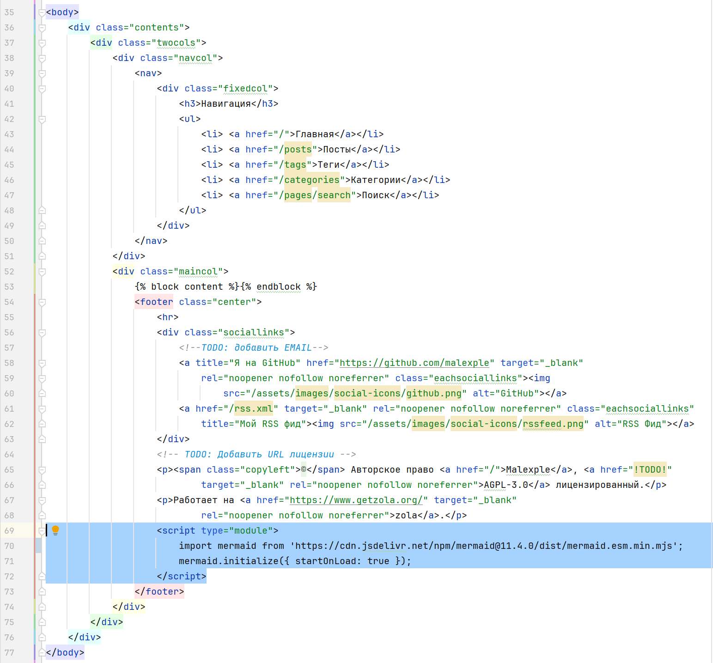
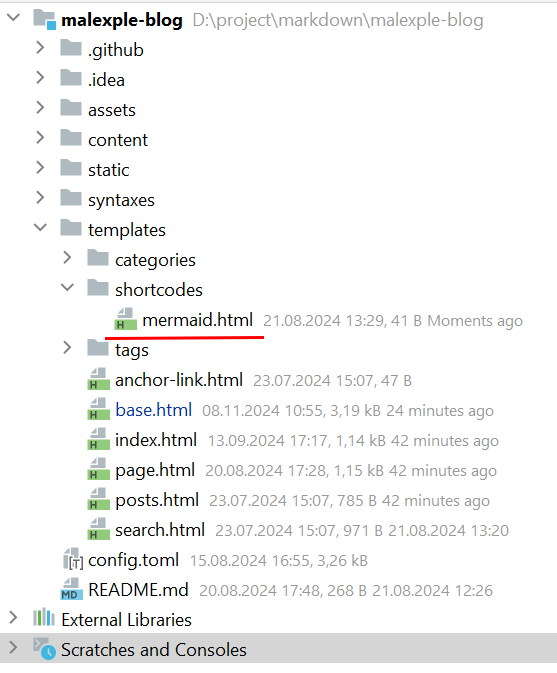
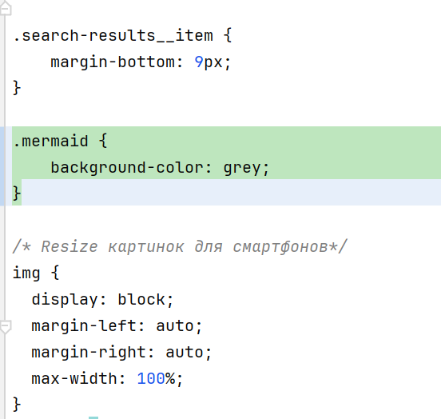
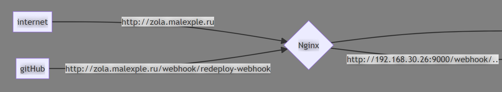

+++
title = "Добавление диаграм (mermaid) в zola"
draft = false
date = 2024-11-08
[taxonomies]
categories = ["blogs"]
tags = ["mermaid", "markdown", "zola"]

+++
## Что такое mermaid
Это проект https://mermaid.js.org/intro/getting-started.html позволяющий отображать графики и диаграммы в markdown.


gitGraph
       commit
       commit
       branch develop
       checkout develop
       commit
       commit
       checkout main
       merge develop
       commit
       commit



sequenceDiagram
    loop Daily query
        Alice->>Bob: Hello Bob, how are you?
        alt is sick
            Bob->>Alice: Not so good :(
        else is well
            Bob->>Alice: Feeling fresh like a daisy
        end

        opt Extra response
            Bob->>Alice: Thanks for asking
        end
    end



classDiagram
    Animal <|-- Duck
    Animal <|-- Fish
    Animal <|-- Zebra
    Animal : +int age
    Animal : +String gender
    Animal: +isMammal()
    Animal: +mate()
    class Duck{
        +String beakColor
        +swim()
        +quack()
    }
    class Fish{
        -int sizeInFeet
        -canEat()
    }
    class Zebra{
        +bool is_wild
        +run()
    }



## Интеграция mermaid в статический генератор zola
По умолчанию в zola нет mermaid. Есть подсветка кода, но нет поддержки диаграмм. Исправляем!
Для начала необходимо добавить скрипт на каждую страницу в zola. Для этого в базовом шаблоне base.html я добавляю следующие теги:
```html
    <script type="module">
    	import mermaid from 'https://cdn.jsdelivr.net/npm/mermaid@11.4.0/dist/mermaid.esm.min.mjs';
        mermaid.initialize({ startOnLoad: true });
    </script>
```


На данный момент последняя версия 11.4.0 все остальные версии mermaid можно посмотреть тут https://cdn.jsdelivr.net/npm/mermaid@11.4.0/dist/

## Добавление shortcodes mermaid в zola
Дополнительно почитать, что такое shortcodes можно тут https://www.getzola.org/documentation/content/shortcodes/

Если коротко, это небольшие вставки кода по шаблону в разных частях страниц. И если нужно изменить что-то в shortcodes изменения вносятся один раз в шаблоне и применяются везде где он вставлен.

В моем случае в папку templates добавляем папку shortcodes и файл mermaid.html


Со следующим кодом:
```html
<pre class="mermaid">
{{ body }}
</pre>
```

## Добавление диаграмм в markdown
Тут есть одно неудобство. Но это все же лучше, чем ничего. В markdown диаграммы добавляются так 
```
    ```mermaid
        classDiagram
        class BankAccount
        BankAccount : +String owner
        BankAccount : +Bigdecimal balance
        BankAccount : +deposit(amount)
        BankAccount : +withdrawal(amount)
    ```
```
Но в zola чтобы статический генератор правильно сгенерировал странички нужно ```mermaid заменить на ****
```
    
        classDiagram
        class BankAccount
        BankAccount : +String owner
        BankAccount : +Bigdecimal balance
        BankAccount : +deposit(amount)
        BankAccount : +withdrawal(amount)
    
```

## Правка стилей в mermaid
В моем случае в файле /static/assets/css/style.css добавляем например цвет фона для диаграмм


На выходе получим серый фон для диаграмм.


Дополнительно почитать про стили в mermaid можно тут https://mermaid.js.org/config/theming.html


