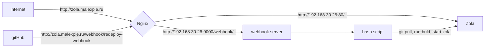

+++
title = "Разворачиваем статический генератор zola в proxmox"
draft = false
date = 2024-08-20
[taxonomies]
categories = ["blogs", "proxmox"]
tags = ["proxmox", "zola"]
+++

В данной статье хочу поделиться как развернуть zola в proxmox. В proxmox я разворачиваю LXC контейнер на Alpine.
И там устанавливаю zola.


## Установка сервера Zola

Устанавливаем zola
```bash
apk add zola
```
Переходим в родительский каталог
```bash
cd ~
```
Создаем проект блога malexple-blog. Его впоследствии я помещаю в репозиторий. При создании будут заданы несколько вопросов. Когда будет спрошено про URL я указываю доменное имя zola.malexple.ru. Это можно будет потом поправить в файле настроек.
```bash
zola init malexple-blog
```
Переходим в папку с проектом
```bash
cd malexple-blog
```
Собираем проект
```bash
zola build
```
Запускаем сервер
```bash
zola serve -i 192.168.30.26 --port 8080
```


Все команды:
```bash
apk add zola
cd ~
zola init malexple-blog
cd malexple-blog
zola build
zola serve -i 192.168.30.26 --port 8080
```


## Установка сервера webhook

```bash
apk add go
apk add webhook
cd ~
mkdir webhook
nano webhook/hooks.json
```

Вносим в hooks.json следующую настройку
```
[
  {
    "id": "redeploy-webhook",
    "execute-command": "/root/webhook/redeploy.sh",
    "command-working-directory": "/root/webhook"
  }
]
```

Создаем файл redeploy.sh 
```bash
nano webhook/redeploy.sh
```
Добавляем следующие скрипт
```bash
#!/bin/sh
echo "Pong"
ls
```
Делаес файл исполняемым
```bash
chmod +x webhook/redeploy.sh
```
Запускам сервер webhook
```bash
webhook -hooks /root/webhook/hooks.json -ip "192.168.30.26" -verbose
```

Переходим http://192.168.30.26:8080/hooks/redeploy-webhook и в консоли получаем наше сообщение


## Общая идея или CI/CD

После настройки сервера zola, его как-то надо обновлять и вносить в него изменения. Это можно сделать через webhook-и. В чем идея? Проект храним в github. В github настраиваем для нашего проекта webhook. Если вносим изменения в master ветку, то отправлется запрос на сервер zola. На сервере запускается скрипт, который подтягивает изменения с github, пересобирает и запускает. На сервере могут быть и другие сервисы поэтому все запросы приходят на сервер nginx, который маршрутизирует запросы. Для нас это поддоменое имя zola.malexple.ru. На www.malexple.ru или git.malexple.ru находится другой ресурс.




## Nginx

Чтобы запросы правильно ходили на сервер zola, а webhook-и на сервер webhook. Добавим настройки в Nginx

```
server {
    listen 80;
    server_name zola.malexple.ru;
    access_log /var/log/nginx/nginx.local-access.log;
    error_log /var/log/nginx/nginx.local-error.log;
    fastcgi_param HTTPS on;
    
    location / {
        proxy_pass http://192.168.30.26:8080;
        proxy_set_header Host $host;
        proxy_set_header X-Real-IP $remote_addr;
        proxy_set_header X-Forwarded-For $proxy_add_x_forwarded_for;
        proxy_set_header X-Forwarded-Proto $scheme;
    }
    
    location /hooks/ {
    	proxy_pass http://192.168.30.26:9000/hooks/;
	}
}

```

```bash
nano /etc/nginx/sites-available/nginx.local
nginx -t && nginx -s reload
service nginx restar
```


## Как решить проблему запуска двух серверов

Мы не можем запустить сервер zola и сервис webhook на одном порту. Но мы можем их запустить фоновыми задачами на разных портах

например сервер webhook

```
webhook -hooks /root/webhook/hooks.json -ip "192.168.30.26" -port 9000 -verbose & 
```

сервер zola 

```
zola serve --interface 0.0.0.0 --base-url zola.malexple.ru --port 80 &
zola serve --interface 0.0.0.0 --port 80 &
```

Так как у нас открыт только 80 порт и нам надо как то проксировать запросы к серверу мы в nginx добавляли [соответствующие настройки](#Nginx).
```sh
location /hooks/ {
    proxy_pass http://192.168.30.26:9000/hooks/;
}
```

Посмотреть что у вас запущено два фоновых процесса можно командой jobs


Чтобы завершить фотоновый процесс можно набрать команду **fg**  указав номер jobId и потом уже ctrl+c


А при переходе на http://zola.malexple.ru видим


## Добавляем webhook в github


После пуша изменений в консоли увидим 


## Правим скрипт redeploy.sh 

Раннее мы добавляли скрипт /root/webhook/redeploy.sh в котором мы просто выводили слово Pong на консоль. Теперь нам надо изменить скрипт чтобы:

1. подтянулись изменения из репозитория 
2. сервер пересобрался
3. сервер запустился в фоновых задачах

```bash
#!/bin/sh
cd /root/malexple-blog
echo "git pull"
git pull
echo "git pull compleate"
echo "zola build"
zola build
echo "build compleate"
echo "Redeploy Success"
```


