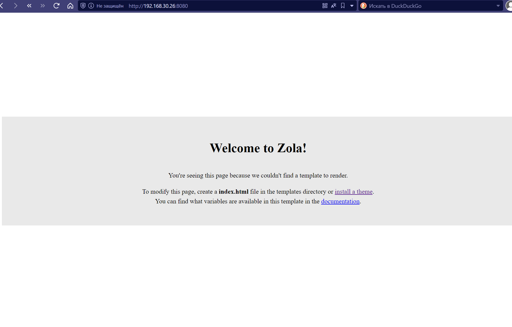
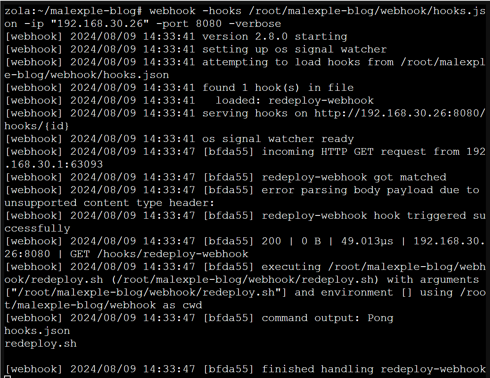
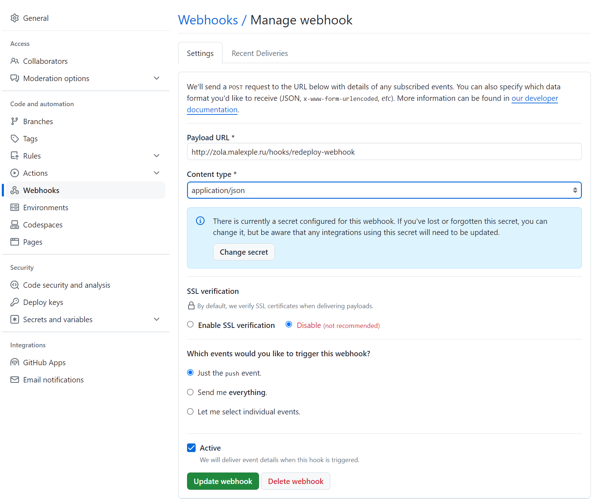
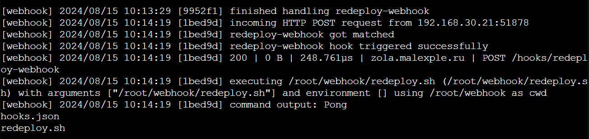
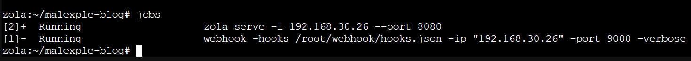
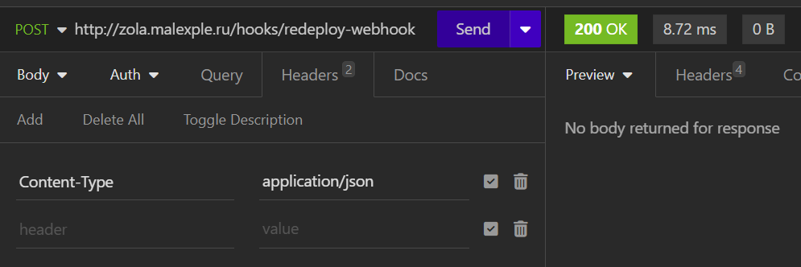
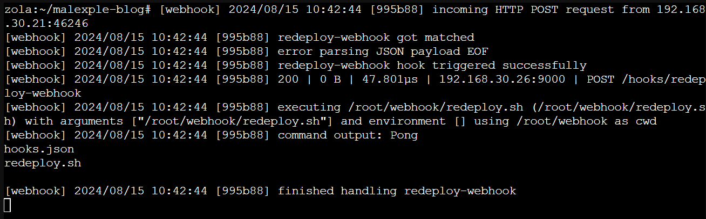
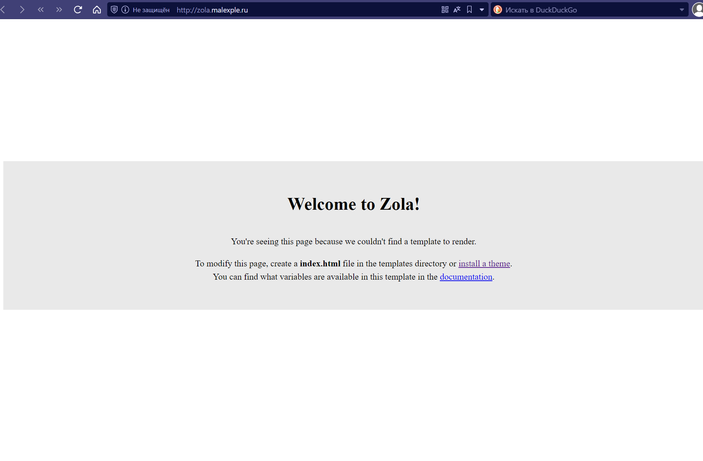

+++
title = "Разворачиваем статический генератор zola в proxmox"
draft = false
date = 2024-08-20
[taxonomies]
categories = ["blogs", "proxmox"]
tags = ["proxmox", "zola"]
+++

В Данной статье хочу поделиться как развернуть zola в proxmox.

# Установка Zola


```bash
apk add zola
cd ~
zola init malexple-blog
cd malexple-blog
zola build
zola serve -i 192.168.30.26 --port 8080
```




```
apk add go
apk add webhook
cd ~
mkdir webhook
nano webhook/hooks.json
```


```
[
  {
    "id": "redeploy-webhook",
    "execute-command": "/root/webhook/redeploy.sh",
    "command-working-directory": "/root/webhook"
  }
]
```

nano webhook/redeploy.sh

```
#!/bin/sh
echo "Pong"
ls
```

```
chmod +x webhook/redeploy.sh
webhook -hooks /root/webhook/hooks.json -ip "192.168.30.26" -verbose
```

Переходим http://192.168.30.26:8080/hooks/redeploy-webhook

в консоли получаем наше сообщение




## Nginx

```
server {
    listen 80;
    server_name zola.malexple.ru;
    access_log /var/log/nginx/nginx.local-access.log;
    error_log /var/log/nginx/nginx.local-error.log;
    fastcgi_param HTTPS on;
    
    location / {
        proxy_pass http://192.168.30.26:8080;
        proxy_set_header Host $host;
        proxy_set_header X-Real-IP $remote_addr;
        proxy_set_header X-Forwarded-For $proxy_add_x_forwarded_for;
        proxy_set_header X-Forwarded-Proto $scheme;
    }
}
```

```
nano /etc/nginx/sites-available/nginx.local
nginx -t && nginx -s reload
service nginx restar
```


## Webhook в github



После пуша изменений в консоли увидим 




## Как решить проблему запуска двух серверов на одном порту

Мы не можем запустить сервер zola и сервис webhook на одном порту. Но мы можем их запустить фоновыми задачами на разных портах

например сервер webhook

```
webhook -hooks /root/webhook/hooks.json -ip "192.168.30.26" -port 9000 -verbose & 
```

сервер zola 

```
zola serve --interface 0.0.0.0 --base-url zola.malexple.ru --port 80 &
zola serve --interface 0.0.0.0 --port 80 &
```

Но есть одна проблема. У нас открыт только 80 порт и нам надо как то проксировать запросы к серверу 192.168.30.26

Посмотреть что у вас запущено два фоновых процесса можно командой jobs



Добавляем в nginx строчки

```sh
location /hooks/ {
    proxy_pass http://192.168.30.26:9000/hooks/;
}
```





А при переходе на http://zola.malexple.ru видим



## Правим скрипт

Ранне мы добавляли скрипт /root/webhook/redeploy.sh в котором мы просто выводили слово Pong на консоль. Теперь нам надо изменить скрипт чтобы:

1. подтянулись изменения из репозитория 
2. сервер пересобрался
3. сервер запустился в фоновых задачах

```bash
#!/bin/sh
cd /root/malexple-blog
echo "git pull"
git pull
echo "git pull compleate"
echo "zola build"
zola build
echo "build compleate"
echo "Redeploy Success"
```
