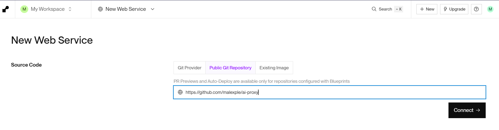
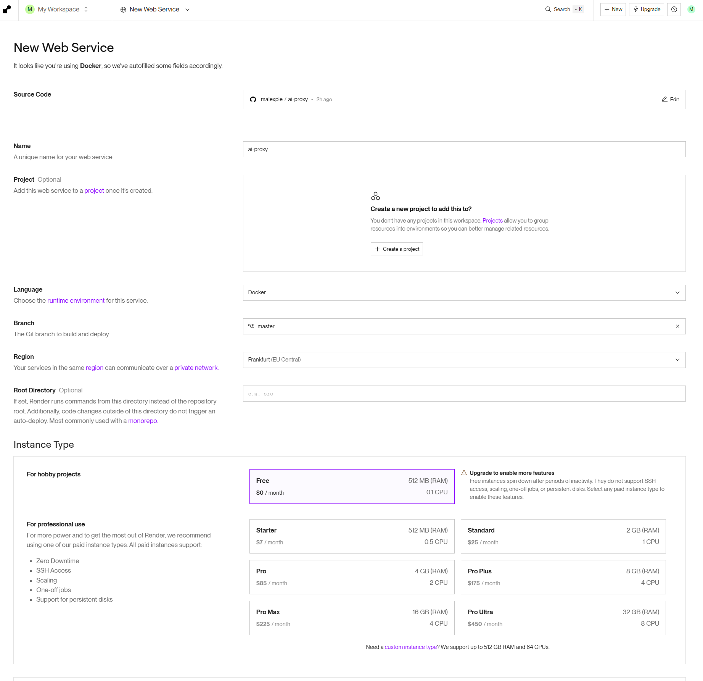
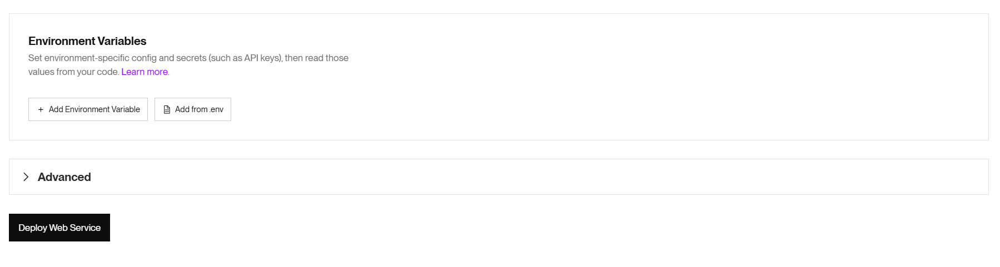
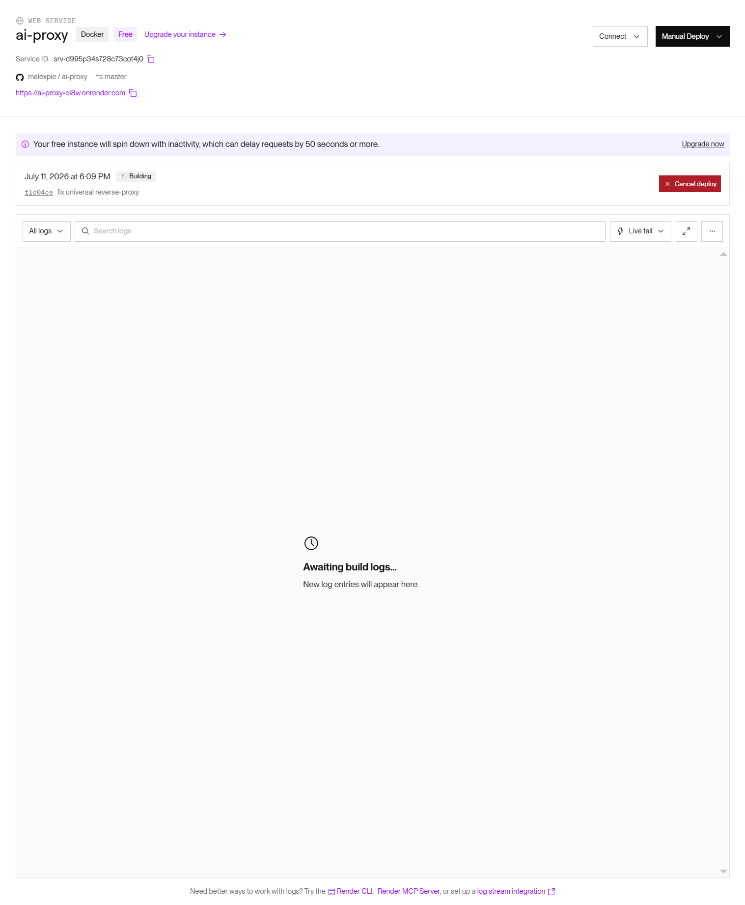
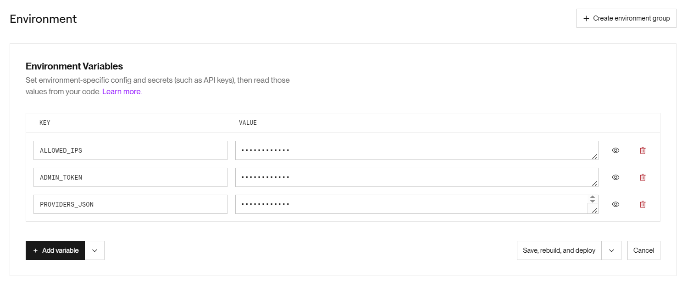

+++
title = "Пишем AI proxy для render.com"
draft = false
date = 2026-07-11
[taxonomies]
categories = ["java"]
tags = ["java", "ai"]

+++

## Описание проблемы
Для разработки одного из моих проектов: документа BDoc (Book Document альтернатива устаревшим закрытым бинарным форматами такими как IDML, INDD или Scribus SLA) потребовалась нейросеть, которая может держать контекст очень долго.
На данный момент для это цели идеально подходит Gemini. Но есть одна загвоздка, компания Google заблокировала некоторые регионы. То есть запросы от этих регионов не будут доходить до google.
Рассмотрев все за и против, было принято решение написать небольшую программу на java - ai-proxy. То есть прокси для нейросетей.


## Идея
Написать на java ai-proxy чтобы она работала не только с Gemini, но и если понадобится с OpenAI и Anthropic. У каждого сервиса — свой формат авторизации: у Gemini ключ идёт в query-параметре, у OpenAI — в Authorization: Bearer, у Anthropic — в заголовке x-api-key. Хотелось единой точки входа: один домен, один прокси, а дальше он сам разбирается, куда слать запрос.

## Версия 1 — наивная, с захардкоженными ключами

Первая версия была предельно простой: Spring WebFlux + `WebClient`, роутинг по первому сегменту пути (`/gemini/...`, `/openai/...`), и конфиг вида:

```yaml
app:
  providers:
    gemini:
      base-url: https://generativelanguage.googleapis.com
      auth:
        type: query
        parameter: key
        value: ${GEMINI_API_KEY}

    openai:
      base-url: https://api.openai.com
      auth:
        type: bearer
        value: ${OPENAI_API_KEY:}

    anthropic:
      base-url: https://api.anthropic.com
      auth:
        type: header
        header: x-api-key
        value: ${ANTHROPIC_API_KEY:}
```

Прокси сам добавлял ключ к запросу — в зависимости от `AuthenticationType` (`QUERY`, `HEADER`, `BEARER`). Работало. Но у этого подхода два системных недостатка, которые я сразу осознал.

**Первый.** Ключи живут на сервере прокси. Это значит, что прокси становится единой точкой хранения секретов для всех клиентов, которые через него ходят. Если у меня несколько ассистентов с разными правами доступа — разделить их не получится без доработки кода.

**Второй, важнее.** Любой новый тип авторизации (а он рано или поздно появится — у следующей нейросети может быть кастомная схема) требовал правки Java-кода: новый `enum` в `AuthenticationType`, новая ветка в `switch`, пересборка образа, редеплой.

## Версия 2 — pass-through ключей

Следующая идея: прокси вообще не должен знать про ключи. Клиент (тот же OpenCode) уже умеет сам подставлять `Authorization` или `x-api-key` — зачем дублировать эту логику на сервере? Прокси должен просто **прозрачно форвардить все заголовки**, включая авторизационные, как есть.

```java
@Service
public class ProxyService {
    private final WebClient webClient;
    private final UrlBuilderService urlBuilderService;

    public ProxyService(WebClient webClient, UrlBuilderService urlBuilderService) {
        this.webClient = webClient;
        this.urlBuilderService = urlBuilderService;
    }

    public Mono<ServerResponse> forward(ProxyRequest request) {
        URI uri = urlBuilderService.build(request);

        WebClient.RequestBodySpec requestBodySpec = webClient.method(request.method()).uri(uri);
        copyHeaders(request.headers(), requestBodySpec);

        WebClient.RequestHeadersSpec<?> clientRequest = hasBody(request.method())
                ? requestBodySpec.body(request.body(), DataBuffer.class)
                : requestBodySpec;

        Mono<ResponseEntity<Flux<DataBuffer>>> responseMono = clientRequest
                .retrieve()
                .onStatus(status -> true, errorResponse -> Mono.empty())
                .toEntityFlux(DataBuffer.class);

        return responseMono.flatMap(entity -> {
            HttpHeaders filteredHeaders = filterHeaders(entity.getHeaders());
            Flux<DataBuffer> body = entity.getBody() != null ? entity.getBody() : Flux.empty();

            return ServerResponse.status(entity.getStatusCode())
                    .headers(h -> h.addAll(filteredHeaders))
                    .body(BodyInserters.fromPublisher(body, DataBuffer.class));
        });
    }

    private boolean hasBody(HttpMethod method) {
        return method != HttpMethod.GET && method != HttpMethod.HEAD;
    }

    private HttpHeaders filterHeaders(HttpHeaders source) {
        HttpHeaders filtered = new HttpHeaders();
        source.forEach((name, values) -> {
            if (HttpHeaders.CONTENT_LENGTH.equalsIgnoreCase(name)) return;
            if (HttpHeaders.TRANSFER_ENCODING.equalsIgnoreCase(name)) return;
            if (HttpHeaders.CONTENT_ENCODING.equalsIgnoreCase(name)) return;
            filtered.put(name, values);
        });
        return filtered;
    }

    private void copyHeaders(HttpHeaders source, WebClient.RequestBodySpec target) {
        source.forEach((name, values) -> {
            if (HttpHeaders.HOST.equalsIgnoreCase(name)) return;
            if (HttpHeaders.CONTENT_LENGTH.equalsIgnoreCase(name)) return;
            if (HttpHeaders.ACCEPT_ENCODING.equalsIgnoreCase(name)) return;
            values.forEach(value -> target.header(name, value));
        });
    }
}
```

Это центральный метод, обрабатывающий входящий запрос от клиента и проксирующий его.

1. **Построение URI**
   Вызывается `urlBuilderService.build(request)` – получает полный URL, на который будет отправлен проксируемый запрос.
2. **Создание `RequestBodySpec`**
   Через `webClient.method(request.method()).uri(uri)` создаётся спецификация запроса с HTTP-методом (GET, POST и т.д.) и целевым URI.
3. **Копирование заголовков**
   Вызывается `copyHeaders(request.headers(), requestBodySpec)` – переносит заголовки из исходного запроса в исходящий, при этом **исключая** некоторые служебные заголовки:
   - `Host` (будет автоматически установлен на основе URI)
   - `Content-Length` (вычисляется автоматически)
   - `Accept-Encoding` (чтобы избежать проблем с кодированием сжатия)
4. **Обработка тела запроса**
   Проверяется, имеет ли метод тело (с помощью `hasBody()` – исключает GET и HEAD). Если тело есть, оно передаётся как `DataBuffer` (потоково, в реактивном стиле). В противном случае используется спецификация без тела.
5. **Выполнение запроса и получение ответа**
   Через `.retrieve()` и `.toEntityFlux(DataBuffer.class)` получается `Mono<ResponseEntity<Flux<DataBuffer>>>`.
   Важный момент: `.onStatus(status -> true, errorResponse -> Mono.empty())` – для **любого** статуса (включая ошибки) не выбрасывается исключение, а ответ передаётся дальше как есть (это позволяет проксировать ошибки от провайдера без трансформации).
6. **Формирование `ServerResponse`**
   В `flatMap` извлекается статус, заголовки и тело ответа.
   - Заголовки фильтруются через `filterHeaders()` – удаляются `Content-Length`, `Transfer-Encoding`, `Content-Encoding`, чтобы избежать конфликтов при формировании ответа от нашего сервера (Spring сам установит эти заголовки корректно).
   - Тело (если есть) передаётся потоково через `BodyInserters.fromPublisher`.
   - Возвращается реактивный ответ с тем же статусом, отфильтрованными заголовками и телом.

А конфиг провайдера стал предельно простым:

```java
public class ProviderProperties {
    private String baseUrl;
    // только baseUrl. Больше ничего
}
```

Ключей в конфиге нет вообще. Провайдер описывается одной строкой — куда слать запрос.

## Версия 3 — универсальный конфиг без пересборки образа

Мне не хотелось каждый  раз лезть в application.yml чтобы добавлять конфиг новой нейросети. В render.com есть UI в который через параметры можно добавить нужные значения. Но нужен был универсальный механизм добавления настроек.

Решение — переносить список провайдеров в JSON-строку внутри одной переменной окружения `PROVIDERS_JSON`, и парсить её при старте приложения:

```java
@Component
public class ProviderConfigLoader implements ApplicationRunner {
    private final AppProperties appProperties;
    private final ObjectMapper objectMapper;

    public ProviderConfigLoader(AppProperties appProperties,ObjectMapper objectMapper
    ) {
        this.appProperties = appProperties;
        this.objectMapper = objectMapper;
    }

    @Override
    public void run(ApplicationArguments args) throws Exception {
        String json = appProperties.getProvidersJson();
        if (json == null || json.isBlank()) {
            return;
        }
        Map<String, Map<String, String>> raw =
                objectMapper.readValue(
                        json,
                        objectMapper.getTypeFactory()
                                .constructMapType(
                                        LinkedHashMap.class,
                                        String.class,
                                        Map.class
                                )
                );

        Map<String, ProviderProperties> providers = new LinkedHashMap<>();
        raw.forEach((name, fields) -> {
            ProviderProperties provider = new ProviderProperties();
            provider.setBaseUrl(fields.get("baseUrl"));
            providers.put(name, provider);
        });
        appProperties.setProviders(providers);
    }
}
```

И теперь весь конфиг провайдеров — это одна переменная окружения:

```json
{
  "gemini": { "baseUrl": "https://generativelanguage.googleapis.com" },
  "openai": { "baseUrl": "https://api.openai.com" },
  "anthropic": { "baseUrl": "https://api.anthropic.com" }
}
```

Появилась новая нейросеть — открыл панель хостинга, дописал в JSON ещё одну пару "имя → baseUrl", перезапустил процесс. Ни строчки Java-кода, ни git commit, ни пересборки образа.

## Что получилось в итоге

Роутинг по пути остался предельно тонким — весь смысл прокси:

```java
public record ProviderPath(String provider, String path) {

    public static ProviderPath parse(String rawPath) {
        if (rawPath == null || rawPath.isBlank()) {
            throw new IllegalArgumentException("Empty request path");
        }

        String path = rawPath.trim();

        if (!path.startsWith("/")) {
            throw new IllegalArgumentException("Invalid path: " + path);
        }

        String withoutFirstSlash = path.substring(1);

        int separator = withoutFirstSlash.indexOf('/');

        String provider;
        String providerPath;

        if (separator == -1) {
            provider = withoutFirstSlash;
            providerPath = "/";
        } else {
            provider = withoutFirstSlash.substring(0, separator);
            providerPath = withoutFirstSlash.substring(separator);
        }

        if (provider.isBlank()) {
            throw new IllegalArgumentException("Provider is empty");
        }

        return new ProviderPath(provider, providerPath);
    }
}
```

Метод `parse(String rawPath)` выполняет синтаксический анализ строки пути и возвращает экземпляр `ProviderPath`. Разберём его работу по шагам:

1. **Проверка входной строки**
   Если `rawPath` равен `null`, пуст или состоит только из пробелов — выбрасывается исключение `IllegalArgumentException` с сообщением «Empty request path».
2. **Очистка и базовая валидация**
   Строка обрезается от ведущих и замыкающих пробелов (`trim()`). Затем проверяется, что она начинается с символа `/` – иначе генерируется исключение «Invalid path».
3. **Удаление начального слеша**
   С помощью `substring(1)` получается строка `withoutFirstSlash`, которая содержит всё после первого слеша. Например, из `"/openai/v1/chat"` получаем `"openai/v1/chat"`.
4. **Поиск разделителя**
   Ищется позиция первого символа `/` в `withoutFirstSlash` (метод `indexOf('/')`).
   - Если разделитель **не найден** (`separator == -1`), это означает, что после начального слеша идёт только имя провайдера без дальнейшего пути. Тогда:
     - `provider` = вся строка `withoutFirstSlash`;
     - `providerPath` = `"/"` (корневой путь для провайдера).
   - Если разделитель **найден**, то:
     - `provider` = часть до первого слеша (подстрока от 0 до `separator`);
     - `providerPath` = часть от этого слеша до конца (включая сам слеш), т.е. `withoutFirstSlash.substring(separator)`.
5. **Проверка на пустое имя провайдера**
   Если после всех преобразований `provider` оказывается пустой строкой (например, входной путь был `"/"` или `"/ /"`), выбрасывается исключение «Provider is empty».
6. **Создание и возврат объекта**
   Если все проверки пройдены, возвращается новый `ProviderPath` с вычисленными значениями.

### Примеры работы

| Входной путь (`rawPath`) | Результат (`provider`, `providerPath`) | Пояснение                                           |
| :----------------------- | :------------------------------------- | :-------------------------------------------------- |
| `"/openai/v1/chat"`      | `("openai", "/v1/chat")`               | Провайдер – `openai`, путь – `/v1/chat`             |
| `"/anthropic"`           | `("anthropic", "/")`                   | Провайдер – `anthropic`, путь по умолчанию – корень |
| `"/"`                    | Исключение: «Provider is empty»        | Нет имени провайдера                                |
| `"openai/v1"`            | Исключение: «Invalid path»             | Путь должен начинаться с `/`                        |
| `null`                   | Исключение: «Empty request path»       |                                                     |

## Безопасность

Чтобы как-то обезопасить прокси и им мог пользоваться только я. Нужно было добавить какую-то фильтрацию. Городить UI или API для управления не хотелось. У меня статический IP и идея просто добавить в конфиг выглядела очевидной. Но оставалась проблема а как я смогу пользоваться прокси, если нужно будет с рабочего места вызвать нейросеть. Или IP будет динамическим. Я нашел решение.

В настройки добавляем ADMIN_TOKEN и мини-эндпоинт `/admin/allow-ip`, который регистрирует текущий IP на несколько часов. 

```yaml
app:
  security:
    enabled: true
    allowed-ips: ${ALLOWED_IPS:}
    admin-token: ${ADMIN_TOKEN:}
    dynamic-ip-ttl-minutes: 720
```

Контроллера с API создавать не нужно, есть класс с @Configuration. Достаточно вызвать:

```bash
curl --request POST \
  --url https://you_project.onrender.com/admin/allow-ip \
  --header 'X-Admin-Token: you_token'
```

И на 12 часов доступ будет разрешен. Время можно поменять в настройке dynamic-ip-ttl-minutes. Удобно, когда работаешь не только из дома, но и с другой сети.

## Как настроить ai-proxy в render?

Тут достаточно все просто. Регистрируетесь в www.render.com. Зайти можно с существующей учеткой от github.

Далее нажимаете New -> Web service. Указывается адрес открытого проекта и нажимаете Connect.




Далее выбирается free подписку. Можете поменять регион какой вам нужен. И Нажимаете Deploy Web Service. 





Дальше проект соберется и запустится



В проекте уже есть .dockerfile и rendre.yaml. Поэтому переменные среды должны подтянутся сами.

```yaml
services:
  - type: web
    name: ai-proxy
    runtime: docker
    plan: free
    autoDeploy: true
    healthCheckPath: /actuator/health
    envVars:
      - key: PORT
        value: "8080"
      - key: ALLOWED_IPS
        sync: false
      - key: ADMIN_TOKEN
        sync: false
      - key: PROVIDERS_JSON
        sync: false
```

Если этого не произошло. Зайдите в Environment и добавьте вручную



Настройки в параметр PROVIDERS_JSON требуется вносить без переносов строки. Примерно так:

```json
{"gemini":{"baseUrl":"https://generativelanguage.googleapis.com"},"openai":{"baseUrl":"https://api.openai.com"},"anthropic":{"baseUrl": "https://api.anthropic.com"}}
```

Далее нажимаете Save, rebuild and deploy. И ждете пока сервис не запустится с новыми параметрами.

Проверить что сервис стартовал можно так:

```bash
curl --request GET \
  --url https://ai-proxy-ol8w.onrender.com/actuator/health \
  --header 'User-Agent: insomnia/8.2.0'
```

Если получили ответ:

```json
{
	"status": "UP",
	"groups": [
		"liveness",
		"readiness"
	]
}
```

Значит сервис стартовал и можно пользоваться. 

### Запрос на добавление своего текущего IP на 12 часов

```bash
curl --request POST \
  --url https://ai-proxy-you_id.onrender.com/admin/allow-ip \
  --header 'X-Admin-Token: ADMIN_TOKEN'
```


### Запрос в Gemini теперь будет такой:

```bash
curl --request GET \
  --url https://ai-proxy-you_id.onrender.com/gemini/v1beta/models \
  --header 'User-Agent: insomnia/8.2.0' \
  --header 'x-goog-api-key: YOU_GEMINI_KEY'
```

Теперь можно в настройках openCode поменять только пути к нейросетям. Остальные параметры остаются теже.

```json
{
  "$schema": "https://opencode.ai/config.json",
  "provider": {
    "google": {
      "npm": "@ai-sdk/google",
      "name": "Gemini via ai-proxy",
      "options": {
        "baseURL": "https://ai-proxy-ol8w.onrender.com/gemini/v1beta/",
        "apiKey": "YOU_GEMINI_API_KEY"
      },
      "models": {
        "gemini-2.5-flash": { "name": "Gemini 2.5 Flash" },
        "gemini-2.5-pro": { "name": "Gemini 2.5 Pro" }
      }
    }
  },
  "model": "google/gemini-2.5-flash"
}
```

## Сервис можно запустить через docker-compose

Если у вас есть файл `docker-compose.yml` (я его уже создал для вас), вы можете запустить `ai-proxy` с помощью следующей команды:

```bash
docker-compose up -d
```

Эта команда соберет образ (если он еще не собран) и запустит контейнер в фоновом режиме. Доступ к приложению будет по адресу `http://localhost:8080`.

Чтобы остановить контейнер:

```bash
docker-compose down
```

### С помощью docker run

Вы также можете запустить образ Docker напрямую, используя команду `docker run`. Замените `malexple/ai-proxy:latest` на актуальный тег образа.

```bash
docker run -d -p 8080:8080 \
  -e "PORT=8080" \
  -e "PROVIDERS_JSON={\"gemini\":{\"baseUrl\":\"https://generativelanguage.googleapis.com\"},\"openai\":{\"baseUrl\":\"https://api.openai.com\"}}" \
  --name ai-proxy malexple/ai-proxy:latest
```

В этой команде:
- `-d` запускает контейнер в фоновом режиме.
- `-p 8080:8080` сопоставляет порт 8080 вашего хоста с портом 8080 в контейнере.
- `-e "PORT=8080"` устанавливает переменную среды `PORT` внутри контейнера.
- `-e "PROVIDERS_JSON=..."` устанавливает переменную среды `PROVIDERS_JSON` для конфигурации прокси. Вам нужно будет заменить содержимое JSON на вашу актуальную конфигурацию.
- `--name ai-proxy` присваивает имя контейнеру для удобства управления.
- `malexple/ai-proxy:latest` - это имя и тег образа Docker для запуска.

Чтобы остановить контейнер:

```bash
docker stop ai-proxy
```

Чтобы удалить контейнер:

```bash
docker rm ai-proxy
```