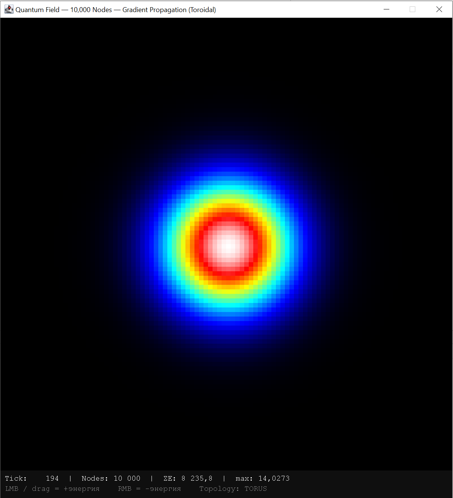
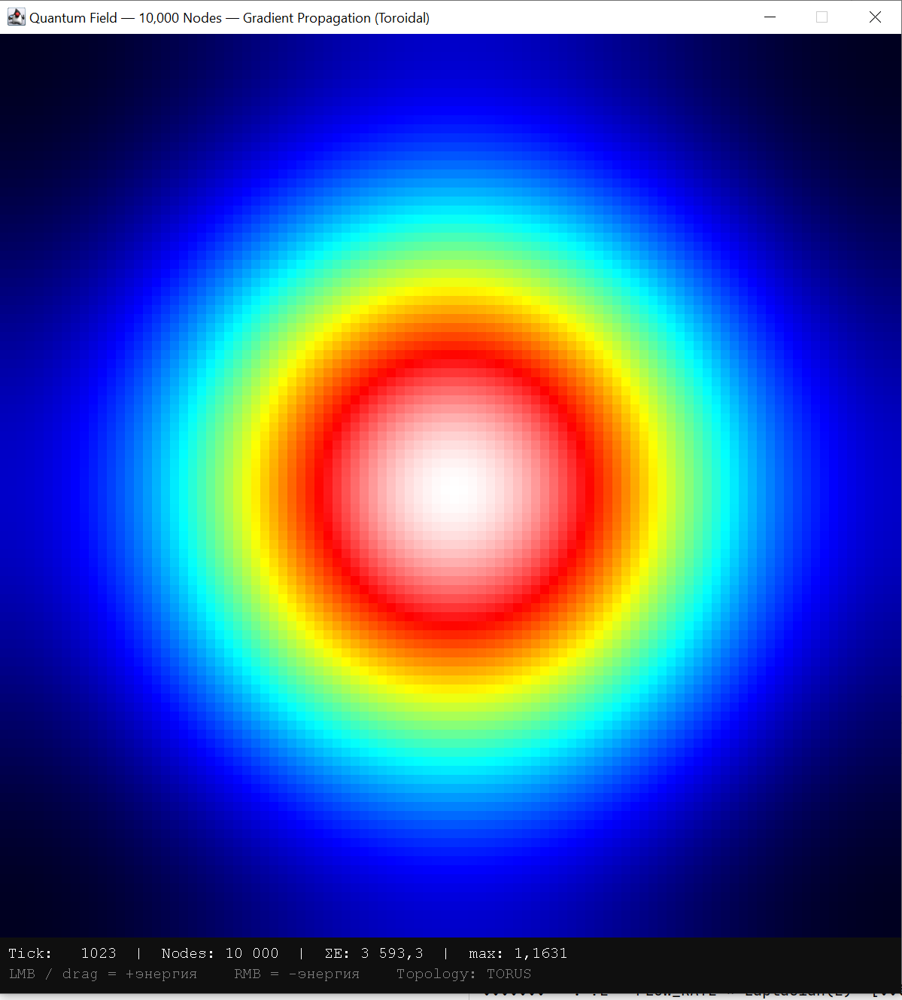
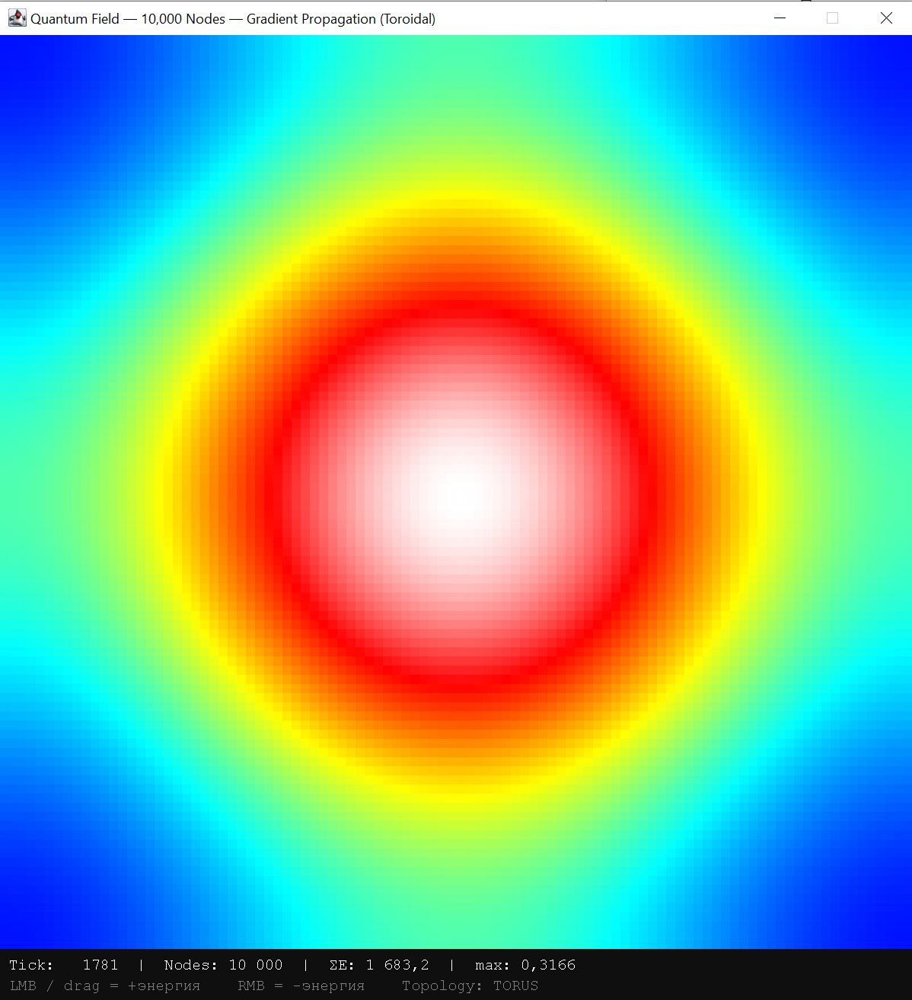
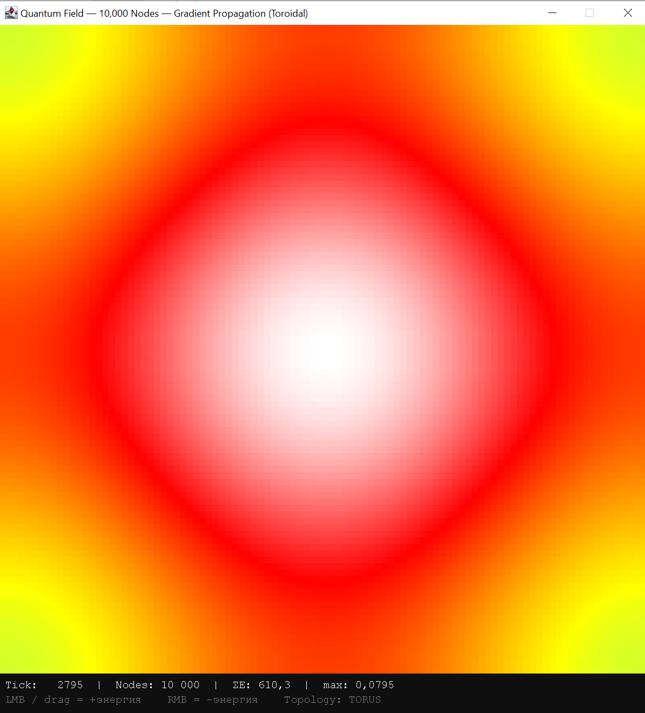
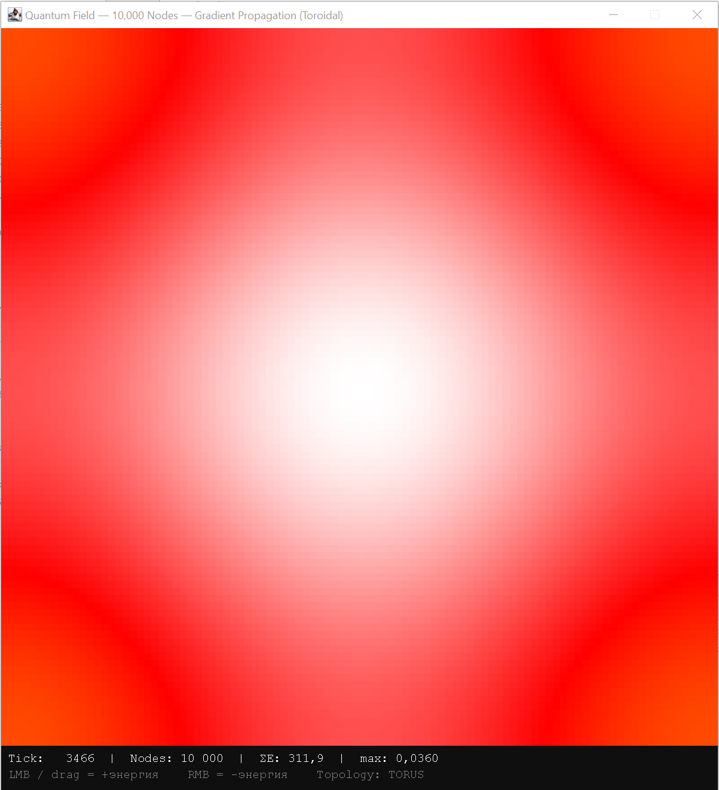
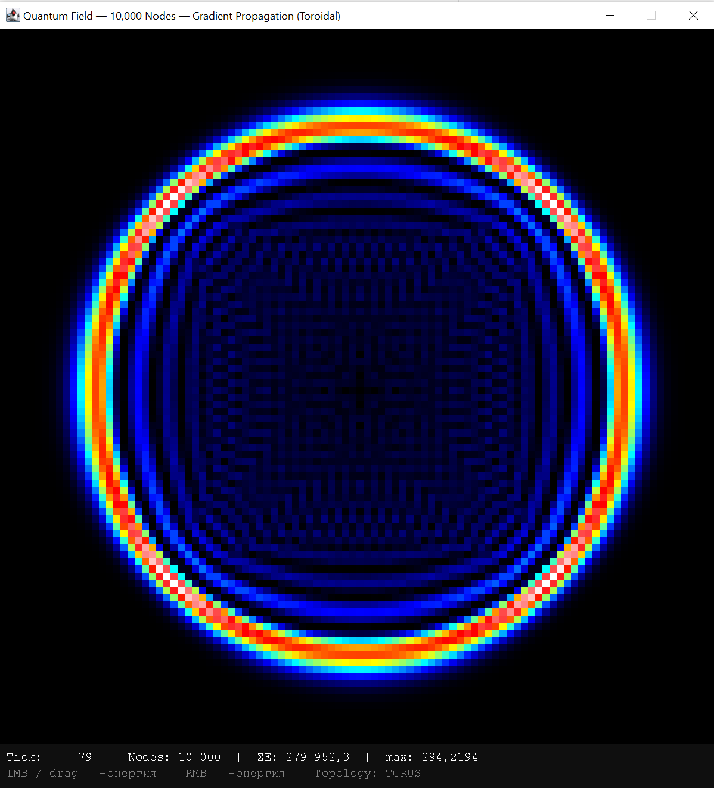
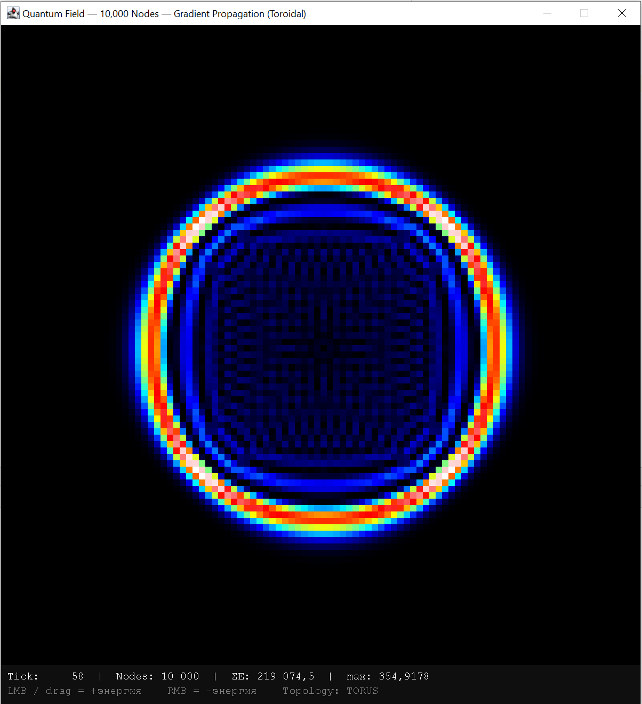

+++
title = "Я попытался смоделировать Вселенную. Вот что получилось"
draft = false
date = 2026-04-08
[taxonomies]
categories = ["qunat"]
tags = ["qunat"]
+++

Всё началось с простого вопроса: а что если взять решётку из 10 000 узлов, задать одно правило передачи энергии между соседями — и просто запустить? Без физики из учебника, без готовых формул. Просто посмотреть что вырастет само.

Спойлер: вырос фазовый переход, рождение частиц и стрела времени. Из одного правила.

---

## Начало: случайность против закона

Первая версия программы работала просто — каждый узел немного случайно дрожал. `Math.random()`. Красиво, но бессмысленно. Шум есть шум, в нём нет структуры.

Потом я заменил случайность на закон: **энергия течёт от узла с большей энергией к узлу с меньшей**. Пропорционально разнице. Это называется дискретным уравнением теплопроводности, но я об этом не думал — я просто хотел посмотреть что будет.

Первый запуск на 10 000 узлах: поставил одну точку с энергией в центре и нажал пуск. По экрану пошла идеальная круговая волна. Дошла до края — и появилась с другой стороны, потому что решётка замкнута как тор. Волна вернулась и встретила себя. Возникли интерференционные кольца — как в опыте с двумя щелями из учебника квантовой механики. Только я это не программировал. Оно вышло само.

---

## Проблема: всё размывается

Красиво, но поле неизбежно размывалось. Через тысячу шагов — равномерный розовый туман. Тепловая смерть. Второе начало термодинамики в действии, хотя я его не закладывал.

Частицы в реальном мире не размываются. Электрон не растворяется в пространстве. Значит нужно что-то ещё.

---

## Поворот: нелинейность

Я добавил одно слагаемое — нелинейный потенциал с двумя устойчивыми состояниями. Грубо говоря: поле теперь не любит быть в нуле. Оно хочет быть либо в состоянии +V, либо в состоянии −V. Как намагниченное железо, которое хочет быть намагничено в одну из двух сторон.

И вот тут началось интересное.

При запуске одной точки возбуждения:

1. Сначала расходится волна — как раньше
2. Потом поле начинает выбирать: здесь будет +V, там −V
3. Между зонами с разными знаками возникает **граница**
4. Эта граница — устойчивая. Она не размывается
5. Она движется, сталкивается с другими границами
6. При столкновении двух противоположных границ — они уничтожают друг друга с выбросом энергии

Программа сама начала считать эти границы. На первых тиках — 7 штук. Через сотню — 222. Через пятьсот — тысячи. Они рождаются **парами** (это можно проверить — счётчик всегда чётный), и аннигилируют парами.

Это не было запрограммировано. Это вышло из правила.

---

## Что я увидел на экране

Самый красивый момент — tick 58 после сильного возбуждения. На синем фоне (вакуум −V) появился золотой круг (домен +V) с чёткой чёрной границей. Как пузырь. Как будто внутри кольца другая вселенная с другими законами.

В космологии это называется фазовым переходом при инфляции. Теоретически именно так мог выглядеть ранний период после Большого Взрыва — пузыри новой фазы в старом вакууме. Я об этом не думал когда писал код. Оно просто получилось.

---

## Что это значит

Я не открыл новую физику. Уравнение Клейна-Гордона с φ⁴ потенциалом известно давно. Солитоны изучаются с 1960-х. Всё это есть в учебниках.

Но есть кое-что важное в самом процессе.

Когда ты сидишь и пишешь код — не читаешь про физику, а именно пишешь, запускаешь, смотришь что получилось — понимание приходит иначе. Не как информация, а как **опыт**. Ты видишь как из простого правила вырастает сложное. Видишь момент когда хаос начинает самоорганизовываться. Видишь рождение структуры там где её не было.

И тогда вопрос "а не так ли устроена настоящая вселенная?" перестаёт казаться странным. Может быть там тоже одно правило. Может быть всё остальное — волны, частицы, взаимодействия — просто то, что выходит само когда это правило работает на достаточно большой решётке.

---

## Код

Написан на Java, никаких внешних зависимостей кроме стандартного Swing. Решётка 100×100, торическая топология, одно уравнение в методе `update()`. 

Если хочешь поиграть сам — запускаешь, кликаешь левой кнопкой мыши в любую точку экрана и смотришь как рождаются и умирают домены. Это занимает минуту. И после этой минуты квантовое поле перестаёт быть абстракцией из учебника.

---

*Написано за один день итеративного эксперимента. Следующий шаг — трёхмерная тетраэдральная решётка.*
