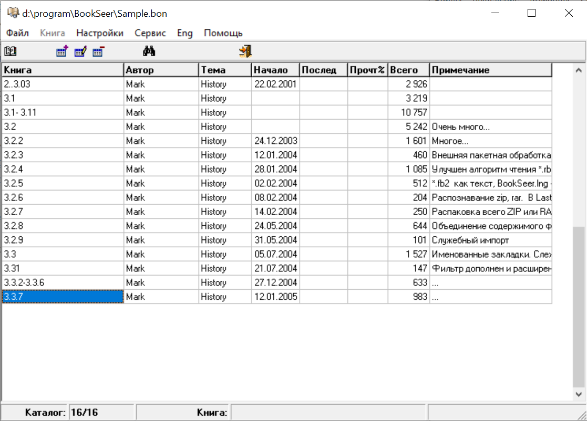
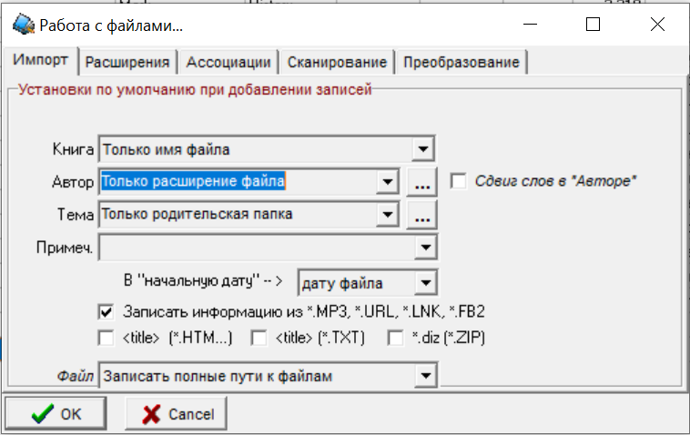
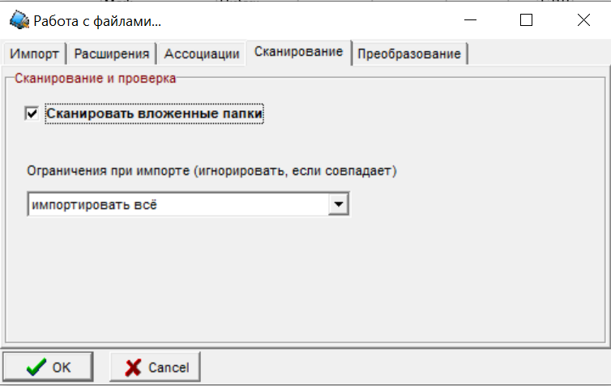
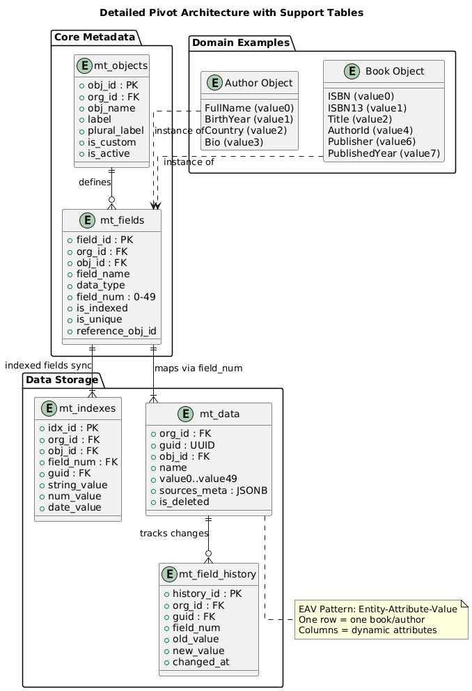
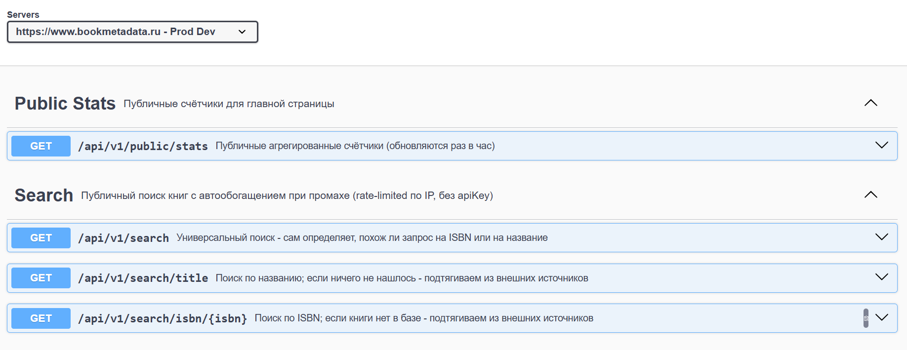
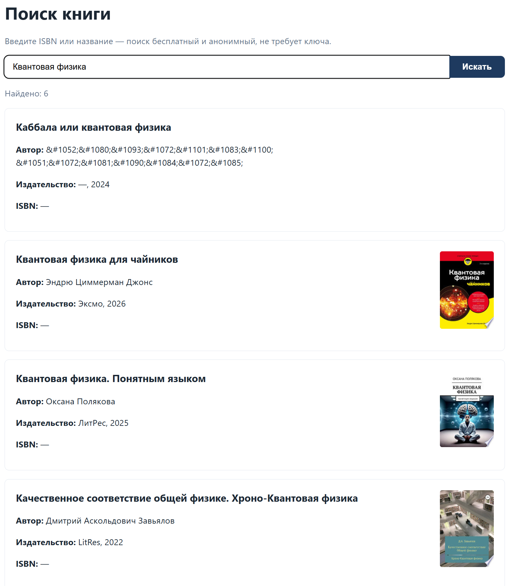
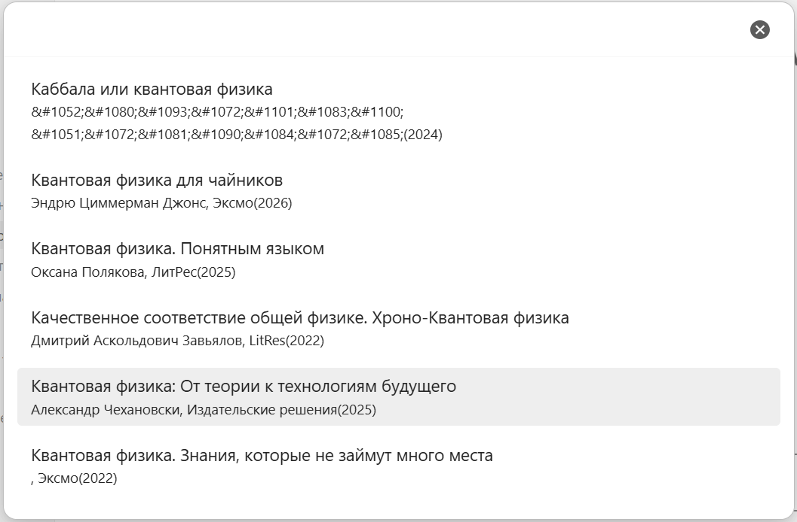
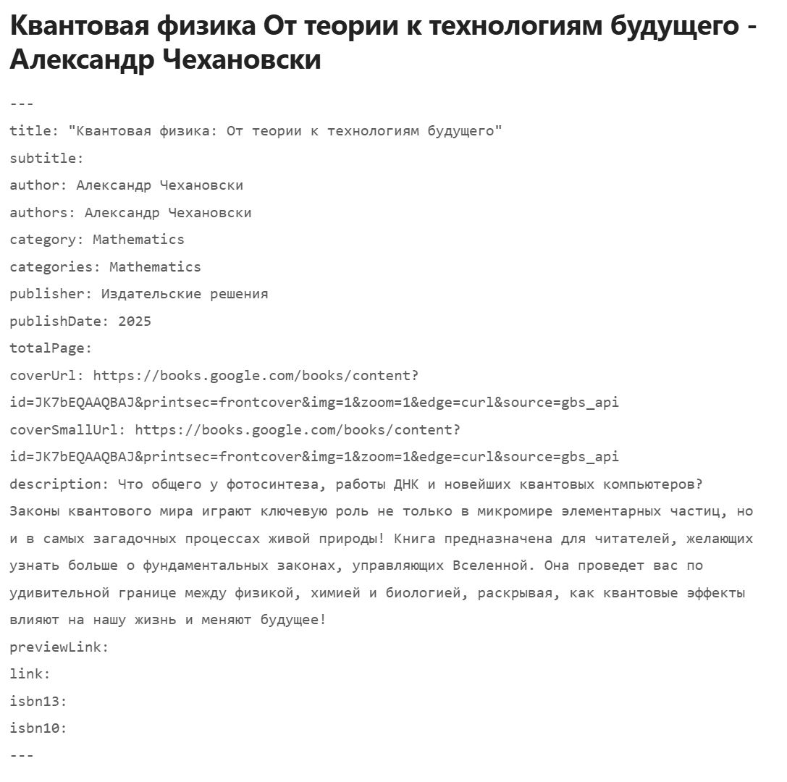

+++
title = "Создаем сервис для получения метаданных книг"
draft = false
date = 2026-09-03
[taxonomies]
categories = ["java"]
tags = ["java", "spring", "microservice", "metadata", "book"]

+++

## Предыстория

Некоторое время назад я уже создавал форк плагина для obsidian и добавлял доработку для получения метаданных с литрес
https://github.com/malexple/obsidian-book-search-plugin. Делал я это для знакомого который в течении полугода говорил что у него не получается переделать плагин в chatGPT.
Я подошел к этой проблеме с другой стороны и прикрутил тогда Литрес. Хотя его идея была немного другой.
Но уже тогда я очень удивился что в пространстве СНГ нет какого-то бесплатного сервиса для получения метаданных книг.
Я с этим сталкивался, когда пытался каталогизировать свою локальную хоть и небольшую библиотеку через Calibre. Мне если честно не очень нравится Calibre, а именно следующие моменты:
1. Большие кнопки и не удобный интерфейс
2. При создании бд он копирует файлы и переименовывает файлы в непонятные номера. Это лишнее место. А мне удобнее каталогизировать по человеческим описаниям папок Математика, Физика, Химия и т.д. То есть структура папок близкая к классификаторам ББК и УДК, если расшифровать номера.
3. Метаданные нужно вводить вручную. Есть плагины, но не все данные можно подтянуть с интернета или они в разных местах

В cвоё время я пользовался программой BookSeer. Автор: Марк Солтанович (Mark Soltanovich). Сейчас сайта автора нет, но интернет помнит все:
https://web.archive.org/web/20090417003848/http://solsoft.narod.ru/
https://web.archive.org/web/20090327121058/http://www.msolt.nm.ru/News32.html



Программа супер простая. Супер маленькая и самое главное работает и по сей день. Отдельного внимания стоит фкнционал добавления файлов и сканирования


Там было удобно сканировать, но все равно нет того чего хотелось.

Мне не хватает создание папок по ББК или УДК и на диске иметь осмысленные названия папок для технической литературы.
У меня была попытка создать такую базу данных номеров и я писал программу для получения УДК номеров https://github.com/malexple/udk-site-parser
Но саму программу я не писал. То есть сканирование, поиск и распознавание и создание папок это отдельная большая задача.
Идей как это все сделать много. Если будет время я создам такую программу.

На канале моего знакомого вышло видео:

[Как я хотел вести каталог книг в Obsidian]: https://www.youtube.com/watch?v=3kN6n9Rjldg

Я понял что с метаданными нужно что то делать. Нужен полностью открытый проект который сам пополняется метаданными книг, при этом не хранит ни картинки ни файлы. Только метаданные. А API возвращает только нужно. Но тут стают вопросы: 
Я добавлю метаданные книг, а потом захочется добавить новое поле в бд, а потом добавить метаданные журналов или комиксов. Каждый раз менять структуру таблиц не хочется. Я вспомнил про одну не очень популярную архитектуру бд, но она работает и избавляет от этой проблемы.

## Pivot architecture database

Где применяется данная модель создания таблиц. В облачных сервисах для построения многопользовательских или мультиарендных систем.



### Суть модели

**Pivot (EAV - Entity-Attribute-Value) архитектура** — это подход к хранению данных, при котором:

1. **Метаданные отделены от данных**: Структура объектов (таблиц) и полей (колонок) описывается в отдельных таблицах метаданных (`mt_objects`, `mt_fields`), а не в DDL базы данных.
2. **Данные хранятся в универсальных колонках**: Вместо создания отдельных колонок для каждого атрибута, используется набор универсальных колонок (`value0`...`value49`), которые могут хранить данные любого типа.
3. **Pivot таблицы для оптимизации**: Для обеспечения быстрой выборки данных создаются специализированные pivot-таблицы (`mt_indexes`), которые содержат типизированные индексы для полей, помеченных как `is_indexed`.


### Ключевые компоненты

| Компонент         | Force.com   | Ваш проект         | Назначение                                        |
| ----------------- | ----------- | ------------------ | ------------------------------------------------- |
| **Objects Table** | Objects     | `mt_objects`       | Хранит метаданные объектов (Book, Author)         |
| **Fields Table**  | Fields      | `mt_fields`        | Описывает поля объектов и их маппинг на value0-49 |
| **Data Table**    | Data        | `mt_data`          | Основное хранилище данных с flex columns          |
| **Indexes Pivot** | Indexes     | `mt_indexes`       | Типизированные индексы для быстрого поиска        |
| **History Table** | Audit trail | `mt_field_history` | История изменений полей                           |


### Преимущества модели

#### **Гибкость и масштабируемость**

- **Без ALTER TABLE**: Добавление новых полей — это просто INSERT в `mt_fields`, а не дорогостоящая миграция схемы БД
- **Zero downtime**: Изменения метаданных не блокируют работу приложения
- **Динамическая схема**: Разные объекты могут иметь совершенно разные наборы полей

#### **Многопользовательность (Multitenancy)**

- **Изоляция тенантов**: Все данные разделены по `org_id`
- **Экономия ресурсов**: Один экземпляр приложения обслуживает множество организаций
- **Кастомизация**: Каждая организация может иметь свою уникальную схему данных

#### **Производительность**

- **Типизированные индексы**: `mt_indexes` позволяет быстро искать по индексированным полям без сканирования всех 50 value-колонок
- **Партиционирование**: Данные физически разделены по `org_id` (partition pruning)
- **Кэширование метаданных**: Метаданные можно кэшировать в памяти

####  **Функциональность**

- **История изменений**: `mt_field_history` автоматически отслеживает изменения
- **Источники данных**: `sources_meta` (JSONB) хранит информацию о происхождении данных
- **Уникальность и валидация**: Ограничения на уровне приложения и БД

### Когда применять

**Подходит для:**

- SaaS-приложений с кастомизируемой схемой данных
- Систем с динамическими атрибутами (каталоги товаров, CRM, метаданные)
- Multi-tenant архитектур
- Приложений, требующих частых изменений схемы

**Не подходит для:**

- Высоконагруженных транзакционных систем с фиксированной схемой
- Сценариев, требующих сложных JOIN между динамическими полями
- Приложений с жесткими требованиями к производительности на больших объемах

Да в такой модели есть свои плюсы и минусы при большом количестве данных, но они есть и в стандартных моделях. Основным плюсом для меня это:

- новая игрушка и попробавать такую архитектуру

- возможность добавлять новые поля без перестарта приложения

- возможность добавления новых объектов

  

Как это примерно происходит:

Добавить объект — это вставка одной строки:

```sql
INSERT INTO mtobjects (orgid, objname, label, plurallabel, iscustom, isactive)
VALUES (1, 'Publisher', 'Издательство', 'Издательства', TRUE, TRUE);
```

Добавить новое поле существующему объекту — тоже вставка, а не миграция, причём номер свободного слота можно вычислить автоматически, а не подбирать руками:

```sql
INSERT INTO mtfields (orgid, objid, fieldname, label, datatype, fieldnum, isindexed, isunique, isrequired, length)
SELECT o.orgid, o.objid, 'Website', 'Сайт издательства', 'url',
       COALESCE((SELECT MAX(mf.fieldnum) FROM mtfields mf
                 WHERE mf.orgid = o.orgid AND mf.objid = o.objid), -1) + 1,
       FALSE, FALSE, FALSE, 500
FROM mtobjects o
WHERE o.orgid = 1 AND o.objname = 'Publisher';
```

С этого момента новое поле сразу доступно через `?fields=Website` в публичном API, участвует в `resolveRequestedFields`, а если пометить его `isIndexed = TRUE` то автоматически начнёт попадать в `mtindexes` при следующем сохранении записи через `PivotIndexService.syncIndexes`, без единой строчки нового Java-кода. 

Заплатить за эту гибкость приходится тем, что каждое чтение поля идёт не через нормальную типизированную колонку, а через `getValue(int slot)` с ручным `switch` на 50 кейсов, и запросы вроде "показать все книги, у которых `PublishedYear > 2020`" требуют JOIN с `mtindexes`, а не прямого `WHERE` по `mtdata`.  Схема бесконечно расширяема во время работы системы, но платим за это цену на каждом отдельном чтении. Для сервиса, где состав полей продолжает меняться (а в Book Metadata Service он будет меняется), этот большущий плюс.

## Трудности выбора идей и реализаций

Изначальная идея создать сервис который сам будет ходить в другие сервиса и у себя агрегировать метаданные книг. Я добавил общедоступные и бесплатные Open Library, Google Books, FantLab и даже LibGen и Sigla. Но это либо серая зона или скрабинг сайта, что на постоянной основе делать нельзя. Это добавил как опцию. Сервис можно скачать и запустить в docker, но по  умолчанию выключены. И на общедоступном сайте они выыключены.   

Мне нельзя делать такие задачки. Потому что очень много идей и хочется все сразу реализовать. Изначально я добавил возможность получения метаданных объектов:

````java
@RestController
@RequestMapping("/api/metadata")
@RequiredArgsConstructor
@Tag(name = "Metadata", description = "Метаданные объектов и полей для UI-конструктора")
public class MetadataController {

    private final MetadataService metadataService;
    private final ApiKeyService apiKeyService;

    @Operation(summary = "Список объектов (Book, Author, Magazine...)")
    @GetMapping("/objects")
    public ResponseEntity<List<MtObject>> getObjects(
            @RequestParam String apiKey,
            @Parameter(example = "1") @RequestParam(defaultValue = "1") Integer orgId) {
        Integer resolvedOrgId = apiKeyService.resolveOrgIdOrThrow(apiKey, ApiKeyScope.ADMIN);
        return ResponseEntity.ok(metadataService.getObjectsByOrg(resolvedOrgId));
    }

    @Operation(summary = "Поля объекта — источник для чекбоксов в UI-конструкторе")
    @GetMapping("/objects/{objectName}/fields")
    public ResponseEntity<List<FieldDto>> getFields(
            @RequestParam String apiKey,
            @Parameter(example = "1") @RequestParam(defaultValue = "1") Integer orgId,
            @Parameter(example = "Book") @PathVariable String objectName) {
        Integer resolvedOrgId = apiKeyService.resolveOrgIdOrThrow(apiKey, ApiKeyScope.ADMIN);
        MtObject object = metadataService.getObjectByName(resolvedOrgId, objectName);
        List<FieldDto> dtos = metadataService.getFieldsByObject(resolvedOrgId, object.getObjId()).stream()
                .map(this::toDto)
                .toList();
        return ResponseEntity.ok(dtos);
    }

    private FieldDto toDto(MtField f) {
        return FieldDto.builder()
                .fieldName(f.getFieldName())
                .label(f.getLabel())
                .dataType(f.getDataType())
                .isIndexed(f.getIsIndexed())
                .isRequired(f.getIsRequired())
                .build();
    }
}
````

И планировал потом расширять функционально и может к этому вернусь с доступом под админом. Но для публичного сервиса убрал пока полностью.

Потом добавлял ручное обогащение данных через LLM. Когда LLM сама ходит ищет книгу которую не нашли в Open Library, Google Books, FantLab. И такая запись сохраняется во временную таблицу llm_suggestions, а ты потом проверяешь и добавляешь в общую таблицу, если все правильно:

````java
@RestController
@RequestMapping("/api/v1/enrichment")
@RequiredArgsConstructor
@Tag(name = "Enrichment", description = "Обогащение метаданных из открытых источников, LLM fallback и модерация предложений")
public class EnrichmentController {

    private final ApiKeyService apiKeyService;
    private final PublicSourcesEnrichmentService publicSourcesEnrichmentService;
    private final BookQueryService bookQueryService;

    @Operation(summary = "Найти книгу по ISBN (Open Library -> Google Books -> FantLab -> LibGen -> LLM fallback в очередь)")
    @PostMapping("/public/by-isbn")
    public ResponseEntity<Map<String, Object>> enrichPublicByIsbn(
            @RequestParam String apiKey,
            @RequestParam String isbn) {

        Integer orgId = apiKeyService.resolveOrgIdOrThrow(apiKey, ApiKeyScope.PARTNER_WRITE);
        MtData result = publicSourcesEnrichmentService.enrichByIsbn(orgId, isbn);
        return respond(orgId, result);
    }

    @Operation(summary = "Найти книгу по названию, когда ISBN неизвестен (LLM fallback тоже уходит в очередь на модерацию)")
    @PostMapping("/public/by-title")
    public ResponseEntity<Map<String, Object>> enrichPublicByTitle(
            @RequestParam String apiKey,
            @RequestParam String title) {

        Integer orgId = apiKeyService.resolveOrgIdOrThrow(apiKey, ApiKeyScope.PARTNER_WRITE);
        MtData result = publicSourcesEnrichmentService.enrichByTitle(orgId, title);
        return respond(orgId, result);
    }

    @Operation(summary = "Список предложений от LLM fallback, ожидающих модерации (по умолчанию status=pending)")
    @GetMapping("/llm-suggestions")
    public ResponseEntity<List<LlmSuggestion>> listSuggestions(
            @RequestParam String apiKey,
            @RequestParam(defaultValue = "pending") String status) {

        Integer orgId = apiKeyService.resolveOrgIdOrThrow(apiKey, ApiKeyScope.ADMIN);
        return ResponseEntity.ok(publicSourcesEnrichmentService.listSuggestions(orgId, status));
    }

    @Operation(summary = "Принять предложение LLM — записать данные в mt_data")
    @PostMapping("/llm-suggestions/{id}/approve")
    public ResponseEntity<Map<String, Object>> approveSuggestion(
            @RequestParam String apiKey,
            @PathVariable Long id) {

        Integer orgId = apiKeyService.resolveOrgIdOrThrow(apiKey, ApiKeyScope.ADMIN);
        MtData result = publicSourcesEnrichmentService.approveSuggestion(orgId, id);

        var book = bookQueryService.getBookObject(orgId);
        var fields = bookQueryService.resolveRequestedFields(orgId, book.getObjId(), null);
        return ResponseEntity.ok(bookQueryService.toResponseMap(result, fields));
    }

    @Operation(summary = "Отклонить предложение LLM — без записи в mt_data")
    @PostMapping("/llm-suggestions/{id}/reject")
    public ResponseEntity<Map<String, Object>> rejectSuggestion(
            @RequestParam String apiKey,
            @PathVariable Long id) {

        Integer orgId = apiKeyService.resolveOrgIdOrThrow(apiKey, ApiKeyScope.ADMIN);
        publicSourcesEnrichmentService.rejectSuggestion(orgId, id);
        return ResponseEntity.ok(Map.of("rejected", true, "id", id));
    }

    private ResponseEntity<Map<String, Object>> respond(Integer orgId, MtData result) {
        if (result == null) {
            return ResponseEntity.ok(Map.of(
                    "found", false,
                    "message", "Книга не найдена структурированными источниками. " +
                            "Если сработал LLM fallback — предложение в /llm-suggestions на модерацию, " +
                            "иначе — в очереди unresolved_lookup."
            ));
        }
        var book = bookQueryService.getBookObject(orgId);
        var fields = bookQueryService.resolveRequestedFields(orgId, book.getObjId(), null);
        return ResponseEntity.ok(bookQueryService.toResponseMap(result, fields));
    }
}
````

Но тоже выпилил частично так как у меня не будет времени на просмотр таких записей. Ну и с LLM на самом деле есть момент того, что она страдает галюцинациями и надо все проверять. Почти что ручное добавление. Добавил проверки как мог даже со слабой LLM. Но это на будущее.

Остались только 4 API  https://www.bookmetadata.ru/swagger-ui/index.html




## В чем проблема LibGen и Sigla 

**LibGen**. Проблема LibGen обусловлена тем, что платформа работает на стыке международного права, принципов свободы информации и жесткого законодательства об авторском праве (Copyright Law).

Формально проект нарушает исключительные права правообладателей, но специфика его работы не позволяет однозначно квалифицировать его как классический «черный» преступный бизнес.

Я вроде добавил получение данных с этого ресурса, но выключил. Если будете запускать у себя включайте на свой страх и риск.

**Sigla (sigla.ru, каталог НБ МГУ).** Здесь вопрос был не в законности контента (это каталожные метаданные, а не файлы книг), а в этичности самого способа доступа — это HTML-скрапинг legacy JSP-сайта, рассчитанного на человека за браузером, а не на автоматические обращения. Тут я ограничил нагрузку на данный ресурс добавив троттлинг не быстрее одного запроса за 2 секунды, синхронизированный на уровне JVM, чтобы параллельные запросы к *нашему* сервису не превращались в залп по чужому серверу. Источник тоже выключен по умолчанию.


## Как работает конвейер обогащения метаданных книг

#### Шаг 1: Триггер и первичный поиск

Когда в систему попадает новый ISBN или Название, сервис проверяет локальный кэш/БД (`mt_data` + `mt_indexes`). Если данных нет или их качество низкое (`SourceStatus`), запускается пайплайн.

#### Шаг 2: Многопоточный обход источников (Aggregation)

Сервис опрашивает Open Library, Google Books, FantLab. Каждый ответ не просто перезаписывает данные, а **сохраняется с мета-информацией** в JSONB-поле `sources_meta` таблицы `mt_data`:

```json
{
  "2": {"source": "litres", "updated_at": "...", "confidence": 0.9}, // Title
  "6": {"source": "ozon", "updated_at": "...", "confidence": 0.8},   // Publisher
  "13": {"source": "searxng", "updated_at": "...", "confidence": 0.5} // Description
}
```

#### Шаг 3: Разрешение конфликтов (Conflict Resolution)

Если Litres вернул одно название, а Ozon другое, система смотрит на `confidence` (уверенность источника) или приоритет поля. Данные с наибольшим весом "побеждают" и записываются в `value2` (Title), а история сохраняется в `mt_field_history`.

#### Шаг 4: Ответ пользователю

Если метаданные нашли то возвращается примерно такой ответ:

````json
[
  {
    "guid": "2441145b-ddb1-4111-828e-c1e06ec75594",
    "Title": "Каббала или квантовая физика",
    "AuthorName": "&#1052;&#1080;&#1093;&#1072;&#1101;&#1083;&#1100; &#1051;&#1072;&#1081;&#1090;&#1084;&#1072;&#1085;",
    "PublishedYear": 2024
  },
  {
    "guid": "2d92aaf6-f0d3-4c0d-8579-54f540c45412",
    "Title": "Квантовая физика для чайников",
    "AuthorName": "Эндрю Циммерман Джонс",
    "PublishedYear": 2026
  },
  {
    "guid": "456d7571-4515-4252-b417-d2b3f570b295",
    "Title": "Квантовая физика. Понятным языком",
    "AuthorName": "Оксана Полякова",
    "PublishedYear": 2025
  },
  {
    "guid": "61886993-a479-46cc-9a64-573cf3200d5f",
    "Title": "Качественное соответствие общей физике. Хроно-Квантовая физика",
    "AuthorName": "Дмитрий Аскольдович Завьялов",
    "PublishedYear": 2022
  },
  {
    "guid": "647f0032-5bd5-4f26-9860-3689843577b6",
    "Title": "Квантовая физика: От теории к технологиям будущего",
    "AuthorName": "Александр Чехановски",
    "PublishedYear": 2025
  },
  {
    "guid": "9c80f1f0-a094-4c43-99ce-1dcd66221fc2",
    "Title": "Квантовая физика. Знания, которые не займут много места",
    "AuthorName": null,
    "PublishedYear": 2022
  }
]
````



Если нет просто пустой список [].


## Поиск по ISBN

```
GET /api/v1/search/isbn/{isbn}
```

Если книги нет в базе — сервис автоматически подтянет данные из Open Library, Google Books, FantLab и других источников и сохранит на будущее. Первый запрос по новому ISBN может занять несколько секунд, повторный — мгновенный.

```
curl "https://ваш-домен/api/v1/search/isbn/9785389143852"
[
  {
    "guid": "c1eac6ea-ecac-4206-9121-d030cfbc9ff2",
    "Title": "Дорога",
    "AuthorName": "Кормак Маккарти",
    "Publisher": "Азбука",
    "PublishedYear": 2018,
    "ISBN": "9785389143852",
    "CoverUrl": "https://covers.openlibrary.org/b/id/12196387-L.jpg"
  }
]
```

Если книгу не удалось найти нигде — вернётся пустой массив `[]`, а не ошибка.

------

## Поиск по названию

```
GET /api/v1/search/title?q=...
```

Возвращает массив — по названию может найтись несколько изданий одной книги или несколько разных книг со сходным названием. Выбор нужного издания — на стороне вашего приложения.

```
curl "https://ваш-домен/api/v1/search/title?q=Мастер+и+Маргарита"
```

------

## Универсальный поиск

```
GET /api/v1/search?q=...
```

Сам определяет по контрольной сумме, похож ли запрос на ISBN, и вызывает нужный метод. Удобен, если в вашем приложении одно поле ввода на всё.

```
curl "https://ваш-домен/api/v1/search?q=9785171234567"
curl "https://ваш-домен/api/v1/search?q=Мастер+и+Маргарита"
```

------

## Выбор полей — ?fields=

По умолчанию возвращается полный набор публичных полей. Можно запросить только нужные — например, для автокомплита в UI достаточно названия и автора:

```
curl "https://ваш-домен/api/v1/search/title?q=дорога&fields=Title,AuthorName"
```

Доступные поля: `Title, Subtitle, AuthorName, Publisher, PublishedYear, ISBN, ISBN13, CoverUrl, Genre, Description, Pages, Language, Series, SeriesNumber, Rating, Format, AgeRestriction`. Неизвестные имена в `fields` просто игнорируются — опечатка не приведёт к ошибке, вернётся набор по умолчанию.


## Плагин для obsidian

Я обновил плагин для обсидиан и теперь можно выбрать  https://www.bookmetadata.ru






В claibre не форкал плагин и не добавлял. Но если будут просьбы добавлю.


Плагин: https://github.com/malexple/obsidian-book-search-plugin

Сайт: https://www.bookmetadata.ru

Проект: https://github.com/malexple/book-metadata-service