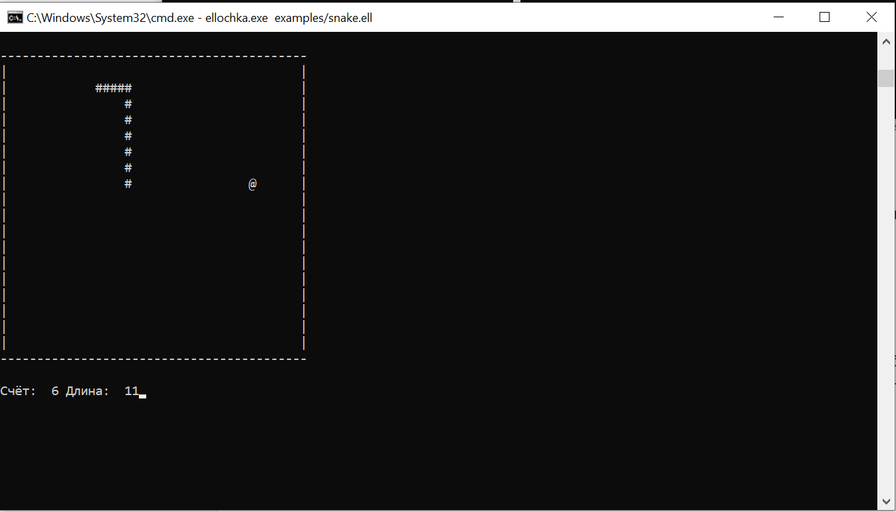
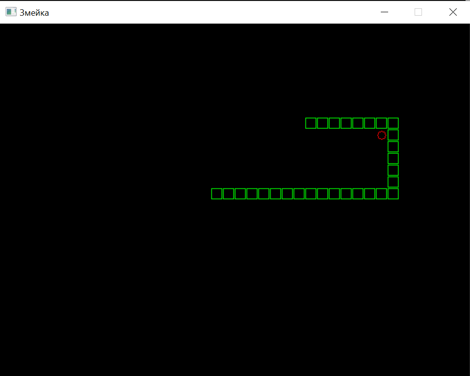
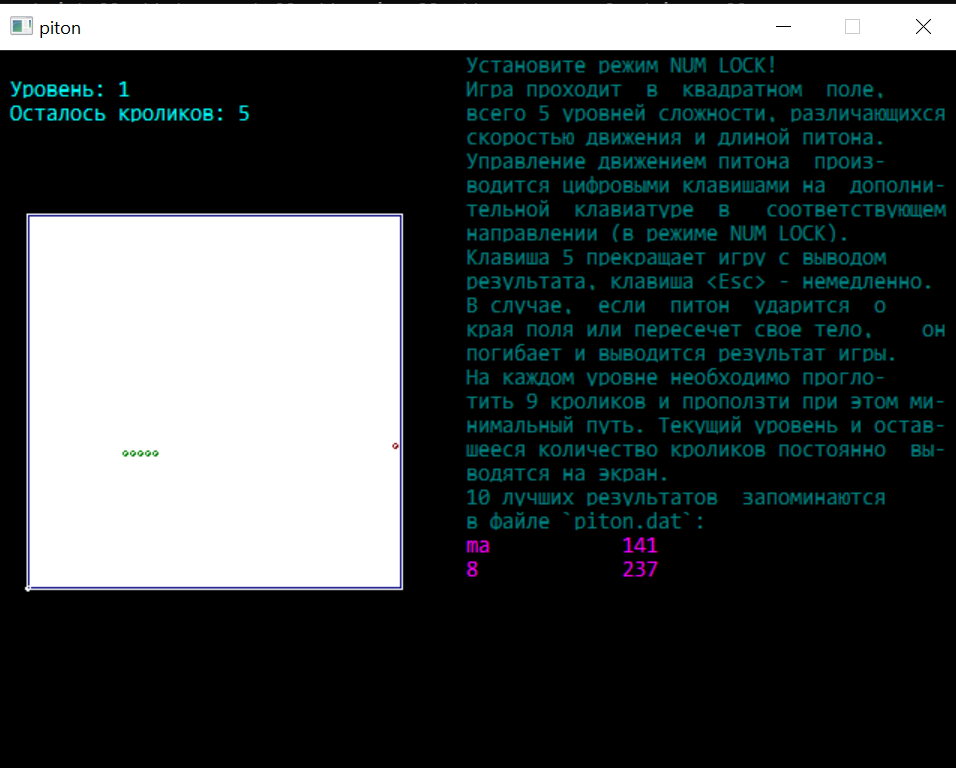
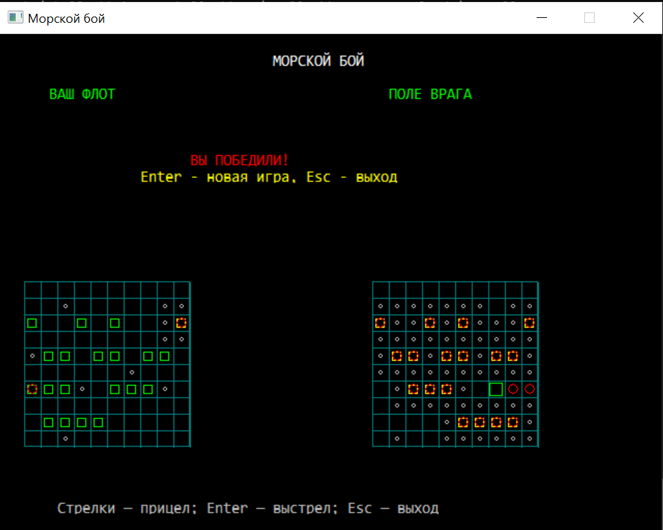

+++
title = "Как я перенёс интерпретатор «Эллочка» из DOS в Windows на Zig"
draft = true
date = 2026-08-11
[taxonomies]
categories = ["zig"]
tags = ["ai", "zig", "ellochka", "dikar"]

+++

# Как я перенёс интерпретатор «Эллочка» из DOS в Windows на Zig

Я перенёс язык программирования **«Эллочка»** из DOS в современную Windows. Новая реализация написана на Zig и ориентирована на совместимость с интерпретатором **DIKAR v7**: текстовый и графический режимы, файлы, массивы, строки, управление выполнением и встроенные математические операторы.

**Исходный код:** [malexple/ellochka-zig](https://github.com/malexple/ellochka-zig)

## Что такое «Эллочка»

«Эллочка» — интерпретируемый язык, созданный **Эрихом Генриховичем Гаузером** в Баку. Он задумывался как язык, доступный пользователю без специальной подготовки в программировании, но при этом получил возможности для прикладных и научных расчётов.

Язык поддерживает числовые и текстовые переменные, одномерные и двумерные массивы, работу с файлами, графику, переходы, математические функции и специализированные операции. В оригинальном описании определены **62 оператора** — системные, управляющие, файловые, графические, математические и другие.

- [Описание языка Ellochka](https://erichware.com/inform/ellochka.htm)
- [DIKAR v7 — оригинальный DOS-интерпретатор](https://erichware.com/inform/dikar.htm)

Оригинальный DIKAR v7 разрабатывался для MS-DOS в 1999–2001 годах. Он включал редактор, справку, пошаговый и командный режимы, диагностику ошибок и комплект примеров.https://erichware.com/inform/dikar.htm)

## Зачем переносить DOS-программу

Старые программы не обязаны исчезать только потому, что их исходная среда связана с DOS. Однако запуск исторической версии обычно требует DOS-окружения, а её поведение зависит от ограничений эпохи: DOS-совместимых файловых имён, текстового и VGA-графического режимов, кодировок и обработки клавиатуры.

Цель проекта — не заменить язык современным синтаксисом, а сохранить его поведение и дать исходным программам возможность работать в Windows без настройки эмулятора или виртуальной машины.

## Реализация на Zig

Интерпретатор написан на **Zig 0.16.0-dev**. В проекте реализованы все 62 оператора Эллочки, а оригинальная демонстрационная программа автора `sample.ela` выполняется от начала до конца.

Поддерживаются:

- числовые переменные, одно- и двумерные массивы;
- текстовые переменные и строковые операции;
- арифметические и строковые выражения;
- условные переходы `ESLI`, безусловные переходы `GOTO`, метки и относительные переходы;
- текстовый вывод, ввод с клавиатуры и файловые операции;
- графические операторы: точки, линии, прямоугольники, эллипсы, заливка и сохранение BMP;
- математические функции и специализированные операторы;
- исходный формат программ, включая ограничение до 75 символов в строке.

Особенность Эллочки — работа с массивами. Часть выразительности языка основана не на привычных циклах `for` и `while`, а на операциях над массивами и неявных циклах. Например, выражение может быть вычислено сразу для всех элементов массива.

## Встроенная математика

В язык изначально входили специализированные средства для расчётов — не отдельная библиотека, а часть синтаксиса и среды исполнения.

| Оператор | Назначение                                                |
| :------- | :-------------------------------------------------------- |
| `LIRA`   | Решение систем линейных алгебраических уравнений          |
| `POLI`   | Вычисление значения полинома                              |
| `DTRM`   | Вычисление определителя матрицы                           |
| `APRO`   | Полиномиальная аппроксимация методом наименьших квадратов |
| `REAK`   | Нелинейная реакционная модель                             |
| `NTGR`   | Численное интегрирование                                  |
| `TRAN`   | Решение нелинейной системы уравнений                      |
| `USER`   | Пользовательская модель аппроксимации                     |

Авторский архив содержит примеры решения уравнений, аппроксимации, построения графиков, расчётов с комплексными числами, файловых утилит и игр:

- [Архив программ на Эллочке](https://erichware.com/inform/elafiles.htm)

## Примеры: от расчётов до игр

В репозитории есть каталог [examples](https://github.com/malexple/ellochka-zig/tree/master/examples) с программами для проверки и изучения реализации.

Два наглядных примера:

- [snake.ell](https://github.com/malexple/ellochka-zig/blob/master/examples/snake.ell) — игра «Змейка» в текстовом режиме;
- [snake_graphics.ell](https://github.com/malexple/ellochka-zig/blob/master/examples/snake_graphics.ell) — графическая версия игры.

Они полезны не только как демонстрации. Текстовая «Змейка» проверяет обработку клавиатуры, экранный вывод, условия, переходы и переменные. Графическая версия дополнительно проверяет графический режим и рисование.

Текстовая версия проверяет ввод с клавиатуры, экранный вывод, переменные, условия и переходы. Графическая — дополнительно тестирует рисование и обработку графического режима.

## 

Эти примеры показывают, что Эллочка применялась не только для расчётов. На её основе можно было создавать и интерактивные графические программы.

## Совместимость важнее косметики

Перенести старый интерпретатор — не значит просто написать новую программу с похожим синтаксисом. Для совместимости важны порядок вычислений, допустимые формы операторов, массивы, строки, коды клавиш, графические координаты и реакция на ошибки.

Поэтому проект ориентирован на оригинальное описание языка и демонстрационные программы автора. Следующий этап — расширять проверку на оригинальных программах и отдельных тестах операторов, чтобы выявлять и устранять различия в поведении.

## Автор и исходники

Автор языка — **Гаузер Эрих Генрихович**. Информация об авторе: [hauserich.vgd.name](https://hauserich.vgd.name).

- [Материалы автора о языке](https://erichware.com/litvor/elacompw.htm)
- [Оригинальное описание языка](https://erichware.com/inform/ellochka.htm)
- [Исходный код реализации на Zig](https://github.com/malexple/ellochka-zig)

Если у вас есть старые программы на Эллочке, примеры, документация или вы обнаружили отличие от DIKAR, создайте issue или pull request в [репозитории проекта](https://github.com/malexple/ellochka-zig).

## Исходный код и участие

Исходный код Windows-реализации Эллочки на Zig, примеры программ и инструкции по сборке доступны в GitHub-репозитории:

**[github.com/malexple/ellochka-zig](https://github.com/malexple/ellochka-zig)**

Если у вас есть старые программы на Эллочке, документация или найдено отличие от поведения DIKAR v7, откройте issue или pull request в репозитории.