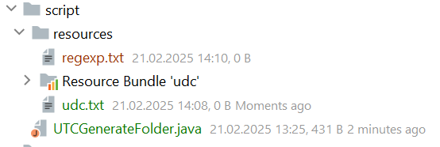
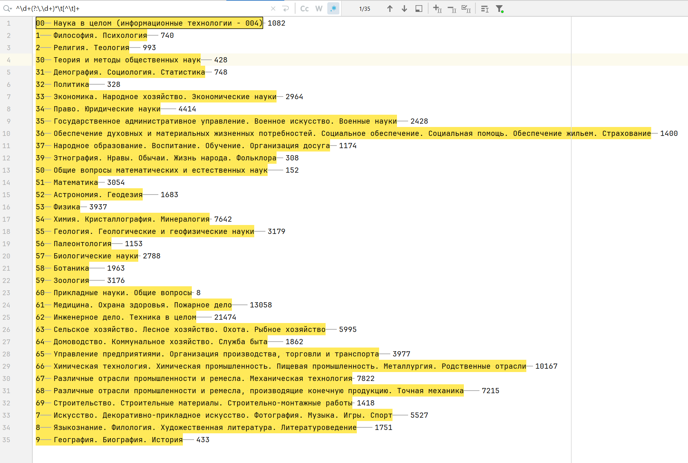
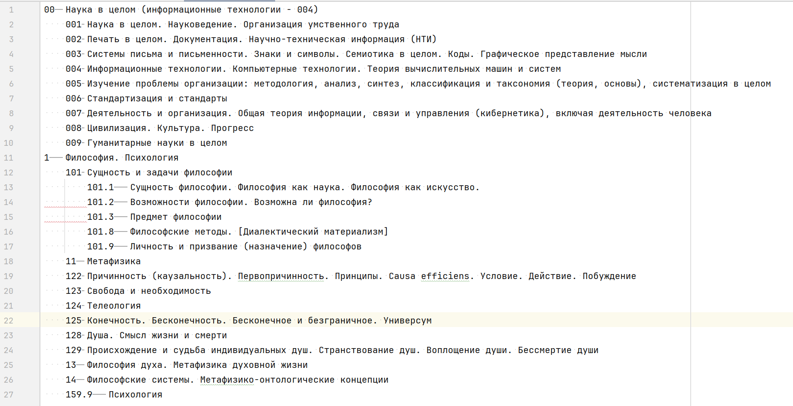
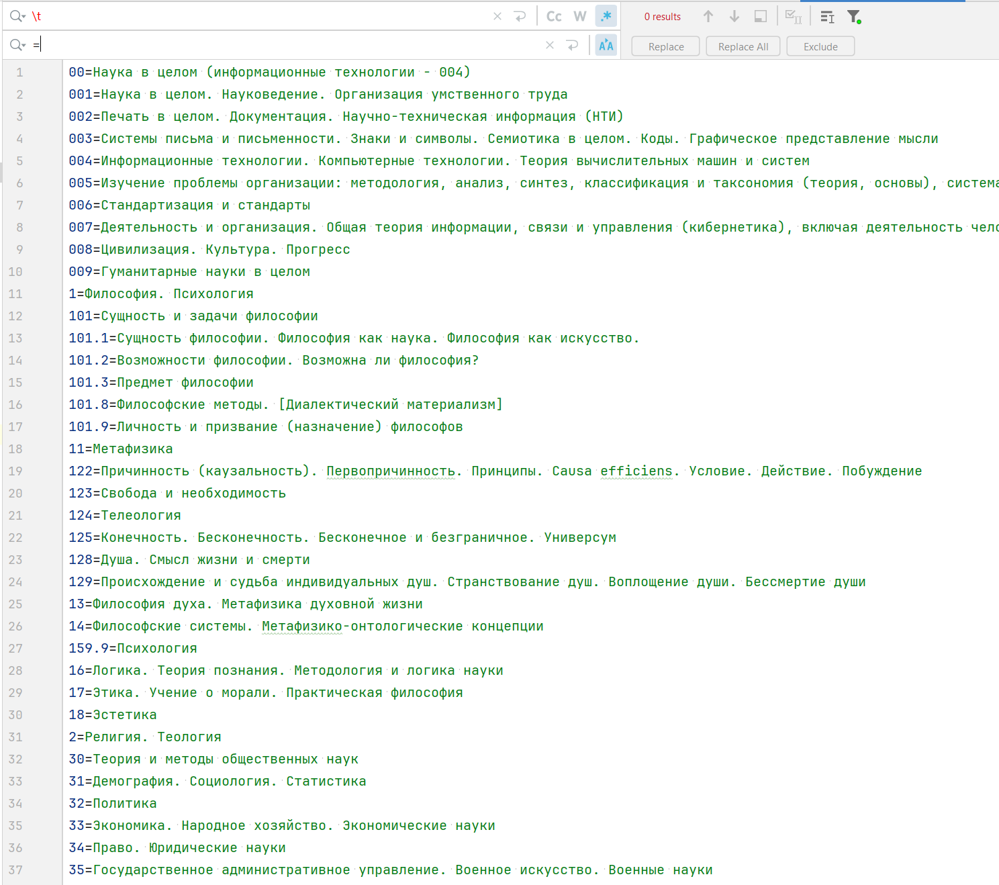
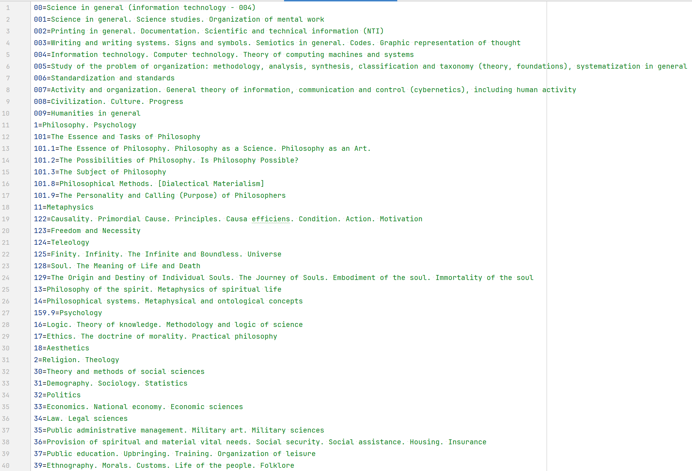

+++
title = "Пишем скрипт для генерации папок по УДК"
draft = false
date = 2025-02-21
[taxonomies]
categories = ["java"]
tags = ["java", "book", "udk"]
+++

## УДК
УДК - универсальная десятичная классификация. Используется во всём мире для систематизации произведений науки, литературы и искусства, периодической печати

## Идея 
Идея заключается в создании структуры папок для упорядочивания электронных книг в формате pdf, djvu. Цель состоит лишь как-то упорядочить информацию. И если есть возможность идти по самому простому варианту, мы будем идти самым простым путем.

## Какую проблему решает
1. Файлы лежат в упорядоченном виде по соответствующему разделу науки или техники
2. Можно упорядочить не только книги, а и иную документацию 
3. Легче найти то что ищешь

## Техническое задание
1. Скрипт должен уметь создавать структуру папок
2. Параметрами должно управляться создание вложенных каталогов и без вложенности
3. Параметрами должен задаваться некий формат названий папок
   * [Номер УДК][Полное название]
   * [Полное название]
   * [Краткое название]
   * [Номер УДК][Краткое название]
   * [Язык][Номер УДК][Краткое название]
   * [Год][Номер УДК][Краткое название]
4. Название папок могут создаваться на любом языке
5. Список УДК с названиями должен быть представлен одним файлом в виде иерархии без бд
6. Скрипт может создавать требуемую структуру папок по определенному коду УДК 

## Проблемы
Именование папок имеет свои ограничения по символам. Поэтому при создании мы эти символы будем отбрасывать.
Книга так же может принадлежать не одному разделу, а нескольким. К этой проблеме вернемся позже, когда будем добавлять файл в требуемую папку.
Решений несколько:
- создавать ссылки на книги
- создать отдельную программу с бд и поиском по УДК
- помещать книгу в первый папку из списка принадлежности УДК


## Создание скрипта
1. Создадим папку script. 
2. В папке создадим файл **UTCGenerateFolder.java**
3. В папке мы создадим папку с ресурсами **resources**, в которой будут храниться переводы УДК кодов. Файлы которых легко можно будет перевести любым доступным онлайн переводчиком, если потребуется.
4. Создадим udc.txt в котором мы будем хранить иерархическую структуру УДК

Для заполнения udc.txt воспользуемся ресурсом https://www.teacode.com/online/udc/. В папке с проектом создадим еще один файл regexp.txt



Переходим на сайт https://www.teacode.com/online/udc/ и копируем страницу. Выделенный текст вставляем в regexp.txt. Далее чтобы не заниматься лишними действиями, составим регулярное выражение, которое будет выделать то, что нам нужно.
Для выделения по регулярному выражению я использую Idea Community Edition.
Регулярное выражение выглядит так: **^\d+(?:\.\d+)*\t[^\t]+** 
Само регулярное выражение, я попросил составить нейросеть. Это заняло не больше 10 минут, с повторными запросами и экспериментами.

Чтобы выделить нужный нам текст нажимаем Ctrl+Alt+Shift+J или соответствующую кнопку с правой стороны от регулярного выражения.

Далее переходим в следующий раздел на сайте https://www.teacode.com/online/udc/00/00.html и так же копируем текст и вставляем в regexp.txt с последующим выделением нужного текста и вставки в udc.txt
У меня получилась следующая структура, которую при желании можно дополнить. Или оставить, только то что нужно.


### Создадим переводы для папок
В папке **resources** создадим пока три файла: **udc.properties**, **udc_ru_RU.properties**, **udc_en_EN.properties**
В файл udc_ru_RU.properties вставляем текст из udc.txt и заменяем знаки табуляции, на знак равенства

Названия папок для локали ru_RU готовы. Пропускаем текст через google translate для локали en_EN получаем следующее: 


### Пишем скрипт выводящий пару переводов в консоль

````java
import java.util.Locale;
import java.util.ResourceBundle;

public class UTCGenerateFolder {
    public static void main(String[] args) {
        Locale locale = Locale.getDefault();
        ResourceBundle rb = ResourceBundle.getBundle("resources/udc", locale);
        System.out.println(rb.getString("00"));
        System.out.println(rb.getString("004"));
        System.out.println(rb.getString("008"));
    }
}
````

Запускаем в консоли командой:  
```cmd
java .\UTCGenerateFolder.java
Наука в целом (информационные технологии - 004)
Информационные технологии. Компьютерные технологии. Теория вычислительных машин и систем
Цивилизация. Культура. Прогресс
```

### Пишем скрипт создания папок

````java
import java.io.*;
import java.util.ArrayList;
import java.util.List;
import java.util.Locale;
import java.util.ResourceBundle;

public class UTCGenerateFolder {
    public static void main(String[] args) throws IOException {
        Locale locale = Locale.getDefault();
        ResourceBundle rb = ResourceBundle.getBundle("udc", locale);
        System.out.println(getFolderName(rb, "00"));
        System.out.println(getFolderName(rb, "00.004"));
        System.out.println(getFolderName(rb, "00.008"));

        Class clazz = UTCGenerateFolder.class;
        InputStream inputStream = clazz.getResourceAsStream("/udc.txt");
        String data = readFromInputStream(inputStream, rb);
        System.out.println(data);
    }

    private static String readFromInputStream(InputStream inputStream, ResourceBundle rb)
            throws IOException {
        StringBuilder resultStringBuilder = new StringBuilder();
        List<String> pathNames = new ArrayList<>();
        try (BufferedReader br = new BufferedReader(new InputStreamReader(inputStream))) {
            String line;
            int level = 0;
            while ((line = br.readLine()) != null) {
                String udcCode = line.replaceAll("\\t[^\\t]+$", "");
                if (udcCode.startsWith(" ")) {
                    level = udcCode.split(" {4}").length - 1;
                    udcCode = udcCode.replaceAll(" ", "");
                } else {
                    level = 0;
                }
                if (rb.containsKey(udcCode)) {
                    String folderName = getFolderName(rb, udcCode);
                    String directoryPath = generateFolderPath(folderName, pathNames, level);

                    File directory = new File("test" + directoryPath);
                    boolean directoryCreated = directory.mkdir();

                    if (directoryCreated) {
                        System.out.println("Directory created successfully at: " + directoryPath);
                    } else {
                        System.out.println("Failed to create directory. It may already exist at: " + directoryPath);
                    }
                    pathNames.add(level, folderName);

                } else {
                    System.out.println("folderName not in resources: " + udcCode);
                }
                resultStringBuilder.append(line).append("\n");
            }
        }
        return resultStringBuilder.toString();
    }

    private static String generateFolderPath(String folderName, List<String> pathNames, int level) {
        StringBuilder result = new StringBuilder();
        for (int index = 0; index < level-1; index++) {
            result.append("\\").append(pathNames.get(index));
        }
        return result.append("\\").append(folderName).toString();
    }

    private static String getFolderName(ResourceBundle rb, String udcCode) {
        String folderName = rb.getString(udcCode);
        folderName = folderName.replaceAll(":","").replaceAll("/*","")
                .replaceAll("/\"","").replaceAll("//","")
                .replaceAll("\\?","").replaceAll("\"","")
                .replaceAll("/|","").replaceAll("<","").replaceAll(">","");
        return folderName;
    }
}
````