+++
title = "Автоматизируем работу в KeePass."
draft = true
date = 2026-09-22
[taxonomies]
categories = ["KeePass"]
tags = ["keepass", "automation"]
+++

Я уже долгое время работаю в IT и проблема паролей, как мне думается, является если не главной, то уж точно важной.
Количество сервисов растет. И нужно каждый день заходить и авторизовываться в jira, confluence, opensearch, grafana, nexus и другие сервисы. Каждый раз водить логины и пароли. А если еще политики компаний таковы, что пароль должен быть меньше 12 символов или другие правила, хочется все это дело автоматизировать. 
Обычный пользователь сохранит пароли в браузере. Это удобно, но только до той поры пока не придется пароль поменять. И придется на каждый вход вводить снова и сохранять. 
Есть готовые расширения для браузеров с облачным хранением, но большие компании не могут позволить утечку учеток или паролей.
И с точки зрения безопасности хранение паролей в браузере считается не надежной практикой:

**1. Уязвимость к вредоносному ПО (Info-Stealers)**
   Существует целый класс вредоносных программ (например, RedLine, Raccoon Stealer), которые специально созданы для кражи данных из браузеров.
**2. Физический доступ к устройству**
   Если кто-то получит физический доступ к вашему разблокированному компьютеру или телефону, он сможет зайти в настройки браузера и просмотреть сохраненные пароли. Во многих браузерах для просмотра пароля требуется ввести только пароль учетной записи ОС (который злоумышленник может уже знать, если устройство разблокировано), а иногда и это не требуется.
**3. Риски синхронизации**
раузеры предлагают синхронизировать пароли между устройствами через облако (например, через аккаунт Google, Microsoft или Apple). Если злоумышленник получит доступ к этому аккаунту (например, через фишинг или утечку данных), он автоматически получит доступ ко всем вашим сохраненным паролям на всех устройствах.
**4. Угроза фишинга**
Хотя браузеры стараются проверять совпадение доменов, механизмы автозаполнения иногда могут быть обмануты. Злоумышленники могут создать сайт, визуально идентичный настоящему, с похожим доменом.
**5. Отсутствие сквозного шифрования (Zero-Knowledge)**
Многие браузеры шифруют пароли, но ключи шифрования хранятся локально на том же устройстве и привязаны к учетной записи ОС.
**6. Проблемы на общих устройствах**
Если вы используете общий компьютер (дома или на работе) и забываете выйти из своего профиля браузера, любой другой пользователь может получить доступ к вашим сохраненным учетным данным.

Есть специальные менеджеры паролей (Bitwarden, 1Password, KeePass, KeePassXC и др.).
Перспективно выглядит Bitwarden популярный менеджер паролей с открытым исходным кодом, который использует модель сквозного шифрования (zero-knowledge) и можно установить свой сервер. 
Это хорошо, но есть старичёк, который является уже классическим приложением для хранения паролей. 
Да у него нет сервера изначально программа не задумывалась как серверный вариант. Но как локальный менеджер паролей отличная программа. И что самое удивительное во многих крупных компаниях это разрешенное приложение для установки. 
Далее опишу, то как я настраиваю KeePass для работы и с чем сталкивался в компаниях которых работал. 

## Проблема доменных учётных записей
Представьте себе ситуацию: вы работаете в крупной компании у вас один корпоративный логин/пароль и куча сервисов куда можно ходить. 
Раз в три месяца или чаще пароль нужно поменять. И тут вы столкнетесь с проблемой: 
Вы меняете доменный пароль, потом вам нужно или в браузере обновить все пароли или в keepass, а если есть еще настройки в maven, gradle и docker поменять и там. 
Я раньше обновлял все ключи в KeePass а потом создал один ключ, а в остальных ключах использую ссылки на основной.
Тогда нужно поменять всего один ключ, а остальные поменяются автоматически. 
Сделать это можно двумя способами:
**Способ первый:**
Необходимо создать основной ключ я его называю corporateAccount
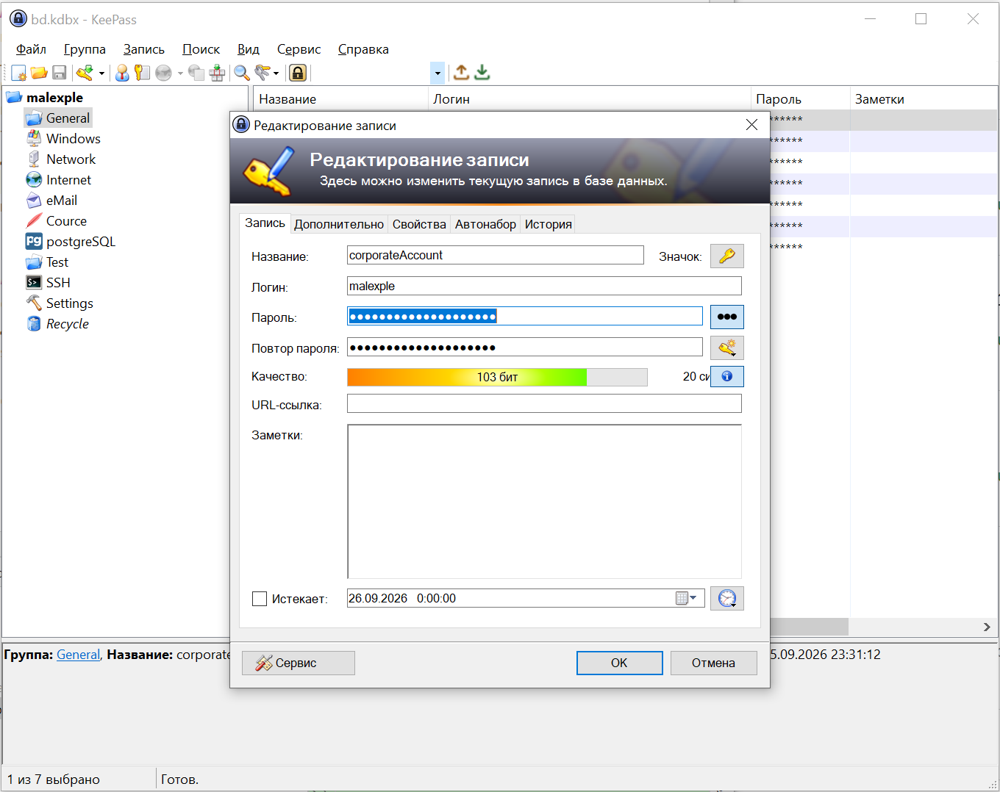
Потом выделяете основной ключ правой кнопкой мыши и выбираете: **"Дублировать запись..."**
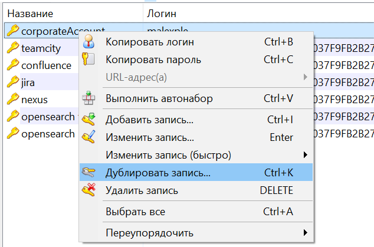
И в появившемся окне выбираете: **"Заменять логины и пароли ссылками"**
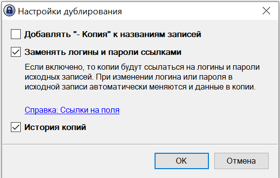
Вам только остается прописать название ключа и ссылку (URL) от сервиса


**Способ второй:**
Данный способ подойдет, если у вас уже созданы ключи. Вам нужно просто указать ссылку на пароль от основного ключа.
Но сделано это в KeePass на мой взгляд не очевидно. Вам необходимо зайти в режим редактирования ключа. Удалить пароль и оставить курсор в нем.

И в левом нижнем углу нажать **Сервис -> Вставить ссылку на поле -> В поле "Логин"**
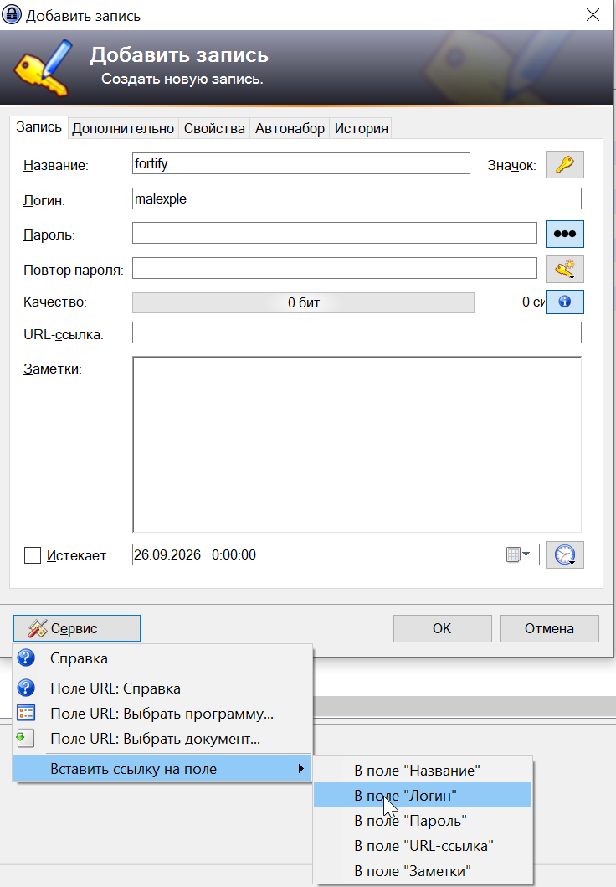
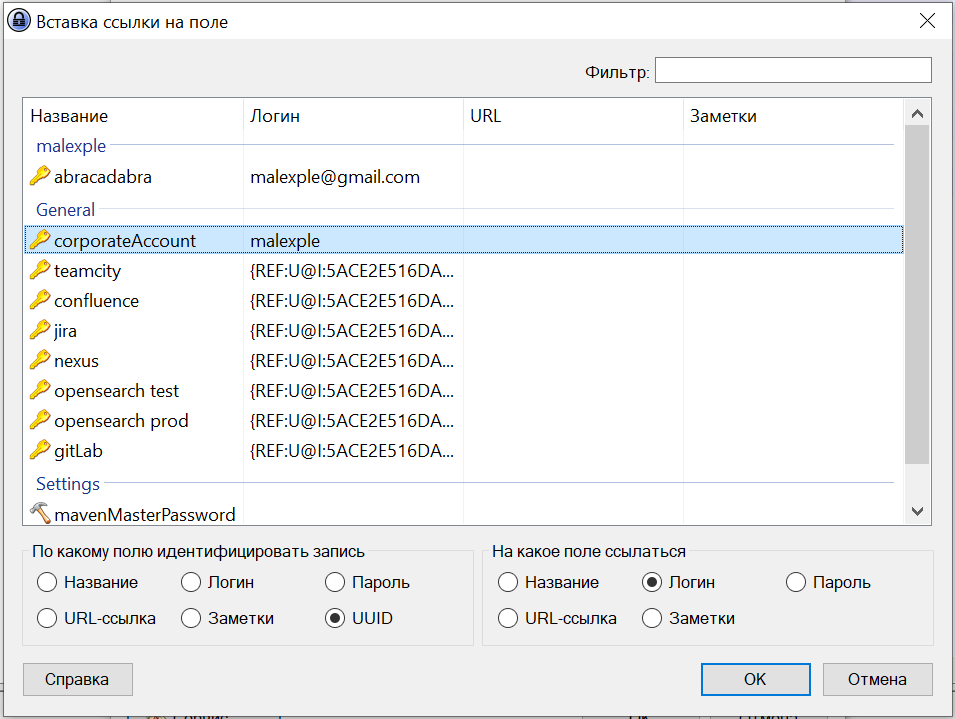
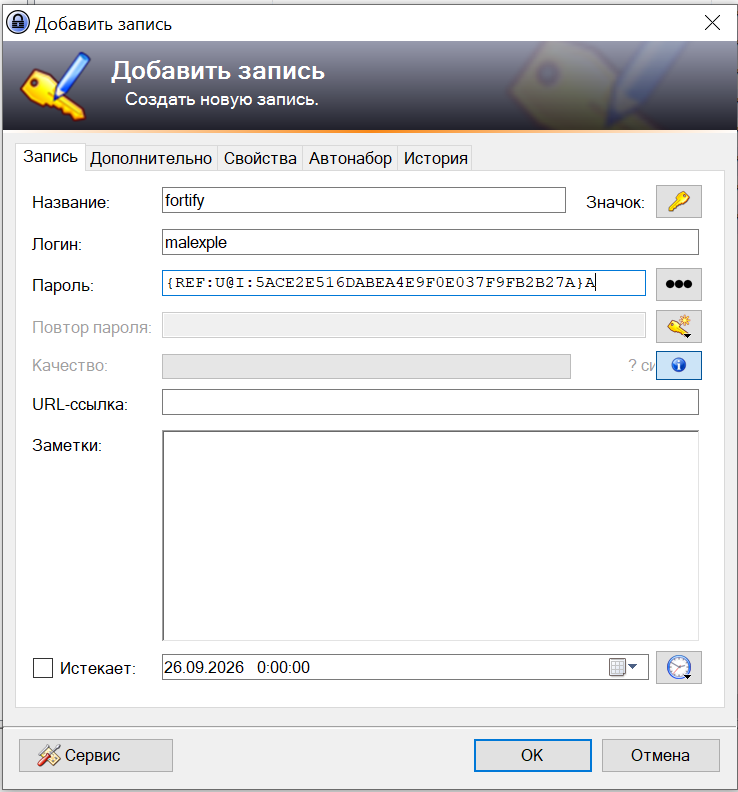

**Примечание:**
Первый способ будет работать и для KeePassXC, а вот со вторым способом у меня не получилось.
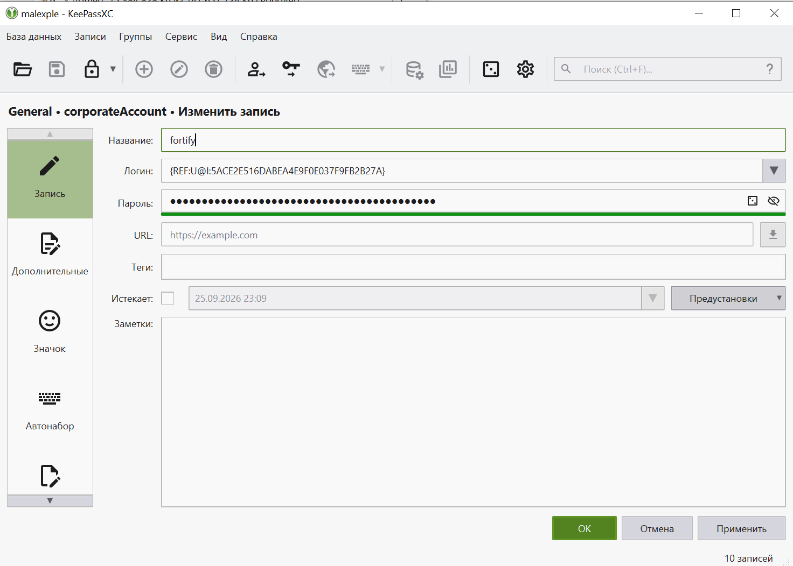

## Проблема автозаполнения паролей в браузерах.
Раньше я пользовался LastPass. Компания в которой я работал тогда, на уровне руководства рекомендовала использовать LastPass или 1Password. На тот момент я работал с Salesforce. 
И там было просто дикое количество учеток. Требовалось зайти то под одним тестовым пользователем, то под другим. Сменялся заказчик, сменялись тестовые пользователи.
Периодически логин и пароль нужно было передать коллегам. 
KeePass у меня стоял, но я не использовал тогда для автозаполнения паролей в браузере. Но потом открыл для себя плагин KeePassHttp https://keepass.info/plugins.html#keepasshttp. 
Если честно до сих пользуюсь данным плагином. Но этот плагин считается устаревшим. Но он позволяет настроить автозаполнение паролей в браузере.
Для локального использования самое то. Но в браузер нужно ставить дополнительное расширения для того чтобы автозаполнение работало.
Для KeePass для разных браузеров свои плагины. Для chrome
ChromeKeePass https://microsoftedge.microsoft.com/addons/detail/chromeipass/dkgmkepjipcjobloimdljpghopceidgh?hl=ru
И для KeePassSC KeePassXC-Browser https://chromewebstore.google.com/detail/keepassxc-browser/oboonakemofpalcgghocfoadofidjkkk?hl=ru&utm_source=ext_sidebar

В KeePass в папку плагина копируем KeePassHttp
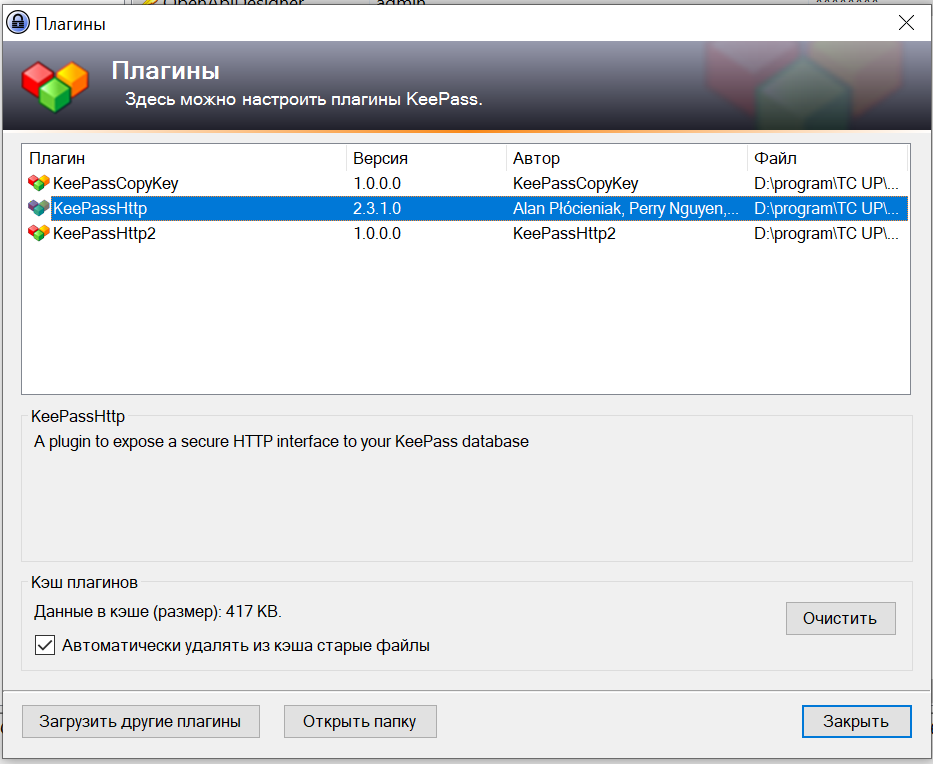

При первом запуска вам будет предложено установить соединение с keepass
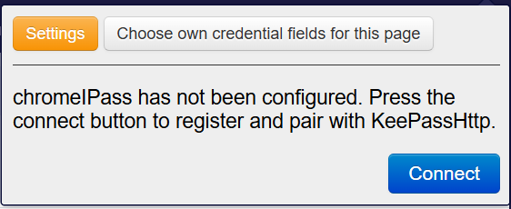
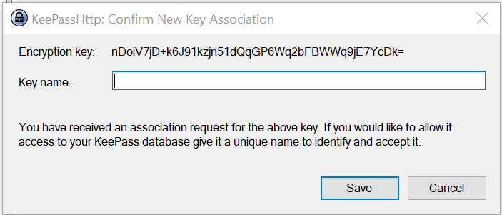
В KeePass будет создан ключ со строковым полем AES Key: keepasshtp 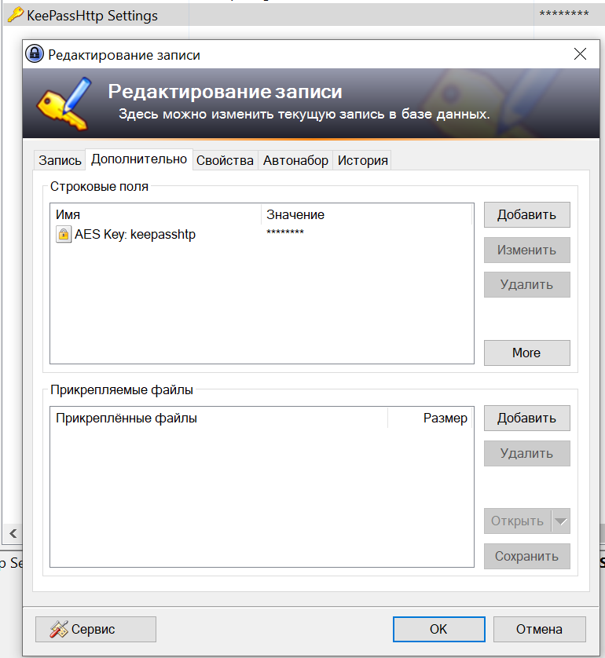
Далее можно создать несколько учеток для тестового стенда 
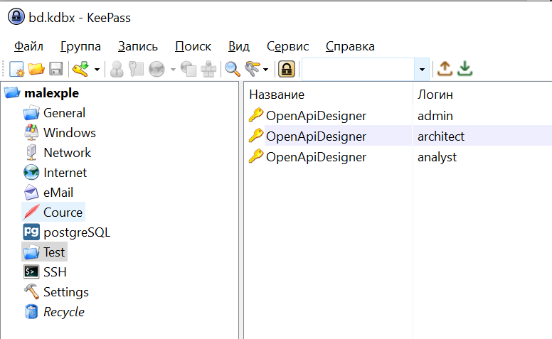
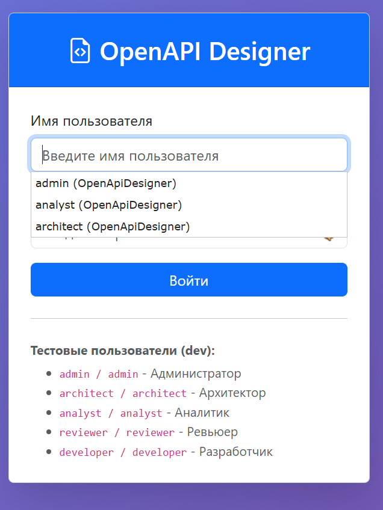
Если будет только одна учетка логин и пароль будет заполнен сразу, но перед этим выскочит окошко с предложением подтвердить и сохранить выбор.
Если учеток несколько для одного URL, то можно выбирать нужную учетку. Удобно когда у тебя несколько тестовых пользователей и периодически приходится переключаться между ними.

В KeePassXC аналогично. Только там немного более безопасный протокол передачи данных.

## Проблема автозаполнения паролей в MAVEN 
Данная операция не частая, но каждый раз хотел это автоматизировать. Ты меняешь пароль в KeePass и ждешь чтобы он поменялся и в maven.
В Maven есть механизм генерации хешей. У меня была инструкция, чтобы генерировать хеши, а если ты торопился, то указывал в settings.xml пароли в явном виде. Что совсем не хорошо. 
В общем мне это надоело и я написал скрипт. Для него не требуются админские права. Кладете как GenerateMavenHashAndUpdate.java c 11 java можно запустить не компилируя.
На вход скрипт ждет мастер пароль, потом корпоративный пароль и пути к settings.xml и settings-security.xml

```java
import java.io.IOException;
import java.nio.charset.StandardCharsets;
import java.nio.file.Files;
import java.nio.file.Path;
import java.nio.file.Paths;
import java.security.SecureRandom;
import java.util.Base64;
import java.util.regex.Matcher;
import java.util.regex.Pattern;

import javax.crypto.Cipher;
import javax.crypto.SecretKey;
import javax.crypto.SecretKeyFactory;
import javax.crypto.spec.GCMParameterSpec;
import javax.crypto.spec.PBEKeySpec;
import javax.crypto.spec.SecretKeySpec;

public class GenerateMavenHashAndUpdate {

   private static final String KDF_ALGORITHM    = "PBKDF2WithHmacSHA256";
   private static final String CIPHER_TRANSFORM = "AES/GCM/NoPadding";
   private static final int    KEY_BITS         = 256;
   private static final int    ITERATIONS       = 10_000;
   private static final int    SALT_BYTES       = 8;
   private static final int    IV_BYTES         = 16;
   private static final int    TAG_BITS         = 128;

   public static void main(String[] args) {
      if (args.length < 4) {
         System.err.println(
                 "Использование: GenerateMavenHashAndUpdate <masterPassword> <domainPassword> " +
                         "<settings.xml> <settings-security.xml>");
         System.exit(1);
      }

      String masterPassword = args[0];
      String domainPassword = args[1];
      Path   settingsPath   = Paths.get(args[2]);
      Path   securityPath   = Paths.get(args[3]);

      try {
         if (masterPassword == null || masterPassword.isEmpty()) {
            throw new IllegalArgumentException("masterPassword пуст");
         }
         if (domainPassword == null || domainPassword.isEmpty()) {
            throw new IllegalArgumentException("domainPassword пуст");
         }
         if (!Files.exists(settingsPath)) {
            throw new IllegalArgumentException("Файл не найден: " + settingsPath);
         }
         if (!Files.exists(securityPath)) {
            throw new IllegalArgumentException("Файл не найден: " + securityPath);
         }

         // 1. Мастер-хеш: мастер-пароль шифруется сам собой → в settings-security.xml
         String masterHash   = "{" + encrypt(masterPassword, masterPassword) + "}";
         // 2. Доменный хеш: доменный пароль шифруется мастер-паролем → в settings.xml
         String domainHash   = "{" + encrypt(domainPassword, masterPassword) + "}";

         System.out.println("[GenerateMavenHashAndUpdate] masterHash = " + masterHash);
         System.out.println("[GenerateMavenHashAndUpdate] domainHash = " + domainHash);

         // 3. Обновляем <master> в settings-security.xml
         updateMaster(securityPath, masterHash);
         System.out.println("[GenerateMavenHashAndUpdate] Обновлён <master>: " + securityPath);

         // 4. Обновляем ВСЕ <password> в settings.xml
         int n = updateAllPasswords(settingsPath, domainHash);
         System.out.println("[GenerateMavenHashAndUpdate] Обновлено <password>: " + n +
                 " в " + settingsPath);
      } catch (Exception e) {
         System.err.println("[GenerateMavenHashAndUpdate] Ошибка: " + e.getMessage());
         e.printStackTrace();
         System.exit(100);
      }
   }
   
   //  Шифрование: PBKDF2(HMAC-SHA256) + AES-GCM, формат Maven
   private static String encrypt(String plaintext, String masterPassword) throws Exception {
      SecureRandom rnd = new SecureRandom();
      byte[] salt = new byte[SALT_BYTES];
      byte[] iv   = new byte[IV_BYTES];
      rnd.nextBytes(salt);
      rnd.nextBytes(iv);

      PBEKeySpec spec = new PBEKeySpec(
              masterPassword.toCharArray(), salt, ITERATIONS, KEY_BITS);
      byte[] keyBytes = SecretKeyFactory.getInstance(KDF_ALGORITHM)
              .generateSecret(spec)
              .getEncoded();
      SecretKey key = new SecretKeySpec(keyBytes, "AES");

      Cipher cipher = Cipher.getInstance(CIPHER_TRANSFORM);
      cipher.init(Cipher.ENCRYPT_MODE, key, new GCMParameterSpec(TAG_BITS, iv));
      byte[] ct = cipher.doFinal(plaintext.getBytes(StandardCharsets.UTF_8));

      byte[] combined = new byte[salt.length + iv.length + ct.length];
      System.arraycopy(salt, 0, combined, 0, salt.length);
      System.arraycopy(iv,   0, combined, salt.length, iv.length);
      System.arraycopy(ct,   0, combined, salt.length + iv.length, ct.length);

      return Base64.getEncoder().encodeToString(combined);
   }
   
   //  Замена ВСЕХ <password>...</password> в settings.xml
   private static int updateAllPasswords(Path settingsPath, String newValue) throws IOException {
      String content = Files.readString(settingsPath, StandardCharsets.UTF_8);

      Matcher m = Pattern.compile("<password>[\\s\\S]*?</password>").matcher(content);
      StringBuilder sb = new StringBuilder();
      int count = 0;
      while (m.find()) {
         m.appendReplacement(sb,
                 Matcher.quoteReplacement("<password>" + newValue + "</password>"));
         count++;
      }
      m.appendTail(sb);

      if (count == 0) {
         throw new IllegalStateException(
                 "В " + settingsPath + " не найдено ни одного <password>");
      }

      Files.writeString(settingsPath, sb.toString(), StandardCharsets.UTF_8);
      return count;
   }
   
   //  Замена <master>...</master> в settings-security.xml
   private static void updateMaster(Path securityPath, String newValue) throws IOException {
      String content = Files.readString(securityPath, StandardCharsets.UTF_8);

      Matcher m = Pattern.compile("<master>[\\s\\S]*?</master>").matcher(content);
      if (m.find()) {
         String updated = content.substring(0, m.start())
                 + "<master>" + newValue + "</master>"
                 + content.substring(m.end());
         Files.writeString(securityPath, updated, StandardCharsets.UTF_8);
         return;
      }

      // Если был самозакрывающийся <settingsSecurity/> — превращаем в парный
      Matcher root = Pattern.compile("<settingsSecurity\\s*/>").matcher(content);
      if (root.find()) {
         String updated = content.substring(0, root.start())
                 + "<settingsSecurity>\n  <master>" + newValue + "</master>\n</settingsSecurity>"
                 + content.substring(root.end());
         Files.writeString(securityPath, updated, StandardCharsets.UTF_8);
         return;
      }

      // Если <settingsSecurity></settingsSecurity> без <master> — вставляем внутрь
      Matcher open = Pattern.compile("<settingsSecurity\\s*>").matcher(content);
      if (open.find()) {
         int insertAt = open.end();
         String updated = content.substring(0, insertAt)
                 + "\n  <master>" + newValue + "</master>\n"
                 + content.substring(insertAt);
         Files.writeString(securityPath, updated, StandardCharsets.UTF_8);
         return;
      }

      throw new IllegalStateException(
              "В " + securityPath + " не найден <settingsSecurity>");
   }
}
```

Но чтобы все это дело было более безопасно мастер пароль будем хранить в KeePass.

В KeePass есть возможность задать триггеры и командой передать параметры в скрипт.


## Проблема паролей в Gradle

## Проблема паролей в файлах .env

## Хранение shh сертификатов и паролей