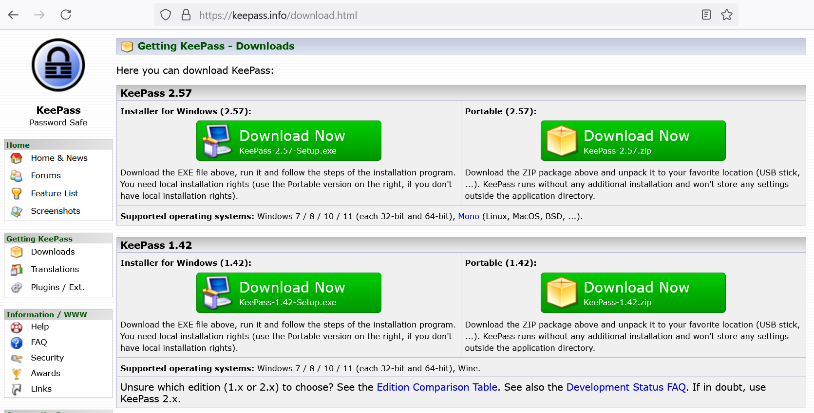
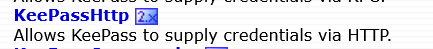
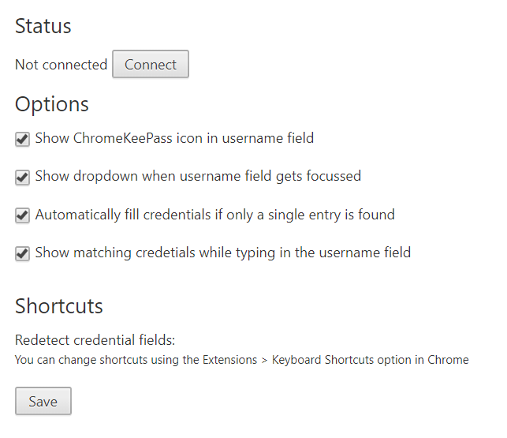
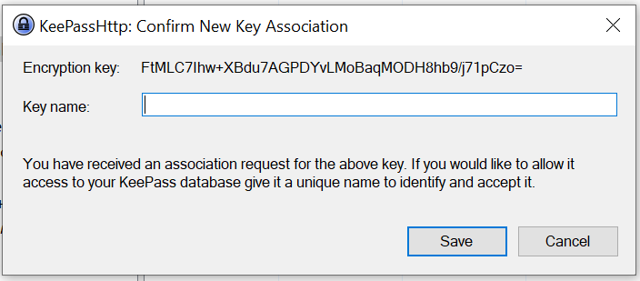
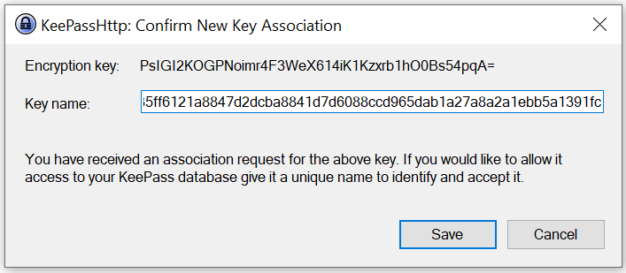
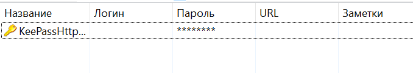
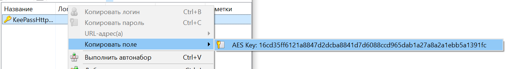
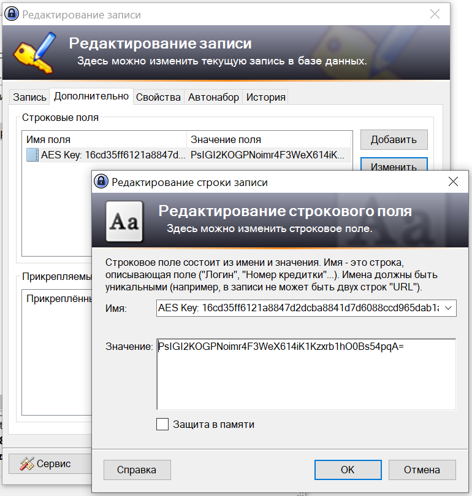

+++
title = "Настройка KeePass для браузера"
draft = false
date = 2024-08-21
[taxonomies]
categories = ["KeePass"]
tags = ["keepass", "automation"]
+++

1. Скачать KeePass на сайте разработчика [KeePass](https://keepass.info/download.html)

   

2. Скачать plugin **KeePassHttp** [тут](https://keepass.info/plugins.html)

    Данный плагин необходимо поместить в папку Plugins в папке с программой

3. Скачать расширение для браузера [ChromeKeePass](https://chrome.google.com/webstore/detail/chromekeepass/dphoaaiomekdhacmfoblfblmncpnbahm)

   

4. Если у вас иной браузер и он не поддерживает расширение ChromeKeePass можно поискать плагин позволяющий запускать chrome плагин.

   Для Opera:  [Install Chrome Extention](https://addons.opera.com/ru/extensions/details/install-chrome-extensions/)

5. Запускаем KeePass, запускаем браузер. Нажимаем на значек плагина. Откроется окно с настройками:

Нажимаем **Connect**

Вводим название ключа (даем любое имя).

В KeePass будет создан ключ 

Нажмите правой кнопкой на ключе  и скопируйте AES Key. Его необходимо добавить в пароли используемые для web страниц.

Создайте пароль или откройте меню изменения пароля, во вкладке **Дополнительно** добавьте строкое поле, вставив в поле скопированный AES Key. Важно иметь ввиду, что KeePass в буфере обмена хранит значения не больше 12 сек. Это нужно повторить для всех web паролей.

