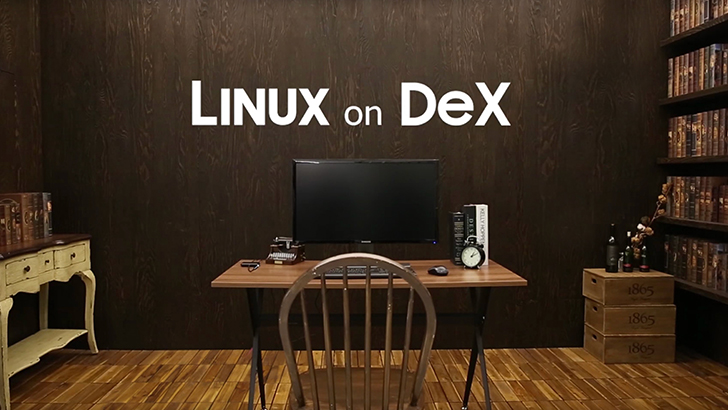
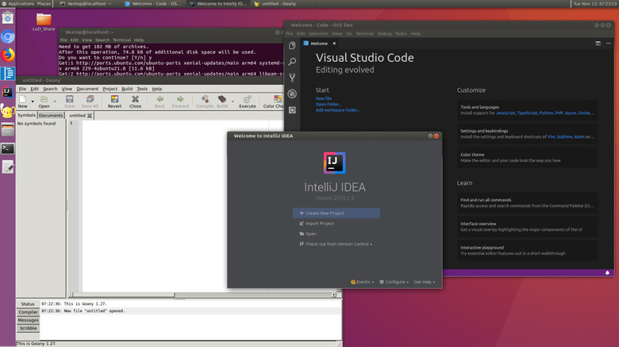

+++
title = "Linux on DeX: когда смартфон становится рабочей станцией"
draft = false
date = 2026-03-30
[taxonomies]
categories = ["dex"]
tags = ["dex", "linux_on_dex"]

+++

# Linux on DeX: когда смартфон становится рабочей станцией

Что если ваш смартфон мог бы заменить ноутбук — не эмулируя его, а запуская
настоящий Linux? Именно это обещал Samsung с проектом **Linux on DeX**.

## Что такое Samsung DeX

Samsung DeX (Desktop Experience) — режим работы флагманских Samsung-устройств,
при котором телефон подключается к монитору через HDMI или USB-C и превращается
в полноценный десктоп с оконным менеджером, панелью задач и поддержкой
клавиатуры с мышью.

Сам по себе DeX работает поверх Android — вы получаете Android-приложения
в оконном режиме. Но в 2018 году Samsung пошёл дальше.

## Linux on DeX: история проекта

На конференции SDC18 в декабре 2018 года Samsung совместно с Canonical
анонсировал **Linux on DeX** — возможность запускать полноценный дистрибутив
Linux прямо на смартфоне. В качестве базового дистрибутива был выбран Ubuntu.

Технически это была не виртуализация, а **контейнеризация**: Linux-окружение
работало поверх Android-ядра, разделяя с ним ресурсы без накладных расходов
гипервизора. При подключении к монитору через DeX пользователь получал
полноценный рабочий стол Ubuntu с оконным менеджером.

Поддерживались устройства: Galaxy S9, S9+, Note 9, Tab S4 и более новые модели.

## Что умел Linux on DeX

- **Терминал и командная строка** — полноценный bash, SSH, git
- **Компиляция кода** — разработчики запускали IDE и собирали проекты
- **Работа с файлами** — доступ к файловой системе Android из Linux и наоборот
- **Браузер** — Firefox ARM работал нативно
- **Переключение** — одна кнопка между Android и Linux без перезагрузки

Для разработчика в командировке это была революция: один девайс в кармане —
и телефон, и рабочая станция.

## Преимущества

### Мобильность без компромиссов
Флагманский смартфон 2018–2019 годов по мощности превосходил многие ноутбуки
среднего класса. Процессор Exynos 9810 / Snapdragon 845, 6–8 ГБ RAM —
достаточно для реальной разработки.

### Нативная производительность
Контейнеризация вместо виртуализации давала почти нулевые накладные расходы.
Linux-процессы работали напрямую на железе, а не внутри эмулятора.

### Единая экосистема
Файлы, буфер обмена, сеть — всё общее между Android и Linux. Скачал файл
в браузере Android — он сразу доступен в Linux-терминале.

### Полноценный ARM Linux
Не Termux, не урезанный BusyBox — настоящий Ubuntu с apt, systemd (в proot),
полным набором пакетов для ARM64.

## Недостатки

### Тепловой троттлинг
Главная проблема мобильного железа — охлаждение. При длительной компиляции
(5–10 минут) процессор начинал троттлить, производительность падала в 2–3 раза.
Телефон — не ноутбук, пассивное охлаждение не справлялось с пиковой нагрузкой.

### ARM-архитектура
В 2018–2019 годах экосистема ARM64 была значительно беднее x86. Часть
инструментов просто не имела ARM-сборок. Сегодня ситуация кардинально изменилась
благодаря Apple Silicon и распространению ARM-серверов — но тогда это был
реальный барьер.

### Только Samsung, только флагманы
Никакого open source, никакой возможности портировать на другие устройства.
Экосистема была полностью закрытой и зависела от одного вендора.

### Проект закрыт
В 2019 году Samsung тихо прекратил поддержку Linux on DeX.
Официальная причина не называлась. С выходом Android 10 проект перестал работать.
Сообщество до сих пор требует возрождения — но официального ответа нет.

## Почему это актуально в 2026

Идея не умерла — она эволюционировала:

- **Android 15** добавил нативную поддержку Linux-терминала через виртуальную
  машину (на Pixel-устройствах)
- **Сообщество** продолжает развивать proot-решения: Termux, UserLAnd и
  независимые проекты
- **ARM64 стал мейнстримом**: Apple Silicon, Raspberry Pi 5, серверы AWS Graviton —
  теперь Linux ARM64 пакеты есть для всего

Samsung закрыл официальный проект, но открыл дверь. И энтузиасты в неё вошли.

---

