+++
title = "Моделируем мир через тетраэдры"
draft = true
date = 2026-04-28
[taxonomies]
categories = ["qunat"]
tags = ["qunat"]
+++

Вы никогда не задумывались, что изучая квантовый мир, вы понимаете, что данный мир выглядит нереальным. 
Как будто кто-то из мира виртуального пытался построить мир физический со своими правилами и чудесами. 
Что если разгадка квантового мира кроется не в области физики или математики, а в области логики, философии, теории игр, а может быть и всего сразу при совмещении всех наук.
Что если вся сложность квантового мира была создана не сразу, а были сформулированы простые правила по которым и был запущен проект "Вселенная". 
Для чего я не знаю, но есть предположения. Что если тот кто создал вселенную сам обучается или просто проводит некий эксперимент. Помните Рика и Морти, где Рик создал мир и потом посещал его как бог.
Что если цель проекта "Вселенная" как раз посмотреть будет ли создан, тот кто создал вселенную и посмотреть как это будет создано. Что если уже был проект "Вселенная" и был создан собеседник или помощник для создателя.
Что если решение нужно искать не сверху вниз, а снизу вверх. В прошлой статье я пробовал понять квантовый мир, но с позиции сверху вниз. В этой статье я буду предполагать, придумывать, делать очень много допущений и буду сразу писать код и проверять. 
Проверять мы будем с уже открытыми явлениями и законами. 
Скажу сразу это не научная статья. Это лишь мысленный эксперимент.

**Начальные условия:**
Мы исходим из того что мы живем в виртуальном мире, как будто мы в компьютерной игре. У нас нет ничего кроме сознания. Все белое, нет границ, вы и себя не видите, а только осознаете. 
Все что вы осознаете и представляете по вашему желанию может появляться. Это ваш виртуальный мир где возможно все. И это все что у вас есть. Нет ничего кроме разума. 
Мы строим точки, точки соединяем в линии. Открываем для себя фигуры, квадраты, треугольники и другие фигуры. Потом строим трех мерные фигуры и возможно n-мерные, тут возможно все.
Потом вы начинаете складывать кубики, тетраэдры и прочие фигуры и строить из них другие фигуры. 
Мы берем каждую трехмерную фигуру и пробуем что-то с ней сделать.  
В данной статье остановимся на тетраэдре.

**Цель:** построить саможивущий мир на простых правилах.

## Предположение первое: что получиться если к каждой стороне тетраэдра прибавлять такой же тетраэдр, что мы получим:

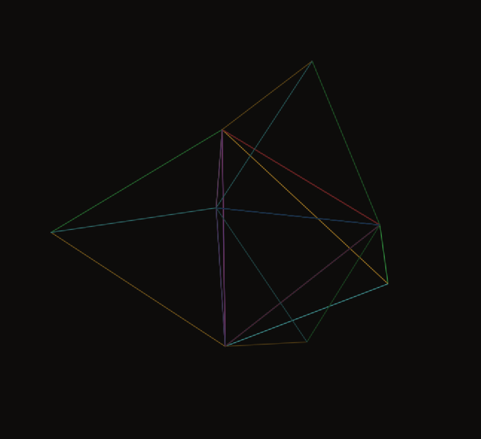
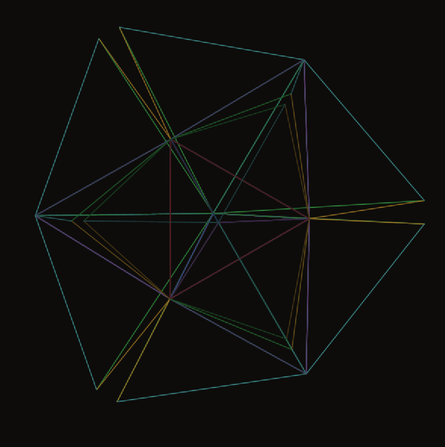

Уже на третьем шаге мы видим что есть зазоры. На четвертом будет более сложная фигура и те же зазоры. 
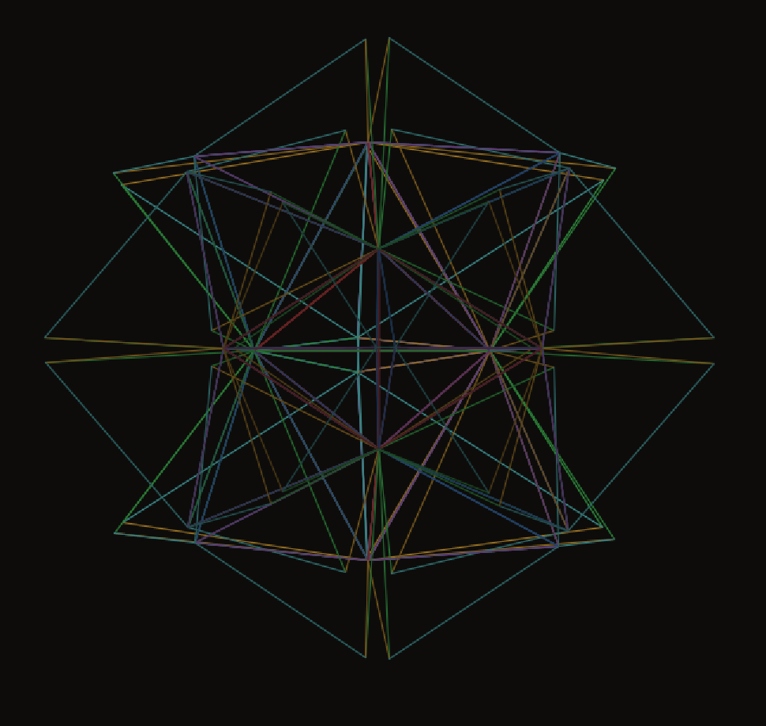
На последующих некий шар из тетраэдров
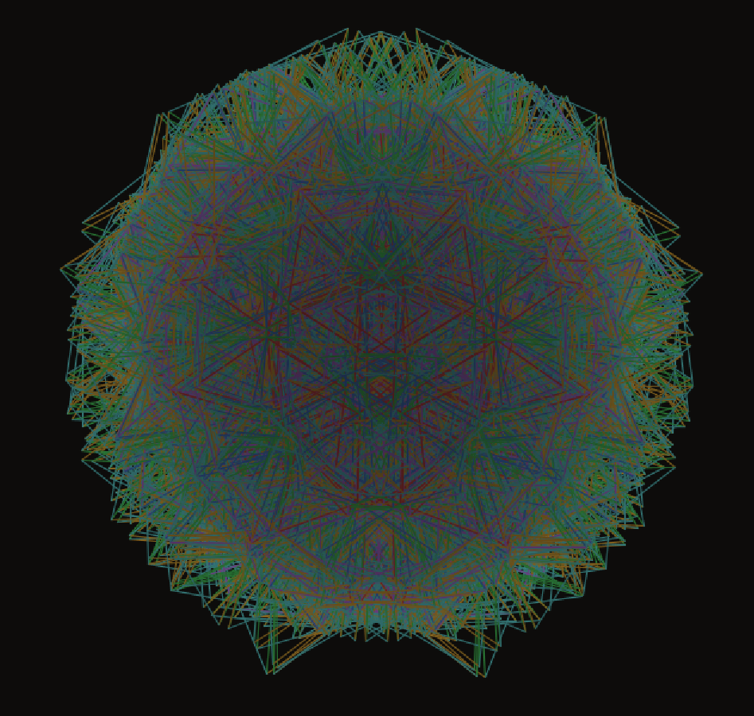

Заполненного пространства из тетраэдров без зазоров не получается.


## **Предположение второе:** Что если грани тетраэдра будут двигаться. Но не просто так, а по правилам: 

1. Фигура стремиться к правильному тетраэдру.
2. Грани могут растягиваться и сжиматься
   - Сжиматься до точки
   - Растягиваться не больше 2x. Если растянулся, то создаем новый тетраэдр
   - Разрывы и промежутки заполняются тетраэдром с последующим сжатием и растягиванием всей фигуры
3. Тетраэдры не могут появляться там где уже стоит другой тетраэдр только там где есть свободная сторона, то есть по границам.
4. Узлы не могут пройти через грани своего и соседнего тетраэдра

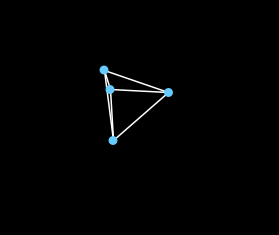


Но при моделировании вы непременно заходите внести еще пару параметров

1. **`k`** жёсткость пружины. Насколько сильно ребро тянет узлы к идеальной длине L₀. Чем больше — тем резче возврат.
2. **`L0 = 50.0`** — идеальная длина ребра. К этой длине каждое ребро стремится постоянно.
3. **`rng = new Random(42)`** — генератор случайных чисел с фиксированным числом. 
4. **`Lmax = 55.0`** — порог перерастяжения. Ребро длиннее этого значения считается "напряжённым"
5. **`fluctAmp = 1.2`** — амплитуда случайного толчка на каждом шаге.
6. **`damping = 0.90`** — коэффициент затухания скорости за шаг. При 0.90 узел каждый шаг теряет 10% скорости.

Что я получил. Я получил тетраэдр, который колеблется в пространстве. Но своим rng я заложил не деление тераэров по шагам, а запуск самоконструирования в некоем промежутке времени.

Но я допустил ошибку. У меня деление было не на свободных гранях, а везде я получил взрывной эффект
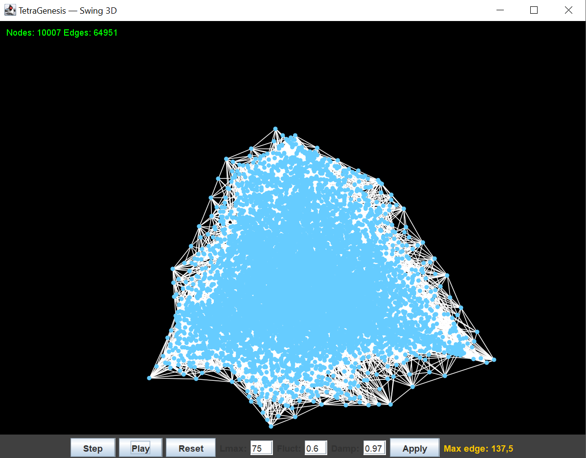
Потом стал думать и сверяться с фактами. Что мы знаем про расширение вселенной какой характер ее расширения. 
Все правильно линейный. И линейности мы можем добиться только по краям на свободных гранях тетраэдров. 
Возник вопрос, а может ли принимать впоследствии такое деление тетраэдров определенную форму? На этот вопрос думаю получим ответ чуть позже.

Следующие вопросы которые возникли играясь с параметрами. Как долго я буду играться параметрами может, стоит посмотреть что мы знаем и скоректировать значения.

## Факт 1: Квантовые системы консервативны

В квантовой механике эволюция унитарна — **энергия не теряется**. Диссипация появляется только при взаимодействии с макроскопической средой (декогеренция). На Планковском масштабе её нет.

**Вывод:** `damping → 1.0`, например `0.9999`

`damping = 0.90` — это 10% потери за шаг. За 20 шагов волна теряет `0.90²⁰ ≈ 12%` начальной амплитуды. **Стоячая волна невозможна** — она затухнет раньше чем сформируется.

## Факт 2: Планковские флуктуации малы но постоянны

Флуктуации вакуума существуют всегда (нулевые колебания), но их амплитуда мала по сравнению с длиной волны частицы. Они не взрывают пространство — они ей "дышат".

**Вывод:** `fluctAmp → маленькое, ~0.1–0.2`

Мои`1.2` — это слишком агрессивно для наблюдения структур. Флуктуации должны возбуждать, но не доминировать над пружинными силами.

## Факт 3: Стабильность частиц — исключительная

Протон живёт дольше 10³⁴ лет. Это значит паттерн должен удерживаться миллиарды миллиардов шагов. Это реально только если система почти консервативна.

**Вывод:** подтверждает `damping → 0.9999`

## Факт 4: Порог деления — Планковская длина

В петлевой квантовой гравитации объём пространства квантован. Минимальная ячейка — порядка планковского объёма. Новая ячейка рождается когда старая растянулась примерно на **10–20%**.

**Вывод:** `Lmax/L0 ≈ 1.1–1.2`, то есть `Lmax = 55–60` при `L0 = 50`

Мои`Lmax = 55` — **правильно**.

## Факт 5: Скорость волны = скорость света

В решётке скорость волны: `v ≈ √k · L0`. Если мы хотим "скорость света" = 1 ячейка за шаг:

```
text
√k · L0 = L0/dt  →  k = 1/dt² = 1/0.25 = 4
```

Мои`k = 0.3` даёт скорость ≈ `√0.3 · 50 ≈ 27` единиц за шаг — это ~0.54 скорости "света". **Можно оставить или увеличить до 1.0–2.0.**

Скорость света на самом деле может быть следствием. Эксперемнтируем с этим.

Что поменял:

| Параметр           | Сейчас | Экспериментальные | Основание                        |
| :----------------- | :----- | :---------------- | :------------------------------- |
| `damping`          | 0.90   | **0.9995**        | Унитарная эволюция               |
| `fluctAmp`         | 1.2    | **0.15**          | Малые вакуумные флуктуации       |
| `Lmax`             | 55     | **55–60**         | Оставить, логично                |
| `k`                | 0.3    | **1.0**           | Скорость волны                   |
| `L0`               | 50     | **50**            | Планковская единица              |
| `dt`               | 0.5    | **0.5**           | Планковское время                |
| `tensionThreshold` | 3      | **5–10**          | Медленнее расти, стабильнее сеть |

Меняем запускаем.

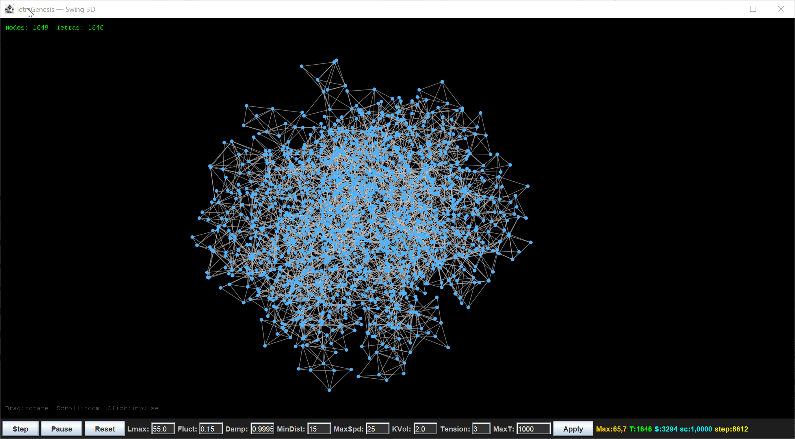![(image-20260430105150663.png)

Не получается какой то конкретной фигуры. Получается некий шар с отростками или ""щупальцами". Я как мог пытался избавиться от наложени щупальцев друг на друга и продумать построение новых тетраэров когда они находятся в близи. Но потом оставил это дело попвил что они не соприкасаются и не наезжают и решил посмостреть что получиться. 
Задался вопросом, а однородно ли квантовое поле? Тут не показано квантовое поле мы его не видим но косвенно ближе к тому, чир стремится к однородности но могут быть пустые области без квантовой материи.

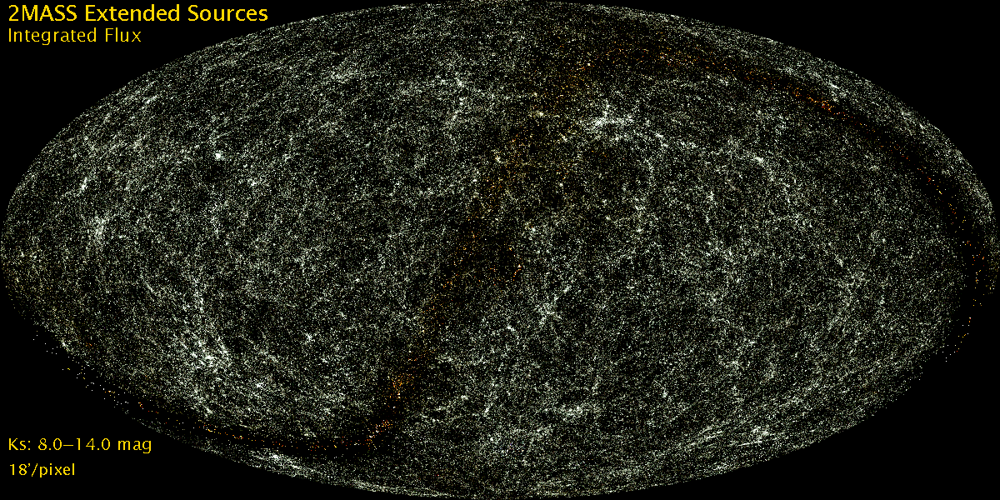

## Предположение третье: Если наше квантовое поле флуктуирует, то должны возникать стоячие волны. Это как раз и будут первые простые частицы. 

Я переписал немного код. Добавил логирование и попытался отпределять такие стоячие волны. Если запустить модель и попытаться дать небольшой импульс то могжет образоваться кратковрменная волна. Отмеченная зеленым цветом. Она не затухает на протяжении десятков шагов или тиков.
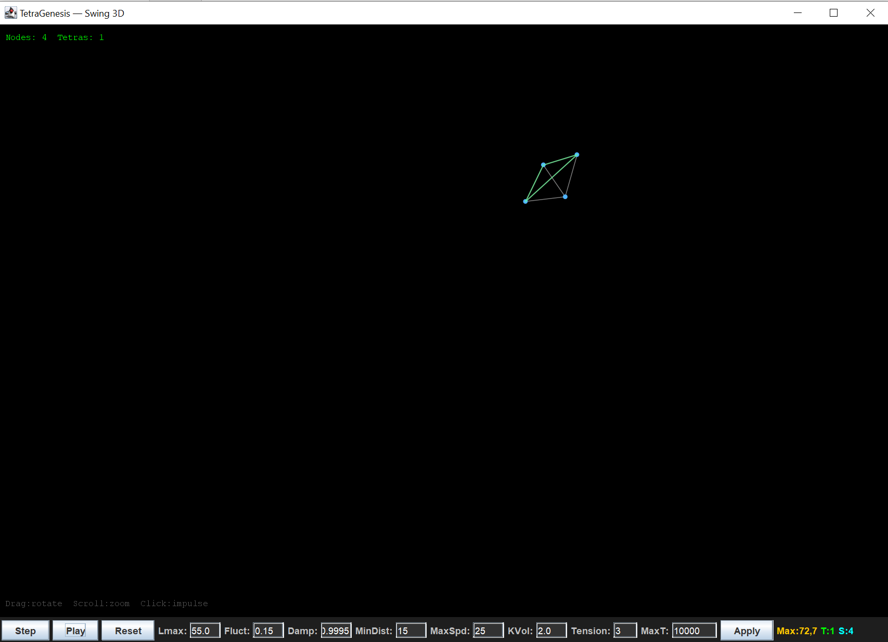 

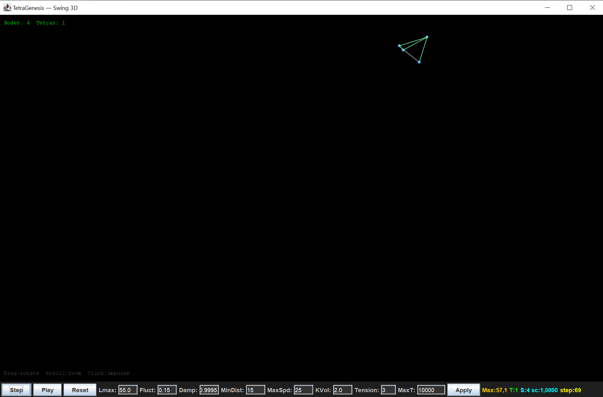

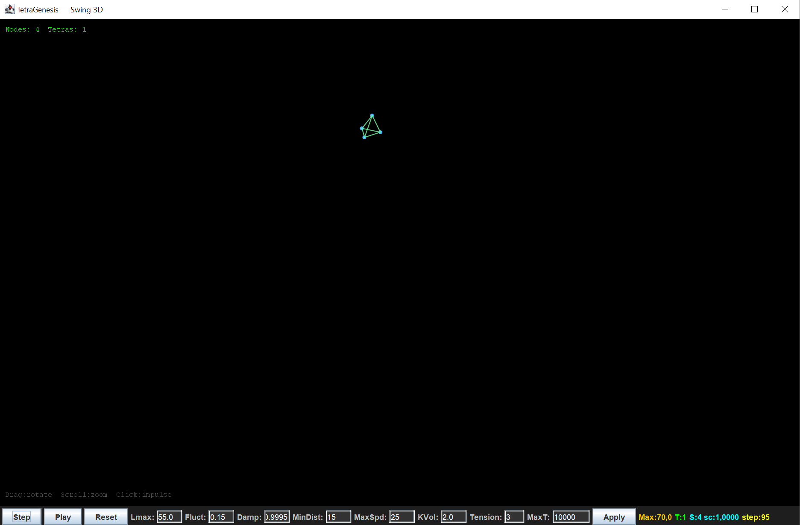

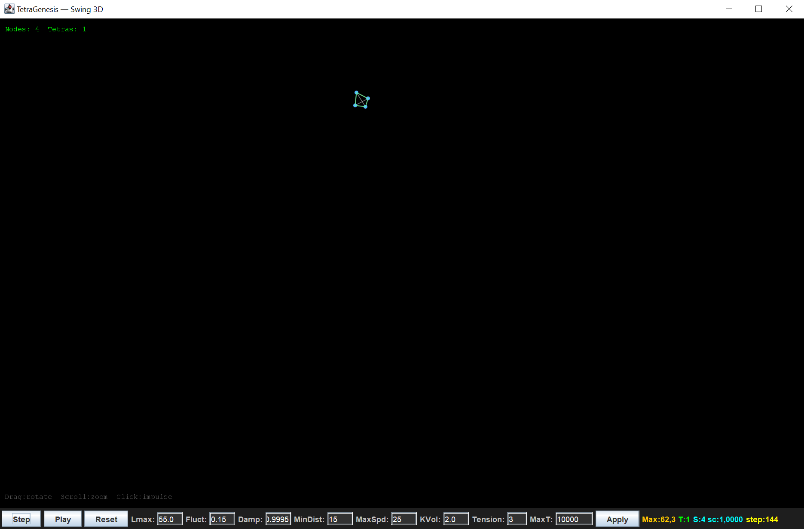

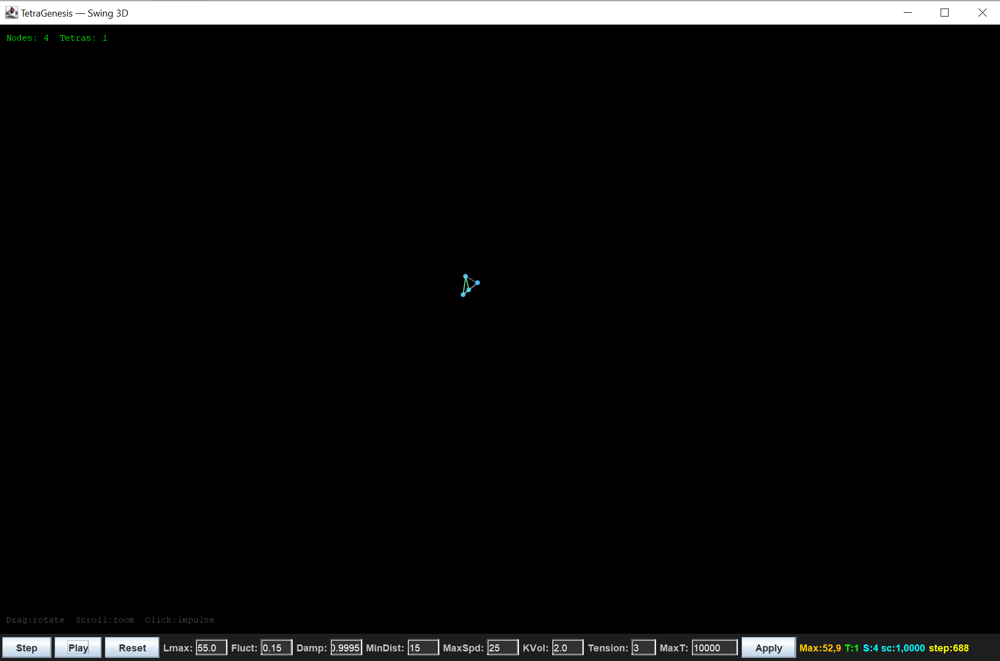

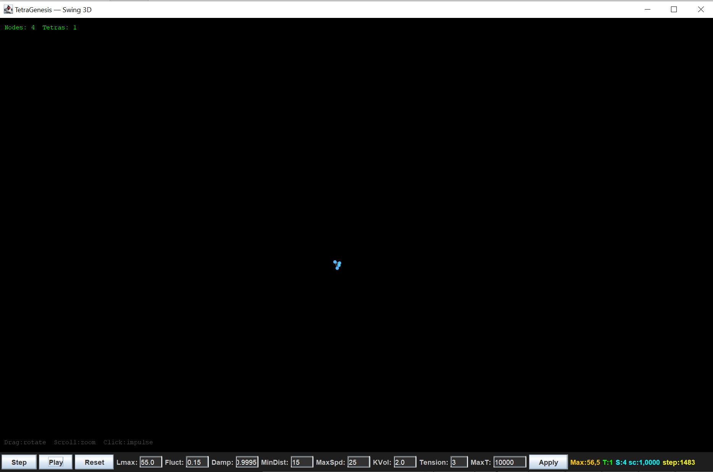

Колебания затухли примерно на 1483 шаге.


