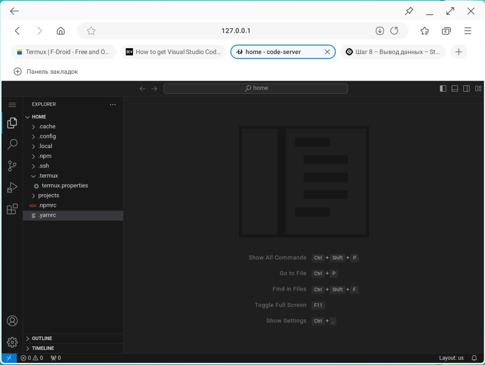
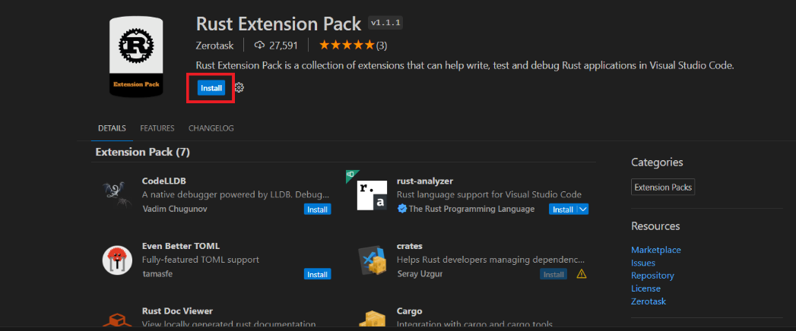
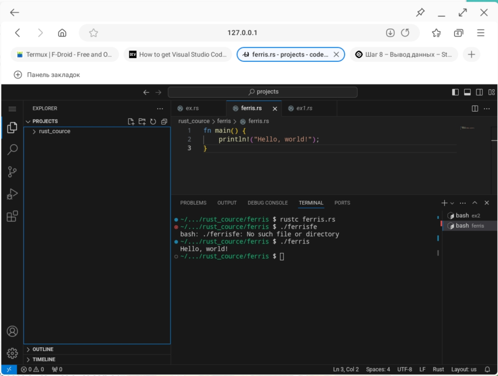

+++
title = "Программируем на rust в андроид в режиме dex."
draft = false
date = 2024-08-23
[taxonomies]
categories = ["dex"]
tags = ["rust", "dex", "termux"]

+++

Что нам понадобиться:
1. Termux https://f-droid.org/en/packages/com.termux/
2. Bluetooth клавиатура и мышка
3. Dex режим
4. Wifi или hdmi кабель с Type c -> hdmi
5. Браузер

Устанавливаем termux. И устанавливаем **Rust** и **VSCode**

## Установка Rust в termux 

```
pkg install rust
rustc --version
```


## Установка VSCode в termux

```bash
pkg install tur-repo
pkg install code-server
pkg install nodejs
pkg install yarn
pkg install build-essential
pkg install python
pkg install git
yarn global add code-server
code-server &
```

Пароль можно посмотреть командой в файле настроек 

```bash
cat ~/.config/code-server/config.yaml
```

Запускаем браузер по адресу: http://127.0.0.1:8080  вводим пароль и видим VSCode\



## Настройка раширений VSCode для работы с Rust

Для работы с **rust** ставим расширение **Rust Extension Pack**



На этом все. Я создал отдельную папку projects в которой создал папку rust_cource, где создаю отдельно папки по каждому заданию. Затем я перехожу в проект rust_cource. Это выглядит примерно так:



Для компиляции приложения использую команду:

```bash
rustc ferris.rs
```

Для запуска:

```bash
./ferris
```

Удачного прохождения курса.

## Дополнительные материалы

1.  https://dev.to/codeledger/how-to-get-visual-studio-code-to-run-in-termux-on-android-405j
2. https://www.geeksforgeeks.org/how-to-install-rust-on-termux/
3. https://stepik.org/lesson/1213908/step/2?auth=login&unit=1227174