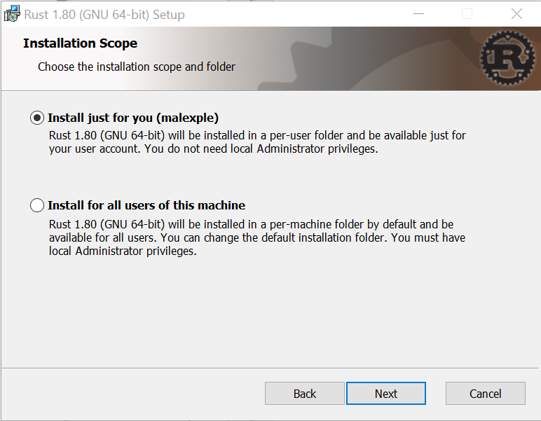
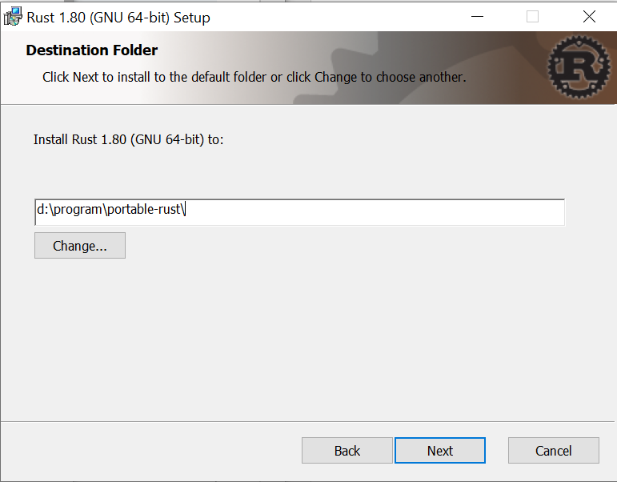
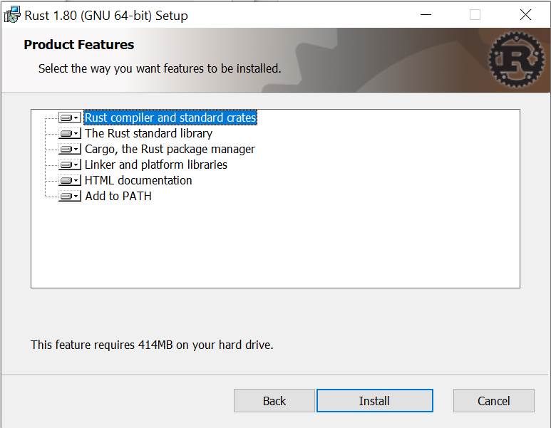
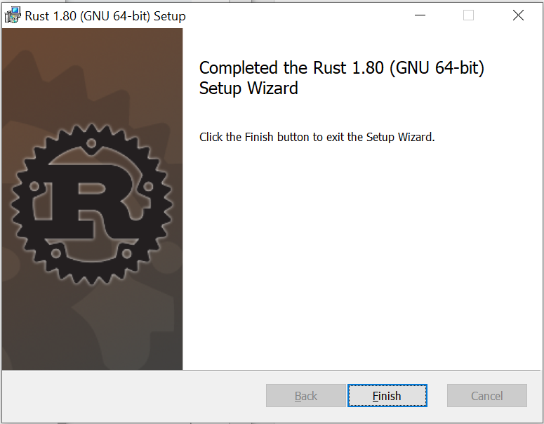
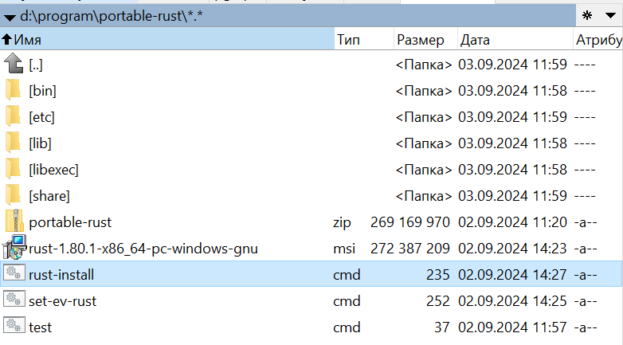
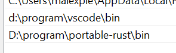
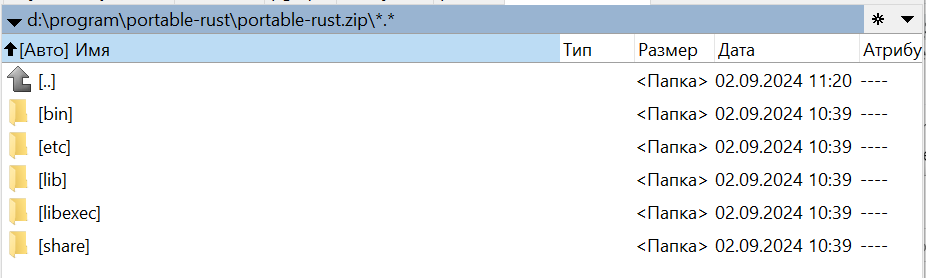
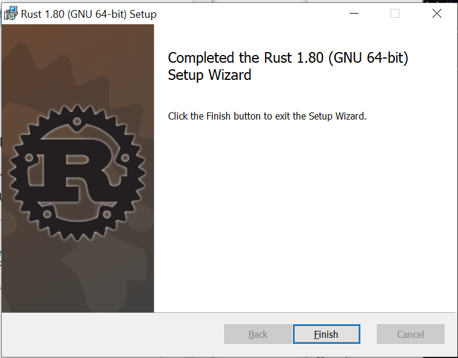
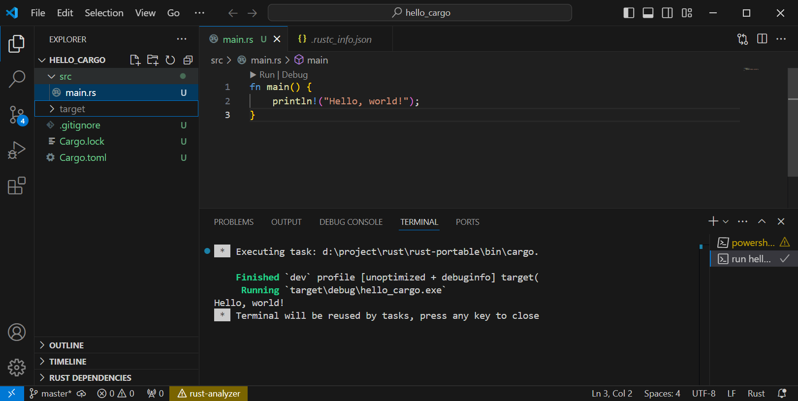

+++
title = "Rust portable"
draft = false
date = 2024-09-02
[taxonomies]
categories = []
tags = ["rust"]
+++

Представьте себе, что вы хотите попробовать программировать на rust, но при этом не устанавливать Rust в системе. Или у вас нет прав на установку. Или вы хотите, чтобы у вас был подготовленный проект в котором у вас все было настроено и вы могли просто скачать запустить скрипт и работать.


## Пишем скрипт установки Rust

Создаем папку **rust-portable** у меня она лежит по пути d:\program\portable-rust\

Создаем файл **rust-install.cmd**

```sh
rem скачиваем файл установки, если есть запускаем
if exist rust-1.80.1-x86_64-pc-windows-gnu.msi (
rust-1.80.1-x86_64-pc-windows-gnu.msi
) else (
curl.exe --output rust-1.80.1-x86_64-pc-windows-gnu.msi --url https://static.rust-lang.org/dist/rust-1.80.1-x86_64-pc-windows-gnu.msi
)
```
Запуститься exist rust-1.80.1-x86_64-pc-windows-gnu.msi выбираем Advanced.

Указываем путь, где будет лежать программа









После установки увидим 



По идее на этом все. Можно программировать. Если в терминале спросить версию, то будет выведено:

```sh
d:\program\portable-rust>rustc --version
rustc 1.80.1 (3f5fd8dd4 2024-08-06)
```

И в переменных среды буден добавлен путь d:\program\portable-rust\bin\



По идее распакованные файлы это и есть интересующие нас файлы. Но если мы их распакуем на отдельном пк, то ничего работать не будет, пока не пропишем в переменных среды.

## Создаем скрипт установки переменных среды

Создаем файл set-ev-rust.cmd в него помещаем следующие команды

```sh
setx DRIVE "%cd%"
setx RUST_HOME "%DRIVE%\rust"
setx RUST_PATH "%DRIVE%\bin"
setx MINGW_PATH "%cd%\MinGW"

setx PATH "%PATH%;%DRIVE%\bin;%MINGW_PATH%\bin;%MINGW_PATH%\msys\1.0\bin;%MINGW_PATH%\dll"
```

## MinGW

Есть проект на gitHub https://github.com/jonasstrandstedt/MinGW Без MinGW ничего собираться и работать не будет. 

Загрузим проект. И скопируем папку MinGW

## Помещаем файлы rust в zip



## Создаем проект на github

Так как на gitHub есть ограничение на размер файлов 100 Мб, а пушить 600 Мб не хочется. То мы помещаем папки по отдельным zip архивам

```sh
tar -a -c -f portable-rust_1.zip bin etc
tar -a -c -f portable-rust_2.zip lib libexec
tar -a -c -f portable-rust_3.zip share
```

Создаем отдельный скрипт install-pertable.cmd и помещаем следующие команды:

```sh
tar -xf portable-rust_1.zip
tar -xf portable-rust_2.zip
tar -xf portable-rust_3.zip
set-ev-rust.cmd
```

Данные команды просто распакуют архивы стандартными средствами windows

Проект выложил тут: https://github.com/malexple/rust-portable

## Удаляем Rust

Запускаем rust-1.80.1-x86_64-pc-windows-gnu.msi и выбираем пункт удалить.



Скачиваем проект с GitHub распаковываем и проверяем, что все прошло успешно.

## Пробуем написать первый проект

Создаем проект командой 

```sh
cargo new hello_cargo
```

Открываем в VSCode. Ставим Cargo Extension Pack. Открываем проект hello_cargo и можем запускать.



Сборку под USB опишу позже