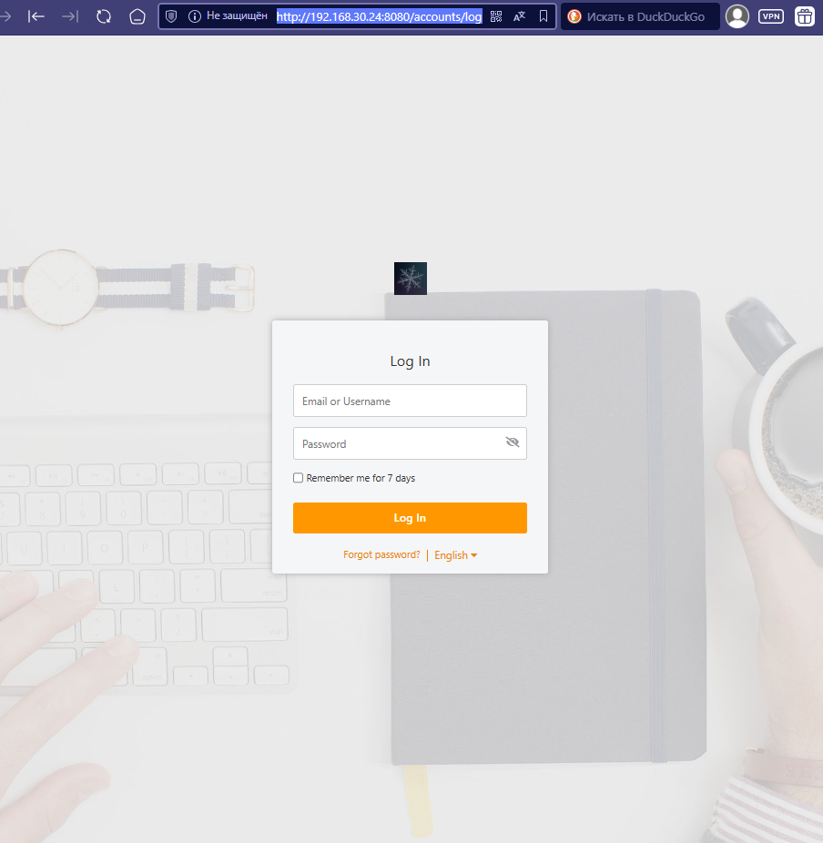
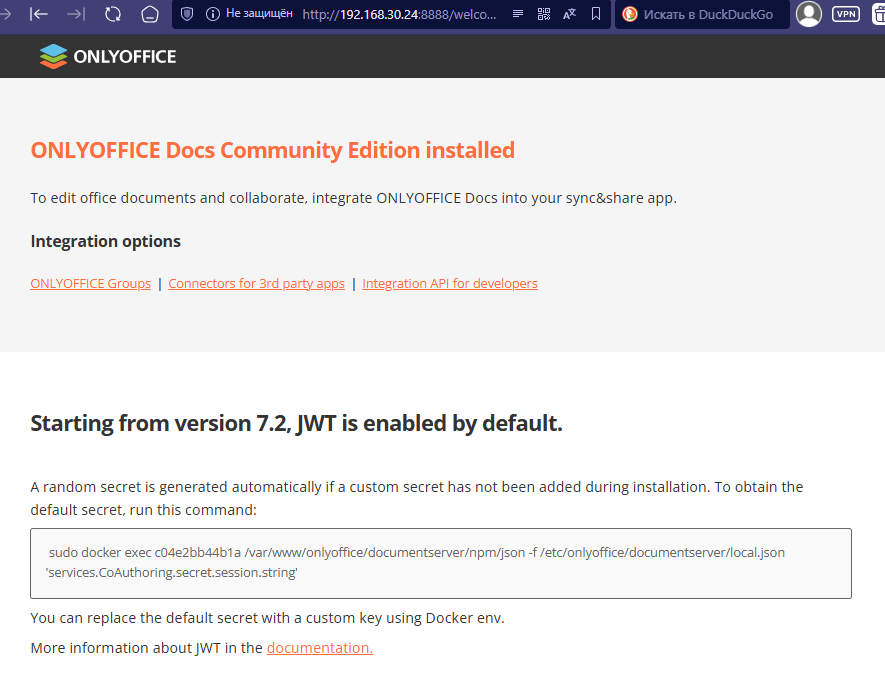
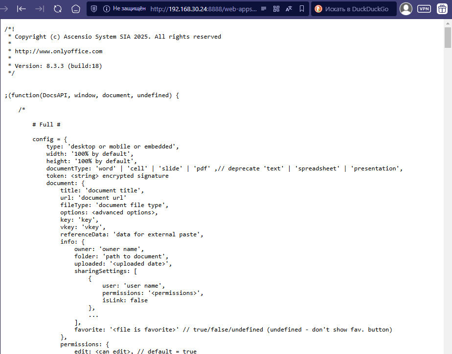
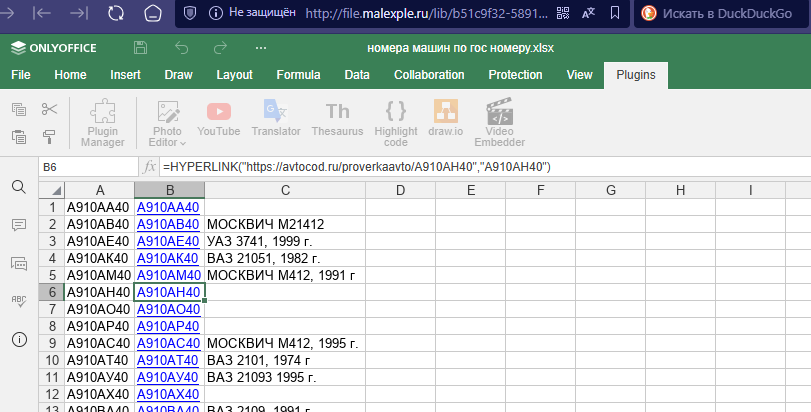

+++
title = "Seafile и совместное редактирование офисных документов"
draft = false
date = 2025-05-14
[taxonomies]
categories = ["docker"]
tags = ["seafile","onlyoffice"]
+++
 

Я уже как то поднимал сервис **seafile**, но у меня не открывались офисные документы в браузере. 
И хотелось бы иметь возможность редактировать офисные документы сразу в браузере. 
Так же хотелось, чтобы офисный документ можно было редактировать совместно с другим пользователем.
Решение было найдено **onllyoffice**

## Создаем docker-compose.yml

Мы поднимаем сервис **seafile** и **onllyoffice** на одной машине и поэтому нужно подумать как мы будем к нему ходить.
Наружу открыт 80 порт и 443. И **seafile** и **onllyoffice** работают на 80 порту. Будем в локальной сети в **seafile** ходить по порту 8080, 
а **onllyoffice** по порту 8888. А как ходить из вне, нужно будет прописать в nginx.

````yaml
version: '2.0'
services:
  db:
    image: mariadb
    container_name: seafile-mysql
    environment:
      - MYSQL_ROOT_PASSWORD=my_sql_password
      - MYSQL_LOG_CONSOLE=true
    volumes:
      - ./data/mariadb:/var/lib/mysql
    networks:
      - seafile-net

  memcached:
    image: memcached
    container_name: seafile-memcached
    entrypoint: memcached -m 256
    networks:
      - seafile-net

  seafile:
    image: docker.seadrive.org/seafileltd/seafile-pro-mc:latest
    container_name: seafile
    ports:
      - "8080:80"
      - "443:443"
    extra_hosts:
      - localhost:127.0.0.1
    volumes:
      - ./data/app:/shared
    environment:
      - DB_HOST=db
      - DB_ROOT_PASSWD=my_sql_password
      - TIME_ZONE=Etc/UTC
      - SEAFILE_ADMIN_EMAIL=malexple@gmail.com
      - SEAFILE_ADMIN_PASSWORD=seafile_password
      - SEAFILE_SERVER_LETSENCRYPT=false
      - SEAFILE_SERVER_HOSTNAME=file.malexple.ru
    depends_on:
      - db
      - memcached
    networks:
      - seafile-net

  oods:
    image: onlyoffice/documentserver:latest
    container_name: seafile-oods
    networks:
      - seafile-net
    ports:
      - "8888:80"
    volumes:
      - ./data/onlyoffice:/var/lib/mysql
      - ./data/onlyoffice/logs:/var/log/onlyoffice
      - ./data/onlyoffice/data:/var/www/onlyoffice/Data
      - ./data/onlyoffice/lib:/var/lib/onlyoffice
    environment:
      - JWT_ENABLED=true
      - JWT_SECRET=your-secret-string
      - MYSQL_SERVER_ROOT_PASSWORD=my_sql_password
      - MYSQL_SERVER_DB_NAME=onlyoffice
      - MYSQL_SERVER_HOST=db
    depends_on:
      - db

networks:
  seafile-net:
````

Запускам контейнер командой:
````bash
docker-compose up -d
````
После запуска будет создана папка data в которой будут файлы от seafile, onlyoffice и mariadb

Если что-то не получилось можно остановить все командой:
````bash
docker compose down
````

Проверяем что все получилось, заходим в локальной сети по адресу:
````
http://192.168.30.24:8080
````


Проверяем что работает onllyoffice
````
http://192.168.30.24:8888
````



## Настройка nginx

У меня отдельный nginx сервер. В конфиге nginx.conf нужно прописать:

```
# Required for only office document server
map $http_x_forwarded_proto $the_scheme {
        default $http_x_forwarded_proto;
        "" $scheme;
    }

map $http_x_forwarded_host $the_host {
        default $http_x_forwarded_host;
        "" $host;
    }

map $http_upgrade $proxy_connection {
        default upgrade;
        "" close;
    }
    
server {
    listen 80;
    server_name file.malexple.ru www.file.malexple.ru;
    access_log /var/log/nginx/nginx.local-access.log;
    error_log /var/log/nginx/nginx.local-error.log;
    fastcgi_param HTTPS on;

    location / {
        proxy_pass http://192.168.30.24:8080;
        proxy_set_header Host $host;
        proxy_set_header X-Real-IP $remote_addr;
        proxy_set_header X-Forwarded-For $proxy_add_x_forwarded_for;
        proxy_set_header X-Forwarded-Proto $scheme;
    }

    location /onlyofficeds/ {
        proxy_pass http://192.168.30.24:8888/;
        proxy_http_version 1.1;
        client_max_body_size 100M;
        proxy_read_timeout 3600s;
        proxy_connect_timeout 3600s;
        proxy_set_header Upgrade $http_upgrade;
        proxy_set_header Connection $proxy_connection;
        proxy_set_header X-Forwarded-Host $the_host/onlyofficeds;
        proxy_set_header X-Forwarded-Proto $the_scheme;
        proxy_set_header X-Forwarded-For $proxy_add_x_forwarded_for;
    }
}
```

Пути к access_log и error_log можно убрать или прописать свои пути.

Далее сохраняем. Перезапускам nginx:
````bash
nginx -t && nginx -s reload
service nginx restart
````

## Настройка seafile к onllyoffice скрипту для открытия офисных документов 

Проверяем что скрипт доступен по адресу: 
````
http://192.168.30.24:8888/web-apps/apps/api/documents/api.js
http://file.malexple.ru/onlyofficeds/web-apps/apps/api/documents/api.js
````


Если что-то пошло не так, нужно разбираться с версией **onlyoffice** или настройками **nginx**

Прописываем в файле **seahub_settings.py** в конце строчки:

````python
# OnlyOffice
ENABLE_ONLYOFFICE = True
VERIFY_ONLYOFFICE_CERTIFICATE = True
ONLYOFFICE_APIJS_URL = 'http://file.malexple.ru/onlyofficeds/web-apps/apps/api/documents/api.js'
ONLYOFFICE_FILE_EXTENSION = ('doc', 'docx', 'ppt', 'pptx', 'xls', 'xlsx', 'odt', 'fodt', 'odp', 'fodp', 'ods', 'fods')
ONLYOFFICE_EDIT_FILE_EXTENSION = ('docx', 'pptx', 'xlsx')
ONLYOFFICE_JWT_SECRET = 'your-secret-string'
````

Файл будет находиться по пути:
```text
data/app/seafile/conf/seahub_settings.py
```
Перезагружаем сервер. И пробуем открыть офисный документ.


Теперь офисный документ можно открывать прямо в браузере. 
На мобильном устройстве можно установить приложение **seafile** и **onlyoffice**, если не очень удобно работать в браузере.
Также на компьютере можно установить приложение **onlyoffice** настроить соединение с **sefile** и работать совместно с другими пользователями.