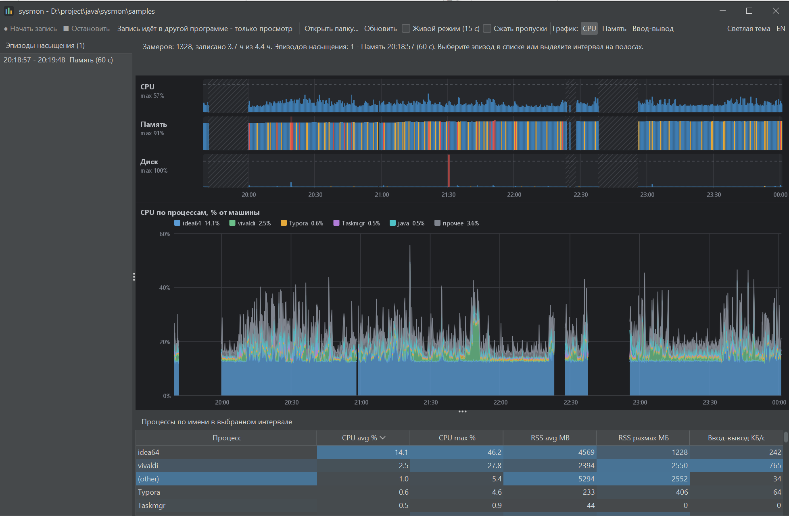
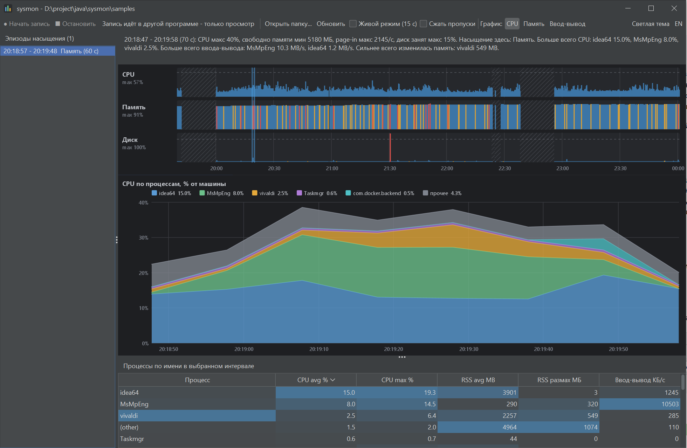
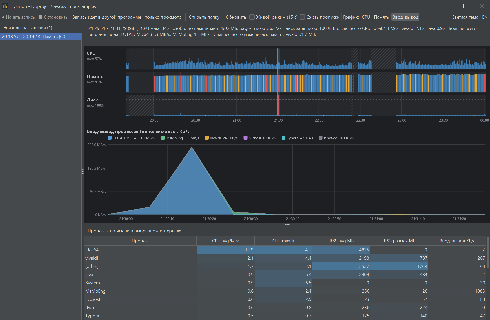

+++
title = "Почему тормозит рабочий ноутбук: И почему я написал утилиту на Java, чтобы это измерить"
draft = false
date = 2026-11-05
[taxonomies]
categories = ["java"]
tags = ["java","swing", "system"]
+++

## С чего всё началось

Мне поставили Windows 11 на рабочий ноутбук. Железо хорошее: 16 ГБ памяти, свежий 10-ядерный процессор, SSD на 500 ГБ. Работаю я так: IntelliJ IDEA, Docker, Postman и браузер, который съедает память без остатка. Прав администратора у меня нет, антивирус и корпоративные агенты поставлены без моего участия.

И система тормозила. Не катастрофически, а так, что это чувствуется каждый день: сборка то летит, то висит, IDE подвисает без видимой причины.

Я пошёл по привычной дороге. Windows у меня с версии 95, потом 98, XP, семёрка, десятка, сейчас одиннадцатая. И все эти годы советы по ускорению одни и те же: отключите автозагрузку, отключите визуальные эффекты, вычистите службы. Это не менялось со времён XP. Но у меня-то загрузка процессора почти нулевая, диск не забит, память не кончается. Тормозит что-то другое, а что именно, я не знаю.

## Почему советы из интернета не помогают

Главная проблема таких советов в том, что они лечат симптомы вслепую. «Отключить службы» на современной Windows почти ничего не даёт: большая часть служб запускается по событию и ничего не потребляет, пока не нужна. Зато сломать можно легко, а на корпоративной машине за это не похвалят.

Мне нужно было другое: понять, что реально происходит с системой в те минуты, когда она тормозит. И принести администраторам не «мне кажется, что антивирус тормозит», а график и цифры. То есть реальные цифры против которых сложно, что-то сказать против

## План: измерять, а не гадать

Сначала я думал сделать «правильно»: Ansible для настройки, Pulumi, WSL. Идея была в том, чтобы одним запуском применять настройки на любой новой машине. Но очень быстро упёрся в реальность:

- Ansible официально не работает на Windows без WSL, а включение WSL требует прав администратора.
- Pulumi создан для облачных ресурсов, а не для локальных файлов и реестра. Это два движка настройки для одной задачи.
- Любое изменение настроек системы без понимания причины опасно. Если что-то сломается, работать я не смогу.

Поэтому я отложил автоматизацию настройки (это будет отдельная утилита для домашнего компьютера) и занялся тем, что нужно в первую очередь: **измерением**. Условия простые: один файл, запускается без установки, без прав администратора, на любой машине с Java. Всё это даёт `jar`: корпоративные политики обычно разрешают положить файл и запустить его, а JDK у разработчика и так есть.

## Метод USE за пять минут

Измерять «загрузку CPU» мало. Я взял [метод USE Брендана Грегга](https://www.brendangregg.com/usemethod.html): для каждого ресурса смотрим на утилизацию, насыщение и ошибки.

- **Утилизация** — насколько ресурс занят.
- **Насыщение** — накопилась ли очередь, которую ресурс не успевает обслужить.
- **Ошибки** — понятно.

Для моей задачи это решающее различие. Процессор может быть занят на 5%, а система при этом тормозит, потому что память кончилась и Windows гоняет страницы с диска, или потому что диск насыщен чужим чтением. Поэтому утилита пишет не только процессы, но и системные метрики насыщения: подкачку в секунду, занятость диска и длину очереди, свободную память.

| Ресурс | Утилизация | Насыщение |
|---|---|---|
| CPU | загрузка всей машины | прямого счётчика очереди нет, использую высокую загрузку |
| Память | занято / всего | page-in в секунду, мало свободной памяти |
| Диск | время занятости | очередь, занятость выше порога |

Из этих метрик утилита сама находит «эпизоды насыщения»: интервалы, где ресурс был перегружен, например, свободно меньше 10% памяти или подкачка выше 500 страниц в секунду, не меньше 20 секунд подряд.

## Что получилось

Утилита называется sysmon, это один `jar` на Java 21. Три режима:

- `record` пишет в CSV системные метрики и топ-25 процессов в каждом замере (остальные складываются в строку `(other)`). Файлы ротируются по размеру, есть общий лимит места на диске, чтобы утилита не съела квоту.
- `report` печатает отчёт в консоли с эпизодами и главными процессами. Удобно прикладывать к заявке.
- `ui` открывает окно с графиками.

В окне три полосы по времени (CPU, память, диск), столбец окрашен по уровню насыщения. Протяните мышью по полосам, и всё остальное покажет выбранный интервал: строка с выводом словами, график топ-5 процессов с накоплением и таблица процессов с тепловой подсветкой. Если запустить `jar` двойным щелчком, откроется окно с диалогом «Начать запись», запись идёт в фоне, а программа сворачивается в трей и показывает красную точку на значке.

`

Несколько технических решений, о которых меня потом спрашивали бы:

- **Swing и FlatLaf вместо JavaFX.** Нативные библиотеки JavaFX поставляются отдельно под каждую платформу, а мне нужен один `jar`. Swing входит в JDK, а FlatLaf делает его современным и поддерживает тёмную тему. Графики я нарисовал на Java2D: ни одна библиотека не умела «полосы насыщения с выделением интервала».
- **CSV, а не база данных.** Файлы можно открыть чем угодно, в том числе в Notepad++ с плагином, который гоняет SQL по CSV. Никаких нативных драйверов в `jar`.
- **В файлы пишутся только имена процессов.** Без путей и аргументов: в них бывают имена пользователей и токены, а отправлять такие файлы кому-то придётся.

## Три ошибки, которые чуть не привели к неверным выводам

Самое полезное в этой истории даже не сама утилита, а то, как мои первые выводы оказались неверными.

### 1. Накопительные счётчики

Windows отдаёт счётчики ввода-вывода процесса накопленными с момента его запуска. Первая версия записывала их как есть, и «записано 40 ГБ» оказывалось суммой за всю жизнь процесса, а не нагрузкой за интервал. Среднее по таким значениям бессмысленно, и пришлось в SQL брать максимум на PID. Сейчас утилита сама считает **скорость за интервал**: дельту счётчика, делённую на фактическое время между замерами.

### 2. Запятая в `printf`, и странный Idle

В первых данных творилось странное. У процесса `Idle` среднее значение оказывалось больше максимума, а у IntelliJ память выходила 46 МБ при том, что он занимает несколько гигабайт. Я нашёл «объяснение» про особенности учёта тиков в Windows и не сомневался. Оно было неверным.

Настоящая причина:

```java
pw.printf("%s,%d,%s,%.2f,%d,%d,%d%n", ...);
```

На русской локали `%.2f` печатает число с **запятой**: `22,74`. А запятая в CSV — это разделитель. Число превращалось в два поля, и всё, что шло дальше, сдвигалось на одну колонку. «Память» оказывалась дробной частью загрузки CPU, а «чтение диска» — реальной памятью. Я заметил это, когда расклеил пять сырых строк и увидел, что `22,74 | 2033 | 1079302 | 501492` сходится идеально: 22,74% CPU, 2033 МБ памяти, потом счётчики ввода-вывода.

Исправление — одна строка `Locale.ROOT`, плюс отдельный тест, который проверяет формат при русской локали. Мораль для меня: если данные странные, сначала проверяю, **что именно записано**, и только потом ищу объяснения.

### 3. Ввод-вывод процесса — это не диск

Счётчик ввода-вывода процесса в Windows считает вообще всё, что процесс читает и пишет: файлы, сеть, устройства. Я увидел это сам: в двух разных записях процесс `RuntimeBroker` с памятью около 9 МБ показал 38 и 49 МБ/с «чтения», а общий счётчик чтения диска в этот момент был 15 КБ/с. Поэтому нагрузку на диск я смотрю только по системным метрикам (занятость и очередь диска, подкачка), а ввод-вывод процесса оставил как подсказку, кто «активничал».

## Пример: сборка проекта и антивирус

Вот находка, ради которой всё затевалось. На домашнем ноутбуке я собирал проект и запустил тесты. В окне появился эпизод памяти:

- время: 20:18:57–20:19:48, 60 секунд;
- подкачка до 2145 страниц в секунду, диск занят до 15%;
- `MsMpEng` (антивирус Microsoft Defender): в среднем 6–9% процессора всей машины, пик 14,5% (больше одного ядра из восьми), ввод-вывод 8–12 МБ/с.

Строка вывода называла главных: «Больше всего CPU: idea64, MsMpEng. Больше всего ввода-вывода: MsMpEng 8,2 MB/s».



Но я не хотел делать вывод по корреляции. Первый вопрос: может, это плановое сканирование? Проверил:

```powershell
Get-MpComputerStatus | Select QuickScanStartTime,QuickScanEndTime,FullScanStartTime,FullScanEndTime
```

Последний быстрый скан был вчера в 15:45 и длился 98 секунд, полного скана не было никогда. Значит, это не плановый скан. Остаётся постоянная защита, которая читает файлы, которые пишет сборка: jar, class, кэши зависимостей. Это согласуется с картиной, но я не утверждаю, что доказал причину. Доказать можно экспериментом: собрать проект несколько раз с исключениями сканирования и без них и сравнить время сборки и нагрузку `MsMpEng`.

## Датчик диска: проверка нагрузкой

Я не хотел верить датчику диска на слово. Поэтому во время записи скопировал файл на 1,4 ГБ. В окне появился всплеск: занятость диска 100%, подкачка до 36 322 страниц в секунду, а в строке вывода «Больше всего ввода-вывода: Total Commander». Значит, счётчик занятости диска работает.

Но эпизодом это не стало: копирование заняло секунды, а минимум эпизода был 30 секунд. Такие короткие, но жёсткие всплески (два замера подряд при интервале 10 секунд) тоже нужно показывать, поэтому минимум я снизил до 20 секунд.



## Ограничения и что дальше

Ограничения утилиты:

- Прямого счётчика очереди CPU нет, насыщение процессора определяется высокой загрузкой.
- Ввод-вывод процесса не равен диску (см. выше), а счётчики диска стоит проверять нагрузкой на каждой машине.
- Мелкие процессы попадают в строку `(other)`. Если нужно больше деталей, увеличьте `--top`.
- Проверено на Windows 11. Другие системы и корпоративные политики безопасности разных компаний, возможно, потребуют доработок.

Дальше хочу довести отчёты и добавить сравнение двух записей («до» и «после» исключений антивируса). Автоматизация настройки системы (откат реестра, безопасное применение конфигов) останется отдельной утилитой.

## Как попробовать

Скачать `jar` можно в релизах: `https://github.com/malexple/sysmon/releases`. Нужна Java 21. Двойной щелчок по файлу открывает окно с диалогом «Начать запись». Из консоли:

```bash
java -jar sysmon-0.0.2.jar record --duration=8h   # писать 8 часов
java -jar sysmon-0.0.2.jar report                 # отчёт в консоли
java -jar sysmon-0.0.2.jar ui                     # окно с графиками
```

Данные пишутся в `%USERPROFILE%\sysmon-samples`. Я буду рад замечаниям и данным с других машин: `https://github.com/malexple/sysmon`.
