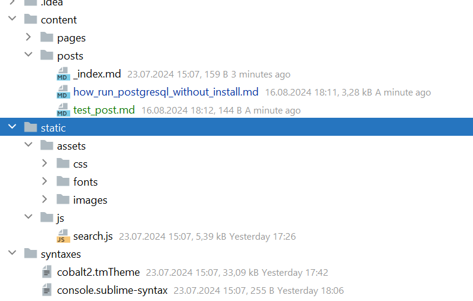

+++
title = "Как хранить картинки в проекте"
draft = false
date = 2024-10-16
[taxonomies]
categories = ["test"]
tags = ["test"]
+++

Не могу пока найти решение чтобы было удобно писать статью и добавлять на сайт

