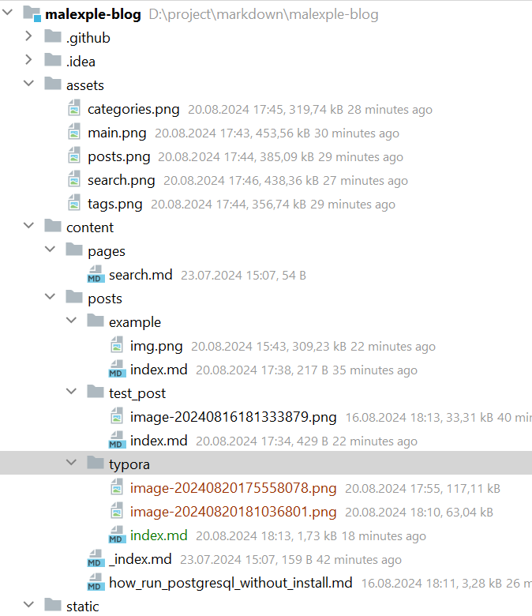
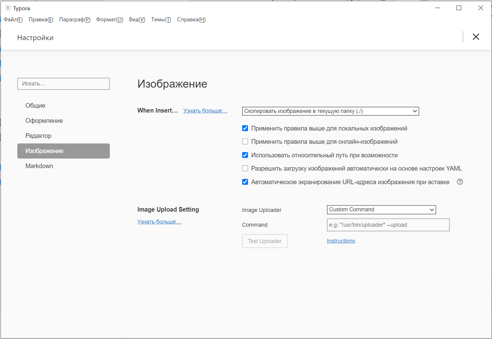

+++
title = "Настраиваем Typora для написания статей"
draft = false
date = 2024-08-20
[taxonomies]
categories = ["blogs"]
tags = ["typora", "markdown"]

+++

Typora - это программа для удобного написания текстов в markdown формате. Я ею пользуюсь уже несколько лет. Посмотреть описание можно тут: https://typora.io

Мне она полюбилась тем, что тут удобно добавлять картинки, таблицы, математические выражения и оглавления. В ней много других функций, но эти для меня важны. Typora позволяет преобразовать markdown в pdf, в html и это будет выглядеть красиво.

В данной статье хочу поделиться небольшой настройкой typora в связке с zola проектом, для генерации статических сайтов (SSG). 

Каждая статья это отдельная папка с материалами для статьи. В основном это рисунки.

Мне удобно создать отдельную папку и уже в typora добавлять картинки и набирать текст. Позже я все это сохраняю в репозиторий. И статья автоматически опубликовывается на сайте.

## Настраиваем путь для добавляемых картинок

В чем удобство. Zola при первой настройке все картинки ищет по пути **\malexple-blog\static\images\<название_блога>** и требуется сначала написать статью. Потом скопировать картинки в нужную папку и потом поправить пути в статье. При этом просмотреть статью со всеми картинками не получится. Но есть вариант, когда ты создаешь отдельную папку и в ней добавляешь статью и картинки. Тогда ты можешь сосредоточиться на написании статьи  и будешь уверен, что на твоей страничке отобразиться все так же как и задумывалось.

