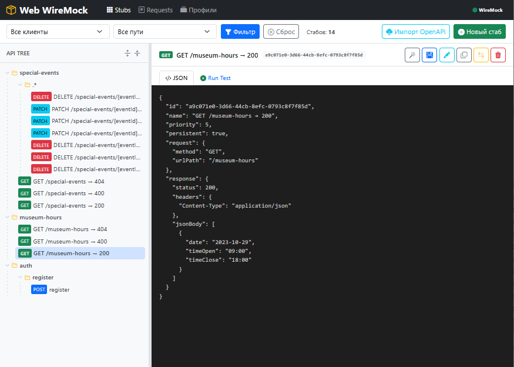
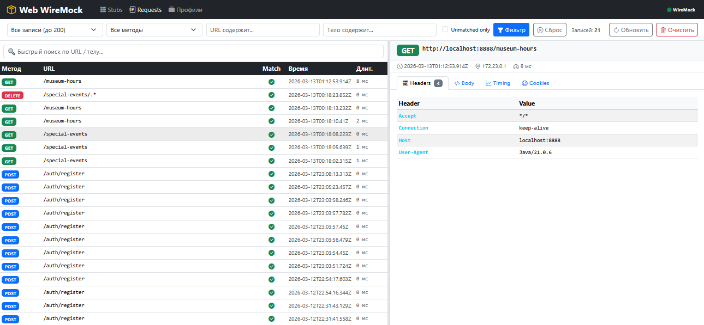

+++
title = "Web WireMock: как я сделал удобный интерфейс для управления моками"
draft = false
date = 2026-03-13
[taxonomies]
categories = ["java"]
tags = ["java", "wiremock"]
+++

Если вы работаете с микросервисами и пишете интеграционные тесты — вы наверняка
сталкивались с [WireMock](https://wiremock.org/). Мощный инструмент, но у него
есть одна проблема: нативный UI минималистичен до боли, а писать JSON руками для
каждого стаба — то ещё удовольствие.

Я решил это исправить.


## Откуда растут ноги
У нас в команде WireMock крутится и локально у разработчиков, и в shared
Kubernetes-окружении для тестировщиков. Сценарии совершенно разные:
- **Локально** — быстро набросать 5–10 стабов под свою задачу, проверить и
выбросить
- **В кубере** — несколько тестировщиков одновременно работают с одним экземпляром,
у каждого свои стабы, никто не должен сломать чужое
Стандартный WireMock Admin UI с этим не справлялся. Появилась идея сделать
свой интерфейс — и я засел за код.


## Что получилось
**Web WireMock** — это Spring Boot приложение с Thymeleaf-фронтом, которое
проксирует WireMock Admin API и добавляет поверх него удобный UI.
### Дерево стабов
Вместо плоского списка — иерархическое дерево, где стабы сгруппированы по
сервисам и путям. Сразу видно всю картину: какие эндпоинты замоканы, с какими
статусами, у кого какой приоритет.




### Мастер создания стаба
Пять шагов вместо написания JSON вручную: запрос → ответ → query-параметры и
заголовки → опции → финальный просмотр JSON перед сохранением. Всё
валидируется на лету.


### Run Test прямо в интерфейсе
Нажал кнопку — получил реальный ответ от WireMock: статус, заголовки, тело,
время ответа. Не нужно переключаться в Postman чтобы проверить что стаб работает.


### Журнал запросов
Все входящие запросы в одном месте: метод, URL, статус совпадения, тайминги,
заголовки, тело, cookies. Если запрос не совпал — сразу видно почему и есть
ссылка на ближайший стаб.




### Профили — главная фишка

Это то, ради чего вся затея и затевалась.
**Профиль** — это просто JSON-файл на диске, содержащий снапшот всех стабов.
Сохранил, и он лежит рядом с проектом. Никаких баз данных, никаких миграций —
просто файл, который можно положить в git.
Два режима применения:

| Режим | Когда использовать |
|-------|--------------------|
| **Заменить** | Локально: сбросить всё и загрузить свой набор стабов |
| **Слияние** | В кубере: добавить свои стабы к чужим, не сломав их |
И главное — **экспорт/импорт**. Я настроил стабы локально, экспортировал

профиль в JSON, скинул коллеге. Он открыл Web WireMock в кубере, нажал «Импорт из файла» → «Слияние» — готово. Мои стабы добавились к его, никто ничего не потерял. 


## Стек
Ничего экзотического:
- **Java 21 + Spring Boot 3** — бэкенд и проксирование Admin API через OpenFeign
- **Thymeleaf + Bootstrap 5** — фронт, никакого React/Vue, всё серверный рендеринг
- **Bootstrap Icons** — иконки без лишних зависимостей
- **WireMock 3** — собственно сам мок-сервер
Приложение разворачивается рядом с WireMock через Docker Compose и занимает
минимум ресурсов.


## Пара строк для старта
```yml
services:
wiremock:
image: wiremock/wiremock:latest
ports:
- "8888:8080"
web-wiremock:
image: web-wiremock:latest
ports:
- "8080:8080"
environment:
INTEGRATION_WIREMOCK_HOST: http://wiremock:8080
volumes:
- ./profiles:/data/profiles
```


Открываешь http://localhost:8080—и всё готово к работе.
Проект уже используется у нас в команде. В планах:

- Темизация (светлая тема)
- Поддержка нескольких WireMock-инстансов в одном UI
- Diff между профилями

Если инструмент покажется полезным—буду рад обратной связи и звезде на GitHub.
А если хочешь поддержать разработку материально:
[boosty.to](https://boosty.to/malexple).

**Спасибо за внимание**!