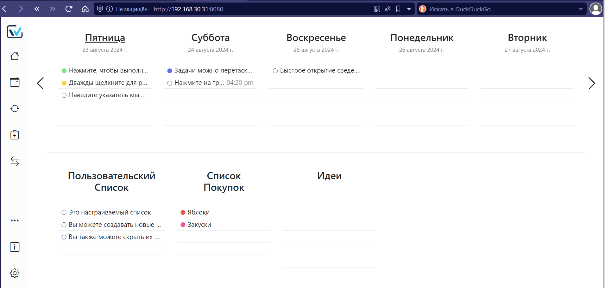

+++
title = "Планер на неделю онлайн WeektoDo"
draft = false
date = 2024-08-26
[taxonomies]
categories = ["proxmox"]
tags = ["week_to_do", "proxmox"]

+++
## WeekToDo
WeekToDo — это бесплатный еженедельный планировщик с открытым исходным кодом. Перестаньте расставлять приоритеты в своем расписании и начните расставлять приоритеты.

Проект на gitHub находится тут [WeekToDo](https://github.com/manuelernestog/weektodo)


Добавляем доменное имя третьего уровня **weektodo.malexple.ru** регистратора доменных имен.

```
apk update
apk add yarn
yarn version
```
## Установка WeekToDo в LXC контейнер на alpine в proxmox


```
cd ~
apk add git
apk add nodejs npm
npm install webpack@latest
git clone https://github.com/manuelernestog/weektodo
cd weektodo
yarn install --ignore-engines
yarn run serve &// to run web version

```

После запуска сервера вы увидите:


При первом запуске:


Будет предложено выбрать язык, тему


и потом появиться стартовая страница ![image-20240823162624916](image-20240823162624916.png




## Nginx

```
server {
    listen 80;
    server_name weektodo.malexple.ru;
    access_log /var/log/nginx/nginx.local-access.log;
    error_log /var/log/nginx/nginx.local-error.log;
    fastcgi_param HTTPS on;

    location / {
        proxy_pass http://192.168.30.31:8080;
        proxy_set_header Host $host;
        proxy_set_header X-Real-IP $remote_addr;
        proxy_set_header X-Forwarded-For $proxy_add_x_forwarded_for;
        proxy_set_header X-Forwarded-Proto $scheme;
    }
}
```


## Сертификат для Nginx

```bash
certbot certonly
```


```
server {
    listen 80;
    server_name weektodo.malexple.ru;
    access_log /var/log/nginx/nginx.local-access.log;
    error_log /var/log/nginx/nginx.local-error.log;
    return 301 https://$server_name$request_uri;
}
server {
    listen 443 ssl;
    server_name weektodo.malexple.ru;
    access_log /var/log/nginx/nginx.local-access.log;
    error_log /var/log/nginx/nginx.local-error.log;

    ssl_certificate /etc/letsencrypt/live/weektodo.malexple.ru/fullchain.pem;
    ssl_certificate_key /etc/letsencrypt/live/weektodo.malexple.ru/privkey.pem;
    ssl_session_timeout 5m;
    ssl_protocols TLSv1 TLSv1.1 TLSv1.2;
    ssl_dhparam /etc/ssl/certs/dhparam.pem;
    ssl_ciphers 'EECDH+AESGCM:EDH+AESGCM:AES256+EECDH:AES256+EDH';
    ssl_prefer_server_ciphers on;
    ssl_session_cache shared:SSL:10m;
    
    location / {
    proxy_pass http://192.168.30.31:8080; 
    proxy_set_header Host $host;
    proxy_set_header X-Forwarded-For $proxy_add_x_forwarded_for;
    proxy_set_header X-Real-IP $remote_addr;
    }
}
```


## Правим файл настроек в weektodo 

Чтобы не было проблем при проксировании маршрутов, и не получать ошибку **Nginx Invalid host header**, нужно добавить в  файл vue.config.js следующие строчки:

```json
module.exports = {
    // options...
    devServer: {
        disableHostCheck: true,
    }
}
```

общий файл будет в этом случае выглядеть так:

```json
module.exports = {
  pluginOptions: {
    electronBuilder: {
      nodeIntegration: true,
      customFileProtocol: './',
      builderOptions: {
        appId: "weektodo-app.netlify.app",
        productName: "WeekToDo",
        publish: ["github"],
        linux: {
          category: "Utility",
          description: "Free and Open Source Minimalist Weekly Planner and To Do list App foc>
          target: ["deb", "rpm", "pacman","AppImage"],
          icon: "build/icon.icns",
        },
        win: {
          target: ["nsis"],
        },
        mac: {
          category: "public.app-category.productivity",
          target: ["dmg", "pkg"],
        },
      },
    },
  },
  devServer: {
      disableHostCheck: true,
  }
};
```

## Как работать через браузер

Программа не хранит данные на сервере. Но есть возможность сохранить и загрузить запланированные задачи. Запланированные задачи сохраняются в файл WeekToDoBackup.wtdb


Также легко импортировать сохраненные настроки нажав на кнопку **Импорт**.


## Заключение 

Программой можно пользоваться по адресу https://weektodo.malexple.ru

Не забывайте сохранять запланированные задачи. 