+++
title = "Wiremokjs как я создавал свой скриптовый язык для wiremock"
draft = false
date = 2026-08-03
[taxonomies]
categories = ["java"]
tags = ["java", "wiremock", "wiremock-extension"]

+++

# Wiremokjs как я создавал свой скриптовый язык для wiremock


[TOC]

В этой статье я расскажу, как создавал скриптовый язык **WiremockJs** — с нуля и до рабочего прототипа. Поделюсь, что меня подтолкнуло к этому «подвигу», как я проектировал грамматику, с какими ограничениями столкнулся и почему в итоге не стал использовать JavaScript, а написал свой упрощённый диалект. Под катом — ANTLR, парсеры, немного боли и много удовольствия от творчества.

 

## **Предисловие: как всё начиналось**

Пару месяцев назад я сделал UI для WireMock. В него вошло всё, что я тогда успел:

- визуальный конструктор стабов,
- удобное дерево API с поиском и фильтрацией,
- вызов стаба прямо из интерфейса (без Postman),
- история запросов на отдельной вкладке,
- сценарии и запись моков.
- Добавление стабов по openApi спецификации

Но главное, что избавило меня от постоянной головной боли при переключении между проектами, — **профили**. Загрузил нужный профиль — и все заглушки уже настроены, не надо думать о приоритетах и совпадениях ручек. Кстати, многие UI пытаются совместить показ API и создание моков в папках, как в Postman, но я считаю такой подход не совсем удобным. Профили оказались проще и практичнее. 

Второй момент – это история запросов. Было не понятно, а вызвался ли запрос? А что пришло и когда?

Третий момент и наверное самое главное это тестировщики. Почему-то с вопросами по мокам они шли именно ко мне. После нескольких дней коллективной настройки я понял, что так дальше нельзя. Во‑первых, я разработчик, а не тестировщик. Во‑вторых, я не могу бесконечно обучать новых сотрудников нюансам WireMock, MockServer и JSON. Люди приходят и уходят, а время на объяснения уходит колоссальное. Плюс я сам забываю что я там создавал и как это делал. Мне нахватало визуального конструктора. Прошелся по шагам и все готово. Не надо думать, а правильно ли ты создал json.

Вы спросите: почему не взять готовый интерфейс для WireMock? Тут причина во мне, мне нравится копаться и делать всё под себя, так, как я считаю удобным. Наверное, я просто очень придирчив к чужим программам, поэтому и решил написать своё.

Ценит ли компания меня за то, что я пытаюсь привнести автоматизацию и что-то новое? Если честно, я уже давно не задаю себе этот вопрос. Я уже писал об этом в отдельной статье (ссылка), и мой опыт за 15 лет говорит: не компания создаёт условия для разработки, а конкретный человек внутри неё. Если мне нужен инструмент, который сэкономит время, — я его пилю. Если нужны деньги — пилю свои собственные сервисы и платформы на стороне. Получается ли? Пока в процессе, но это уже совсем другая история.

А чтобы не выгорать на основной работе, я позволяю себе такие маленькие пет-проекты — UI или расширения для WireMock. Они приносят удовольствие, а заодно экономят время на те задачи, которые я действительно люблю.

## На чём я остановился в прошлый раз?

В прошлой версии UI я не успел добавить **скрипты**.  Для автотестов хотелось задавать не просто статичные стабы, а гибкие моки с логикой. WireMock позволяет подключать расширения на Java через JAR-файлы, но такой подход казался мне слишком громоздким:

- автотестировщики пишут на Python или других языках, не факт, что они будут кодить на Java;
- любое изменение требует сборки, деплоя и перезапуска WireMock — это минуты, а не секунды.

Я мечтал о том, чтобы скрипт можно было править на лету и сразу видеть результат. Ну и автотестировщики получив такой инструмент напишут автотесты. Что в долгосрочной перспективе скажется положительно на разработке. 

Я стал искать что есть в wiremock. И как это сделано в других сервисах для моков. Нашел WireMockCoolExtensions https://github.com/kumarvikas1/WireMockCoolExtensions. Но там проект не обновлялся уже 10 лет. Да и не выглядел он как законченный продукт. Стал думать как добавить javascript в расширение, но тут всплыли проблемы:

- безопасность (выполнение JS в JVM — это риск),
- зависимость от Nashorn (устарел) или GraalVM Polyglot (тяжёлый),
- WireMock до сих пор сидит на Java 11, и подтаскивать эти фреймворки не хотелось.

Я взвесил всё и решил: всех возможностей JavaScript для написания заглушек не нужно. Достаточно создать свой **упрощённый скриптовый язык**. Назвал его WiremockJs. Для построения грамматики выбрал **ANTLR** — мощный и проверенный генератор парсеров.

 Итак, первая версия грамматики выглядела так:

````
grammar WiremockJs;

script
    : statement+ EOF
    ;

statement
    : ifStatement
    | returnStatement
    ;

ifStatement
    : IF '(' expression ')' '{' thenStmt+=statement+ '}' (ELSE '{' elseStmt+=statement+ '}')?
    ;

returnStatement
    : RETURN expression ';'
    ;

expression
    : expression op=('*'|'/'|'%') expression        # MulDiv
    | expression op=('+'|'-') expression            # AddSub
    | expression op=('>'|'>='|'<'|'<=') expression  # Compare
    | expression op=('=='|'!=') expression          # Equality
    | expression AND expression                     # LogicalAnd
    | expression OR expression                      # LogicalOr
    | NOT expression                                # LogicalNot
    | functionCall                                  # FuncCallExpr
    | fieldAccess                                   # FieldAccessExpr
    | literal                                       # LiteralExpr
    | '(' expression ')'                            # ParenExpr
    ;

functionCall
    : IDENTIFIER '(' argumentList? ')'
    ;

argumentList
    : expression (',' expression)*
    ;

fieldAccess
    : IDENTIFIER ('.' IDENTIFIER)*
    ;

literal
    : STRING
    | NUMBER
    | BOOLEAN
    | jsonObject
    ;

jsonObject
    : '{' (jsonPair (',' jsonPair)*)? '}'
    ;

jsonPair
    : STRING ':' expression
    ;

IF: 'if';
ELSE: 'else';
RETURN: 'return';
AND: '&&';
OR: '||';
NOT: '!';
BOOLEAN: 'true' | 'false';
NUMBER: '-'? [0-9]+ ('.' [0-9]+)?;
STRING: '"' (~["\\] | '\\' .)* '"';
IDENTIFIER: [a-zA-Z_][a-zA-Z0-9_]*;
WS: [ \t\r\n]+ -> skip;
COMMENT: '//' ~[\r\n]* -> skip;
````

Как видите правил не так много. Нет циклов, переменных и много чего. На начальном этапе мне нужно было просто создать расширение и простую грамматику для языка. По возможности максимально повторить javascript. И возможность добавить скрипт и легко привязать к стабу. И чтобы это правильно выполнилось. 

У wiremock есть шаблон или пример на основе которого можно создать свое расширение: https://github.com/wiremock/wiremock-extension-template

Чтобы добавить грамматику в приложении нужно указать зависимости. 

Зависимость в gradle  

````groovy
    antlr 'org.antlr:antlr4:4.13.2'
    implementation 'org.antlr:antlr4-runtime:4.13.2'
````

- **`antlr 'org.antlr:antlr4:4.13.2'`**: **Инструмент для генерации кода.** Плагин `antlr` в Gradle использует эту зависимость, чтобы запустить ANTLR Tool и сгенерировать Java-классы из `.g4` файлов во время сборки проекта. Эти классы появятся в папке `build/generated-src/...` и будут скомпилированы вместе с остальным кодом.
- **`implementation 'org.antlr:antlr4-runtime:4.13.2'`**: **Библиотека для выполнения.**  Чтобы сгенерированные классы могли правильно работать в рантайме (когда WireMock обрабатывает запрос): создавать токены, строить деревья разбора и обходить их

B проекте нужно еще создать папку `src/main/antlr` (её нет по умолчанию) и положите туда наш `WiremockJs.g4`

Дальше в ходе разработки грамматика языка претерпела изменения и стала выглядеть так:

````
grammar WiremockJs;

script
    : statement+ EOF
    ;

statement
    : ifStatement
    | returnStatement
    | varDeclaration
    | forEachStatement
    ;

forEachStatement
    : FOR '(' VAR IDENTIFIER OF expression ')' '{' statement* '}'
    ;

varDeclaration
    : VAR IDENTIFIER '=' expression ';'
    ;

ifStatement
    : IF '(' expression ')' '{' thenStmt+=statement+ '}' (ELSE '{' elseStmt+=statement+ '}')?
    ;

returnStatement
    : RETURN expression ';'
    ;

expression
    : expression op=('*'|'/'|'%') expression        # MulDiv
    | expression op=('+'|'-') expression            # AddSub
    | expression op=('>'|'>='|'<'|'<=') expression  # Compare
    | expression op=('=='|'!=') expression          # Equality
    | expression AND expression                     # LogicalAnd
    | expression OR expression                      # LogicalOr
    | NOT expression                                # LogicalNot
    | functionCall                                  # FuncCallExpr
    | fieldAccess                                   # FieldAccessExpr
    | IDENTIFIER                                     # VarRefExpr
    | literal                                       # LiteralExpr
    | '(' expression ')'                            # ParenExpr
    ;

functionCall
    : IDENTIFIER '(' argumentList? ')'
    ;

argumentList
    : expression (',' expression)*
    ;

fieldAccess
    : IDENTIFIER ('.' IDENTIFIER)+
    ;

literal
    : STRING
    | NUMBER
    | BOOLEAN
    | NULL
    | jsonObject
    ;

jsonObject
    : '{' (jsonPair (',' jsonPair)*)? '}'
    ;

jsonPair
    : STRING ':' expression
    ;

IF: 'if';
ELSE: 'else';
RETURN: 'return';
VAR: 'var';
NULL: 'null';
AND: '&&';
OR: '||';
NOT: '!';
FOR: 'for';
OF: 'of';
BOOLEAN: 'true' | 'false';
NUMBER: '-'? [0-9]+ ('.' [0-9]+)?;
STRING: '"' (~["\\] | '\\' .)* '"';
IDENTIFIER: [a-zA-Z_][a-zA-Z0-9_]*;
WS: [ \t\r\n]+ -> skip;
COMMENT: '//' ~[\r\n]* -> skip;
````

### Сравнение грамматик было и стало

| Компонент              | Было (v1)                                 | Стало (v2)                                | Что изменилось                          |
| :--------------------- | :---------------------------------------- | :---------------------------------------- | :-------------------------------------- |
| **Ключевые слова**     | 4 (`if`, `else`, `return`, `true/false`)  | 8 (+`var`, `null`, `for`, `of`)           | Добавлены переменные, циклы и null      |
| **Типы statement**     | 2 (`if`, `return`)                        | 4 (+`varDeclaration`, `forEachStatement`) | Появились объявление переменных и циклы |
| **Типы выражений**     | 10                                        | 11 (+`VarRefExpr`)                        | Добавлена ссылка на переменную          |
| **Литералы**           | 4 (`string`, `number`, `boolean`, `json`) | 5 (+`null`)                               | Добавлен null-литерал                   |
| **Правила грамматики** | 16                                        | 19                                        | +3 новых правила                        |

Первая версия грамматики была **минималистичной** — только условия и возврат. Этого хватало для простых сценариев, но для реальных автотестов требовалось гораздо больше.

### Грамматические правила

| Правило / Токен        | Продукция (синтаксис)                                        | Пояснение                                                    |
| :--------------------- | :----------------------------------------------------------- | :----------------------------------------------------------- |
| `script`               | `statement+ EOF`                                             | Скрипт состоит из одной или нескольких инструкций, после которых идёт конец файла. |
| `statement`            | `ifStatement` | `returnStatement` **| `varDeclaration`** **| `forEachStatement`** | Инструкция может быть условным оператором, возвратом, **объявлением переменной** или **циклом `for-of`**. |
| **`varDeclaration`**   | **`VAR IDENTIFIER '=' expression ';'`**                      | **Объявляет переменную с начальным значением. Область видимости — весь скрипт.** |
| **`forEachStatement`** | **`FOR '(' VAR IDENTIFIER OF expression ')' '{' statement\* '}'`** | **Цикл по элементам массива (или итерируемого объекта). Переменная цикла получает значение каждого элемента.** |
| `ifStatement`          | `IF '(' expression ')' '{' thenStmt+=statement+ '}'` `(ELSE '{' elseStmt+=statement+ '}')?` | Условный оператор с обязательным блоком `then` и необязательным `else`. Внутри блоков может быть несколько инструкций. |
| `returnStatement`      | `RETURN expression ';'`                                      | Возвращает значение вычисленного выражения и завершает выполнение скрипта. |
| `expression`           | `expression op=('*'|'/'|'%') expression` \| `expression op=('+'|'-') expression` \| `expression op=('>'|'>='|'<'|'<=') expression` \| `expression op=('=='|'!=') expression` \| `expression AND expression` | `expression OR expression` | `NOT expression` | `functionCall` | `fieldAccess` **| `IDENTIFIER` (ссылка на переменную)** | `literal` | `'(' expression ')'` | Выражения всех типов. **Добавлена поддержка ссылок на переменные (`IDENTIFIER`)**, что позволяет использовать значения, сохранённые через `var`. Приоритет операторов задаётся порядком альтернатив (сверху вниз — от высшего к низшему). |
| `functionCall`         | `IDENTIFIER '(' argumentList? ')'`                           | Вызов функции по имени с нулём или более аргументов. Функции предоставляются окружением (например, `query()`, `jsonField()`). |
| `argumentList`         | `expression (',' expression)*`                               | Список аргументов функции, разделённых запятыми.             |
| `fieldAccess`          | **`IDENTIFIER ('.' IDENTIFIER)+`**                           | Доступ к свойствам объектов через точечную нотацию. **В v2 обязательно хотя бы одно обращение к полю (т.е. `user.name` допустимо, а просто `user` — это уже ссылка на переменную).** |
| `literal`              | `STRING` | `NUMBER` | `BOOLEAN` **| `NULL`** | `jsonObject`  | Базовые литералы: строки, числа, булевы значения, **`null`** и JSON-объекты. |
| `jsonObject`           | `'{' (jsonPair (',' jsonPair)*)? '}'`                        | JSON-объект в фигурных скобках, содержащий ноль или более пар «ключ: значение». |
| `jsonPair`             | `STRING ':' expression`                                      | Пара ключ-значение в JSON-объекте: ключ — строка, значение — любое выражение. |

### Лексические токены

| Токен        | Распознаваемое значение      | Пояснение                                                    |
| :----------- | :--------------------------- | :----------------------------------------------------------- |
| `IF`         | `'if'`                       | Ключевое слово условного оператора.                          |
| `ELSE`       | `'else'`                     | Ключевое слово для альтернативной ветки.                     |
| `RETURN`     | `'return'`                   | Ключевое слово оператора возврата.                           |
| **`VAR`**    | **`'var'`**                  | **Ключевое слово для объявления переменной.**                |
| **`FOR`**    | **`'for'`**                  | **Ключевое слово цикла.**                                    |
| **`OF`**     | **`'of'`**                   | **Ключевое слово для указания итерируемого объекта в цикле.** |
| **`NULL`**   | **`'null'`**                 | **Литерал нулевого значения.**                               |
| `AND`        | `'&&'`                       | Логическое И.                                                |
| `OR`         | `'||'`                       | Логическое ИЛИ.                                              |
| `NOT`        | `'!'`                        | Логическое отрицание.                                        |
| `BOOLEAN`    | `'true'` | `'false'`         | Булевы литералы.                                             |
| `NUMBER`     | `'-'? [0-9]+ ('.' [0-9]+)?`  | Числовые литералы (целые или дробные, с необязательным знаком минус). |
| `STRING`     | `'"' (~["\\] | '\\' .)* '"'` | Строковые литералы в двойных кавычках с поддержкой escape-последовательностей (например, `\n`, `\"`). |
| `IDENTIFIER` | `[a-zA-Z_][a-zA-Z0-9_]*`     | Имена переменных, функций и полей (буквы, цифры, подчёркивание, не начинаются с цифры). |
| `WS`         | `[ \t\r\n]+ -> skip`         | Пробельные символы игнорируются.                             |
| `COMMENT`    | `'//' ~[\r\n]* -> skip`      | Однострочные комментарии (начинаются с `//`) игнорируются.   |

## Visitor: как дерево разбора превращается в результат

Перед тем как погрузиться в реализацию, стоит сказать пару слов о том, как ANTLR позволяет обходить дерево разбора. В ANTLR есть два основных паттерна для этого: **Listener** и **Visitor**.

Listener работает по принципу «push» — ANTLR автоматически обходит дерево и вызывает ваши методы при входе в узел и выходе из него. Но методы Listener ничего не возвращают, поэтому вам пришлось бы хранить промежуточные результаты в стеке или полях класса

В нашем случае нужно **вычислить** значение каждого узла и вернуть результат наверх. Это идеальная задача для **Visitor**. Он работает по принципу «pull» — вы сами управляете обходом, а каждый метод `visit` может возвращать вычисленное значение (число, строку, булево, JSON-объект). Такой подход естественно ложится на интерпретацию выражений.

ANTLR по грамматике генерирует не только парсер, но и абстрактный класс `WiremockJsBaseVisitor<T>` с заготовкой метода на каждое правило грамматики — `visitIfStatement`, `visitReturnStatement`, `visitCompare`, `visitMulDiv`, `visitEquality`, `visitFuncCallExpr`, `visitLiteral`, `visitFieldAccessExpr` и так далее. Класс `WiremockJsInterpreter` наследует этот Visitor и переопределяет нужные методы — по сути, это классический паттерн "обойти дерево разбора и на каждом узле посчитать значение".

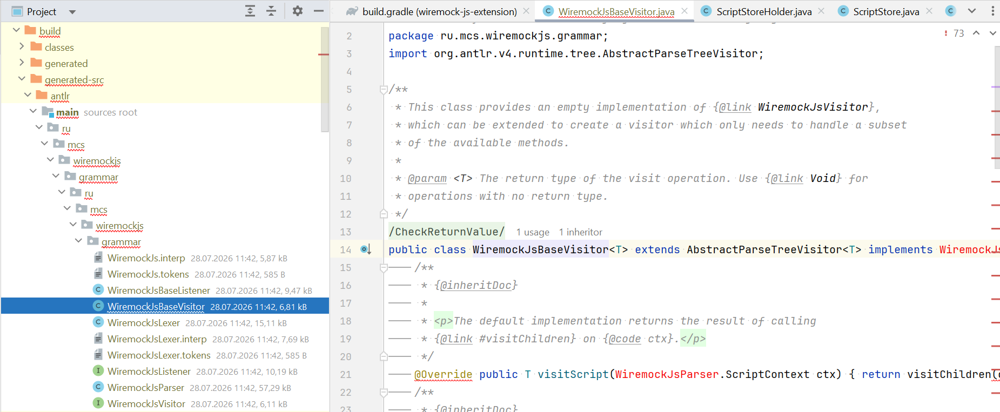

Например, для узла сравнения (`>`, `>=`, `<`, `<=`) Visitor вычисляет обе части выражения рекурсивно (`visit(ctx.expression(0))`, `visit(ctx.expression(1))`), приводит их к числу и применяет оператор по тексту токена:

````java
        @Override
        public Object visitCompare(WiremockJsParser.CompareContext ctx) {
            double left = num(visit(ctx.expression(0)));
            double right = num(visit(ctx.expression(1)));
            String op = ctx.op.getText();
            if (op.equals(">")) return left > right;
            if (op.equals(">=")) return left >= right;
            if (op.equals("<")) return left < right;
            if (op.equals("<=")) return left <= right;
            throw new ScriptExecutionException("Неизвестный оператор сравнения");
        }
````

Именно так рекурсивный спуск по AST превращается в вычисление: каждый вызов `visit(...)` — это спуск на дочерний узел дерева, а возврат из метода — "всплытие" вычисленного значения обратно наверх, пока весь скрипт не свернётся в один `Map<String, Object>`, который `visitReturnStatement` отдаёт как финальный результат. Доступ к полям объекта через точку (`order.amount`) реализован аналогично — `visitFieldAccessExpr` берёт первый идентификатор из объявленных `var`-переменных в scope, а затем последовательно "спускается" по `Map`, возвращая `null` при отсутствующем промежуточном поле и бросая `ScriptExecutionException`, если базовое значение — не объект

## Как WireMock узнаёт про расширение?

WireMock загружает сторонний код двумя способами: либо класс реализует интерфейс `Extension` напрямую, либо через `ExtensionFactory`, который WireMock находит через механизм `META-INF/services` (Java `ServiceLoader`). 

Есть нюанс, на который стоит обратить внимание: в WireMock 3.13.1 флаг `--extensions` в CLI ожидает класс, реализующий именно `Extension`, а не фабрику. Попытка передать туда `ExtensionFactory` напрямую приведёт к `ClassCastException: cannot be cast to class Extension`. Поэтому я регистрирую сразу конкретные классы: 

`--extensions=ru.mcs.wiremockjs.ScriptTransformer,ru.mcs.wiremockjs.admin.ScriptAdminApi`. 

- `ScriptTransformer` реализует `ResponseDefinitionTransformerV2` — это основной движок, который выполняет скрипты.
- `ScriptAdminApi` реализует `AdminApiExtension` — он добавляет REST-эндпоинты для управления скриптами (загрузка, обновление, удаление) прямо через API WireMock.

### Точка входа: transform()

Точка входа для логики скриптов — метод `transform(ServeEvent)` в `ScriptTransformer`. На каждый входящий запрос, попавший под стаб с `transformers: ["wiremock-js"]`, WireMock вызывает этот метод, передавая `ServeEvent`, из параметров которого извлекается `scriptId`, находится соответствующий `ScriptDefinition` в `ScriptStore`, и запускается интерпретатор:

````java

public class ScriptTransformer implements ResponseDefinitionTransformerV2 {
    private static final long EXECUTION_TIMEOUT_MS = 100;

@Override
    public ResponseDefinition transform(ServeEvent serveEvent) {
        Parameters parameters = serveEvent.getTransformerParameters();
        String scriptId = parameters.getString("scriptId");
        if (scriptId == null || scriptId.isBlank()) {
            throw new ScriptExecutionException("Параметр scriptId не указан в transformerParameters");
        }

        ScriptDefinition definition = scriptStore.findById(scriptId).orElseThrow(() -> new ScriptExecutionException("Скрипт не найден: " + scriptId));

        ScriptGuard.validate(definition.getSourceCode());

        RequestFacade facade = new RequestFacade(serveEvent.getRequest());
        WiremockJsInterpreter interpreter = new WiremockJsInterpreter(facade);

        Map<String, Object> result = executeWithTimeout(interpreter, definition.getSourceCode());

        return buildResponse(serveEvent.getResponseDefinition(), result);
    }
}

````

### Защита от зависаний: таймаут выполнения

Для обеспечения безопасности выполнение скрипта я обернул в `CompletableFuture` с явным вызовом `future.get(100, TimeUnit.MILLISECONDS)`. При истечении таймаута вызывается `future.cancel(true)`, что прерывает выполняющийся поток, после чего выбрасывается `ScriptExecutionException`. Таймаут в 100 миллисекунд даёт реальную защиту от зависших скриптов на уровне JVM-потока, не позволяя одному некорректному скрипту заблокировать обработку других запросов.

````java
    private Map<String, Object> executeWithTimeout(WiremockJsInterpreter interpreter, String source) {
        CompletableFuture<Map<String, Object>> future = CompletableFuture.supplyAsync(
                () -> interpreter.execute(source));
        try {
            return future.get(EXECUTION_TIMEOUT_MS, TimeUnit.MILLISECONDS);
        } catch (TimeoutException e) {
            future.cancel(true);
            throw new ScriptExecutionException(
                    "Превышено время выполнения скрипта (" + EXECUTION_TIMEOUT_MS + " мс)");
        } catch (ExecutionException e) {
            Throwable cause = e.getCause();
            if (cause instanceof ScriptParseException || cause instanceof ScriptExecutionException) {
                throw (RuntimeException) cause;
            }
            throw new ScriptExecutionException("Ошибка выполнения скрипта: " + cause.getMessage(), cause);
        } catch (InterruptedException e) {
            Thread.currentThread().interrupt();
            throw new ScriptExecutionException("Выполнение скрипта прервано");
        }
    }
````


## Зачем нужен RequestFacade? 

Идея фасада простая, но важная: скрипт никогда не видит объект `Request` от WireMock напрямую — только методы `RequestFacade`, вызываемые через whitelist-функции интерпретатора. Именно поэтому `visitFieldAccessExpr` жёстко бросает `ScriptExecutionException`, если скрипт попытается написать `request.method` — фасад физически не выставляет наружу ничего, кроме своих публичных методов, вызываемых через `query()`, `header()`, `body()` и так далее.

Фасада имеет несколько методов на базе `Request` из WireMock API:

````java
public class RequestFacade {

    private static final Map<String, JsonPath> PATH_CACHE = new ConcurrentHashMap<>();

    private final Request request;
    private DocumentContext documentContext;
    private boolean documentContextInitialized = false;

    public RequestFacade(Request request) {
        this.request = request;
    }

    public Object jsonField(String path) {
        DocumentContext context = getOrParseDocumentContext();
        if (context == null) {
            return null;
        }

        JsonPath compiledPath = PATH_CACHE.computeIfAbsent(path, JsonPath::compile);

        try {
            return context.read(compiledPath);
        } catch (PathNotFoundException e) {
            return null;
        } catch (Exception e) {
            throw new ScriptExecutionException("Ошибка при чтении JSONPath \"" + path + "\": " + e.getMessage());
        }
    }

    private DocumentContext getOrParseDocumentContext() {
        if (!documentContextInitialized) {
            documentContextInitialized = true;
            try {
                documentContext = JsonPath.parse(request.getBodyAsString());
            } catch (Exception e) {
                documentContext = null;
            }
        }
        return documentContext;
    }

    public String query(String name) {
        QueryParameter param = request.queryParameter(name);
        return (param != null && param.isPresent()) ? param.firstValue() : null;
    }

    public String header(String name) {
        com.github.tomakehurst.wiremock.http.HttpHeader h = request.header(name);
        return (h != null && h.isPresent()) ? h.firstValue() : null;
    }

    public String body() {
        return request.getBodyAsString();
    }

    public String method() {
        return request.getMethod().getName();
    }

    public String pathSegment(int index) {
        List<String> segments = splitPath(request.getUrl());
        return index >= 0 && index < segments.size() ? segments.get(index) : null;
    }

    public Map<String, String> allHeaders() {
        Map<String, String> result = new HashMap<>();
        for (String key : request.getAllHeaderKeys()) {
            result.put(key, request.header(key).firstValue());
        }
        return result;
    }

    private List<String> splitPath(String url) {
        String path = url.split("\\?")[0];
        return java.util.Arrays.stream(path.split("/"))
                .filter(s -> !s.isBlank())
                .collect(java.util.stream.Collectors.toList());
    }
}
````

Обратите внимание на `splitPath` — путь сначала очищается от query-строки (`url.split("\\?")[0]`), затем разбивается на сегменты и фильтруется от пустых строк, что даёт предсказуемую индексацию: `/api/customer/vip` превращается в `["api", "customer", "vip"]`, а не в массив с пустым первым элементом из-за ведущего слеша.

То есть изначально было добавлено несколько функций в WiremockJsInterpreter:

```java
private Object callWhitelistedFunction(String name, List<Object> args) {
    switch (name) {
        case "query": return requestFacade.query(str(args, 0));
        case "header": return requestFacade.header(str(args, 0));
        case "body": return requestFacade.body();
        case "method": return requestFacade.method();
        case "pathSegment": return requestFacade.pathSegment((int) num(args, 0));
        case "contains":
            return str(args, 0) != null && str(args, 0).contains(str(args, 1));
        default:
            throw new ScriptExecutionException("Функция не разрешена или не существует: " + name);
    }
}
```

| Функция | Сигнатура | Возвращает | Описание |
|---|---|---|---|
| `query(name)` | `query(String) -> String \| null` | Значение query-параметра | `null`, если параметр отсутствует |
| `header(name)` | `header(String) -> String \| null` | Значение заголовка | `null`, если заголовок отсутствует |
| `body()` | `body() -> String` | Тело запроса как строка | Без парсинга JSON, сырая строка |
| `method()` | `method() -> String` | HTTP-метод | Например, `"GET"`, `"POST"` |
| `pathSegment(index)` | `pathSegment(Number) -> String \| null` | Сегмент пути по индексу | `/api/customer/vip` → `pathSegment(2)` = `"vip"` |
| `contains(str, substr)` | `contains(String, String) -> Boolean` | true/false | Безопасно обрабатывает `null` как первый аргумент |

Но потом я расширил и добавил методы: random, now, nowPlusDays, uuid, randomInt, matches, fake, sum, count, avg, mapKeys.

```java
case "query": return requestFacade.query(str(args, 0));
case "header": return requestFacade.header(str(args, 0));
case "body": return requestFacade.body();
case "method": return requestFacade.method();
case "pathSegment": return requestFacade.pathSegment((int) num(args, 0));
case "jsonField": return requestFacade.jsonField(str(args, 0));
case "contains": {
    String haystack = str(args, 0);
    String needle = str(args, 1);
    if (haystack == null || needle == null) {
        return false;
    }
    return haystack.contains(needle);
}
case "random": return random.nextDouble();
case "now": return Instant.now().toString();
case "nowPlusDays": return Instant.now().plus((long) num(args, 0), ChronoUnit.DAYS).toString();
case "uuid": return generateUuid();
case "randomInt": return (double) randomInt((int) num(args, 0), (int) num(args, 1));
case "matches": {
    String input = str(args, 0);
    String pattern = str(args, 1);
    if (input == null || pattern == null) {
        return false;
    }
    try {
        return com.google.re2j.Pattern.matches(pattern, input);
    } catch (com.google.re2j.PatternSyntaxException e) {
        throw new ScriptExecutionException("Некорректное регулярное выражение: " + e.getMessage());
    }
}
case "fake": {
    String pattern = str(args, 0);
    if (pattern == null) {
        throw new ScriptExecutionException("fake(): шаблон не может быть null");
    }
    try {
        return faker.expression(pattern);
    } catch (Exception e) {
        throw new ScriptExecutionException("Ошибка в шаблоне fake(\"" + pattern + "\"): " + e.getMessage());
    }
}
case "sum": return sumOf(args.get(0));
case "count": return (double) toList(args.get(0)).size();
case "avg": {
    List<Object> list = toList(args.get(0));
    if (list.isEmpty()) {
        throw new ScriptExecutionException("avg(): пустой массив");
    }
    return sumOf(args.get(0)) / list.size();
}
case "mapKeys": return mapKeys(toList(args.get(0)), toMap(args.get(1)));
default:
    throw new ScriptExecutionException("Функция не разрешена или не существует: " + name);
```

## ScriptGuard: первая линия защиты до ANTLR

Идея `ScriptGuard` в том, чтобы отсеять заведомо плохой скрипт максимально дёшево — без запуска полноценного лексера и парсера ANTLR, которые сами по себе тратят ресурсы на построение дерева разбора. Проверка выполняется единым проходом по массиву символов, попутно считая глубину вложенности скобок и балансировку строк, скобок и фигурных блоков:

````java
public class ScriptGuard {

    private static int maxScriptLength = readMaxScriptLength();
    private static final int MAX_NESTING_DEPTH = 5;

    private static int readMaxScriptLength() {
        return Integer.parseInt(System.getProperty("wiremockjs.max.script.length", "2000"));
    }

    static void reloadMaxScriptLength() {
        maxScriptLength = readMaxScriptLength();
    }

    public static void validate(String source) {
        if (source == null || source.isBlank()) {
            throw new ScriptTooLargeException("Скрипт не может быть пустым");
        }
        if (source.length() > maxScriptLength) {
            throw new ScriptTooLargeException(
                    "Скрипт превышает максимальную длину " + maxScriptLength + " символов");
        }

        int braceDepth = 0;
        int maxBraceDepth = 0;
        int parenDepth = 0;
        boolean inString = false;

        char[] chars = source.toCharArray();
        for (int i = 0; i < chars.length; i++) {
            char c = chars[i];

            if (inString) {
                if (c == '\\') {
                    i++; // экранированный символ — пропускаем следующий как есть
                } else if (c == '"') {
                    inString = false;
                }
                continue;
            }

            switch (c) {
                case '"':
                    inString = true;
                    break;
                case '{':
                    braceDepth++;
                    maxBraceDepth = Math.max(maxBraceDepth, braceDepth);
                    break;
                case '}':
                    braceDepth--;
                    if (braceDepth < 0) {
                        throw new ScriptParseException(
                                "Лишняя закрывающая скобка '}' без соответствующей открывающей");
                    }
                    break;
                case '(':
                    parenDepth++;
                    break;
                case ')':
                    parenDepth--;
                    if (parenDepth < 0) {
                        throw new ScriptParseException(
                                "Лишняя закрывающая скобка ')' без соответствующей открывающей");
                    }
                    break;
                default:
                    break;
            }
        }

        if (inString) {
            throw new ScriptParseException("Незакрытая строка — отсутствует завершающая кавычка \"");
        }
        if (braceDepth != 0) {
            throw new ScriptParseException(
                    "Несбалансированные фигурные скобки '{' '}': не хватает " + braceDepth + " закрывающих");
        }
        if (parenDepth != 0) {
            throw new ScriptParseException(
                    "Несбалансированные круглые скобки '(' ')': не хватает " + parenDepth + " закрывающих");
        }
        if (maxBraceDepth > MAX_NESTING_DEPTH) {
            throw new ScriptTooLargeException(
                    "Превышена максимальная глубина вложенности блоков: " + MAX_NESTING_DEPTH);
        }
    }
}
````

### Два момента вызова — на входе и на исполнении

Вызывать `ScriptGuard.validate()` нужно было в двух разных точках жизненного цикла скрипта, а не только в одной. Первая точка — `ScriptAdminApi` на этапе `POST`/`PUT` сохранения скрипта: если валидация не проходит, пользователь получает понятный HTTP 400 с телом `{"error": "..."}`, не дожидаясь первого реального запроса к стабу:

````java
        router.add(RequestMethod.POST, "/extensions/wiremock-js/scripts",
                (AdminTask) (Admin admin, ServeEvent serveEvent, PathParams pathParams) -> {
                    Request request = serveEvent.getRequest();
                    ScriptDefinition def = Json.read(request.getBodyAsString(), ScriptDefinition.class);

                    try {
                        ScriptGuard.validate(def.getSourceCode());
                    } catch (ScriptParseException | ScriptTooLargeException e) {
                        return errorResponse(e.getMessage(), 400);
                    }

                    ScriptDefinition saved = scriptStore.save(def);
                    return jsonResponse(saved, 201);
                });
````

Вторая точка — `ScriptTransformer.transformServeEvent()`, где `ScriptGuard.validate()` вызывается прямо перед запуском интерпретатора на каждый входящий HTTP-запрос. Это выглядит избыточным (скрипт же уже прошёл валидацию при сохранении), но на самом деле закрывает реальный пробел: хранилище скриптов — JSON-файлы на диске, и теоретически файл может быть отредактирован вручную или через прямой доступ к файловой системе, минуя Admin API — вторая проверка гарантирует, что даже в этом случае в интерпретатор не попадёт скрипт, нарушающий лимиты.

## Администрирование и операции со скриптами

Для управления скриптами в `wiremock-js-extension` реализован отдельный **Admin API**. Все эндпоинты имеют базовый путь `/__admin/extensions/wiremock-js/scripts`

| Метод    | Путь              | Описание                                                     |
| :------- | :---------------- | :----------------------------------------------------------- |
| `GET`    | `/scripts`        | Получить список всех скриптов (краткая информация, без `sourceCode`) |
| `GET`    | `/scripts?name=X` | Поиск скриптов по подстроке в имени (регистронезависимый)    |
| `GET`    | `/scripts/{id}`   | Получить полную информацию о конкретном скрипте, включая его исходный код |
| `POST`   | `/scripts`        | Создать новый скрипт                                         |
| `PUT`    | `/scripts/{id}`   | Обновить существующий скрипт                                 |
| `DELETE` | `/scripts/{id}`   | Удалить скрипт                                               |

Если CRUD методы не взывают вопросов, то вот методы `/scripts` и `/scripts?name=X` возможно в будущем мне придется переделать или добавить новые. 

В текущей архитектуре один скрипт может быть использован сразу в нескольких стабах. Поэтому для интерфейса потребуется:

- Получать список скриптов с привязкой к стабам, чтобы видеть, где используется каждый скрипт, и понимать последствия его изменения или удаления.
- Искать стабы, которые либо уже используют скрипты, либо, наоборот, созданы вручную и не привязаны ни к одному скрипту и это поможет выявлять «бесхозные» моки и упрощать миграцию на скриптовый подход.

Таким образом, текущие GET-методы минимально необходимая функциональность, а в перспективе я планирую обогатить API дополнительными фильтрами и агрегирующими запросами, чтобы UI стал по-настоящему удобным инструментом для работы с моками.

### Добавление скриптов:

Чтобы добавить скрипт нужно выполнить:

~~~bash
```
curl -X POST http://localhost:8888/__admin/extensions/wiremock-js/scripts \
  -H "Content-Type: application/json" \
  -d '{
    "name": "Approve by amount",
    "description": "Одобряет заявку, если сумма меньше 1000",
    "sourceCode": "if (query(\"amount\") > 1000) { return { \"approved\": false, \"reason\": \"limit exceeded\" }; } else { return { \"approved\": true }; }"
  }'
```
~~~

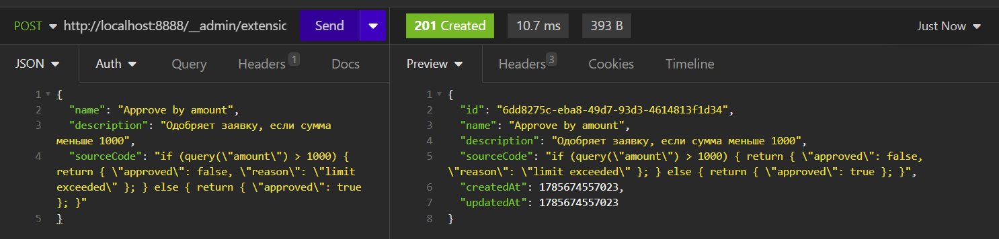

А дальше уже создать стаб:

````bash
​```
curl -X POST http://localhost:8888/__admin/mappings \
  -H "Content-Type: application/json" \
  -d '{
    "request": { "method": "GET", "urlPath": "/api/orders/approve" },
    "response": {
      "status": 200,
      "transformers": ["wiremock-js"],
      "transformerParameters": { "scriptId": "<ID>" }
    }
  }'
​```
````

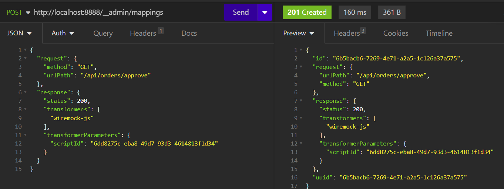

И проверить так:

~~~bash
```
curl "http://localhost:8888/api/orders/approve?amount=2000"
# {"approved":false,"reason":"limit exceeded"}

curl "http://localhost:8888/api/orders/approve?amount=500"
# {"approved":true}
```
~~~

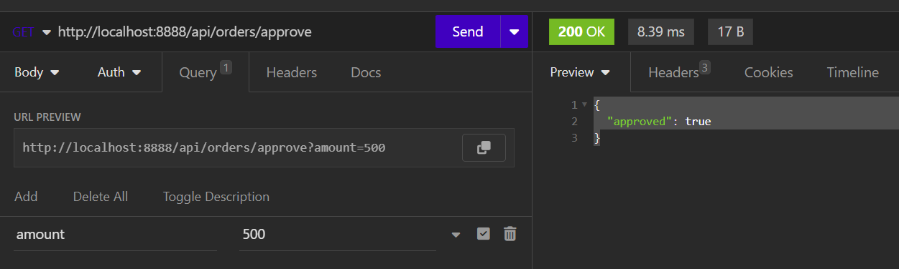

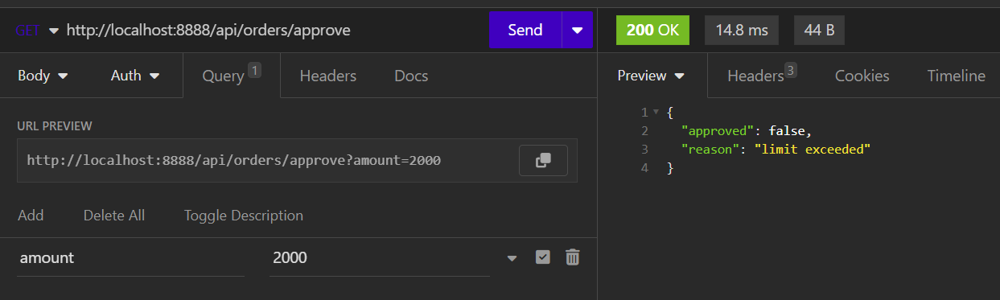


Первая версия языка умела читать только query-параметры, заголовки и сегменты пути — этого хватало для простых сценариев вроде "одобрить по сумме" или "проверить токен", но реальные тестовые сценарии в практике чаще приходят как JSON в теле POST/PUT-запроса, а не как query-строка. Без доступа к полям JSON-тела скрипт мог различать заказы только по внешним параметрам запроса, а не по содержимому самого заказа — то есть нельзя было написать условие вида "если `order.amount` больше лимита и клиент не VIP" Но потом я добавил функции.


## Функции

### jsonField(path)

`jsonField(path)` это безопасный и удобный способ для скрипта получить доступ к данным из тела входящего HTTP-запроса в формате JSON. Он закрыл проблему с json: единая функция, которая парсит тело один раз (лениво, с кэшированием в `parsedBody()`), а затем навигируется по дереву `JsonNode` через путь с точками, поддерживая одновременно и текстовые ключи, и числовые индексы массива в одном выражении — `jsonField("items.0.id")`. 

Если тело — не JSON или отсутствует вовсе, `jsonField` не бросает исключение, а возвращает `null`, и это сделано специально — скрипт не должен падать только потому, что запрос пришёл без тела. Это же решение проверяется тестом `shouldReturnNullForInvalidJsonBody`, где на вход подаётся строка `"not a json at all"` и ожидается спокойный `null`, а не exception.

````java
    @Test
    @DisplayName("jsonField() безопасно обрабатывает невалидный JSON в теле")
    void shouldReturnNullForInvalidJsonBody() {
        when(mockRequest.getBodyAsString()).thenReturn("not a json at all");

        String script = """
            return { "field": jsonField("anything") };
            """;

        Map<String, Object> result = run(script);

        assertEquals(null, result.get("field"));
    }
````

**Примеры**:

- Для JSON-запроса `{"user": {"role": "admin"}}` вызов `jsonField("user.role")` вернёт строку `"admin"`.
- Для запроса `{"items": [{"id": 42}]}` вызов `jsonField("items[0].id")` вернёт число `42`.


### Даты через java.time, а не вручную

Как работают now() и nowPlusDays():

```java
case "now": return Instant.now().toString();
case "nowPlusDays": return Instant.now().plus((long) num(args, 0), ChronoUnit.DAYS).toString();
```

`now()` возвращает текущий момент времени в формате ISO-8601 (UTC), например `2026-08-03T00:27:15.123Z`, а `nowPlusDays(n)` берёт текущее время и добавляет к нему `n` суток, тоже возвращая строку в том же формате. Ключевое отличие от `random()`/`uuid()` — эти функции полностью независимы от `seed`, потому что берут значение из системных часов через `Instant.now()`, а не из генератора псевдослучайных чисел — вы уже убедились в этом на примере с фейковым адресом доставки, где `createdAt` менялся при каждом вызове даже при фиксированном `seed: 7`.

**Пример — дата создания заказа и срок доставки**

Практичный сценарий: сервис принимает заказ и сразу возвращает ожидаемую дату доставки через определённое количество дней.

Скрипт:

```javascript
var orderId = uuid();
var createdAt = now();
var estimatedDelivery = nowPlusDays(3);
return {
    "status": 200,
    "body": {
        "orderId": orderId,
        "createdAt": createdAt,
        "estimatedDelivery": estimatedDelivery
    }
};

```

Добавление скрипта в wiremock:

```bash
curl --request POST \
  --url http://localhost:8888/__admin/extensions/wiremock-js/scripts \
  --header 'Content-Type: application/json' \
  --data '{
	"name": "Order with delivery estimate",
	"description": "Дата создания заказа и расчётная дата доставки через 3 дня",
	"sourceCode": "var orderId = uuid(); var createdAt = now(); var estimatedDelivery = nowPlusDays(3); return { \"status\": 200, \"body\": { \"orderId\": orderId, \"createdAt\": createdAt, \"estimatedDelivery\": estimatedDelivery } };"
}'
```

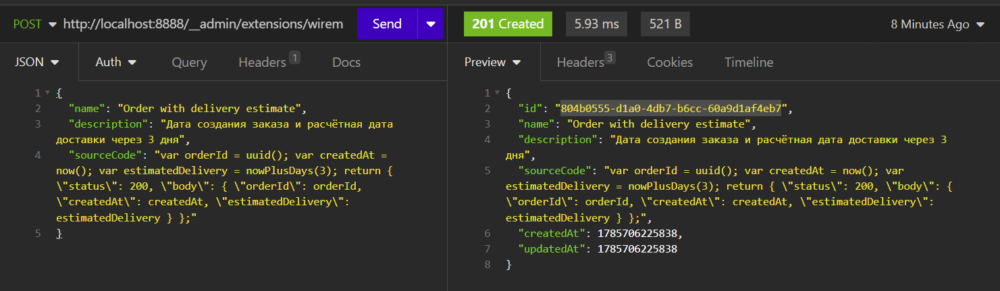

```bash
curl --request POST \
  --url http://localhost:8888/__admin/mappings \
  --header 'Content-Type: application/json' \
  --data '{"request": {"method": "POST", "urlPath": "/api/orders/create"}, "response": {"status": 200, "transformers": ["wiremock-js"], "transformerParameters": {"scriptId": "804b0555-d1a0-4db7-b6cc-60a9d1af4eb7"}}}'
```

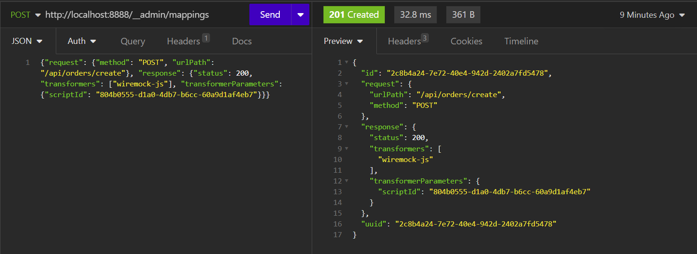

```bash
curl --request POST \
  --url http://localhost:8888/api/orders/create \
  --header 'Content-Type: application/json' \
  --data '{
	"amount": 1500
}'
```

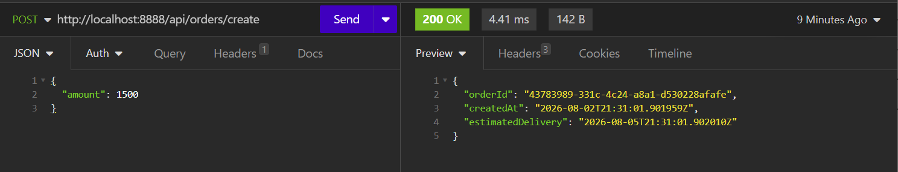


| Функция | Сигнатура | Возвращает | Описание |
|---|---|---|---|
| `now()` | `now() -> String` | ISO-8601 timestamp с миллисекундами | Например, `"2026-07-28T01:02:03.456Z"` |
| `nowPlusDays(n)` | `nowPlusDays(Number) -> String` | ISO-8601 timestamp | `n` может быть отрицательным (дата в прошлом) |


### uuid() и randomInt() — с оглядкой на детерминизм

Здесь решение было чуть менее тривиальным, потому что обе функции должны были подчиняться общему `seed`, а `UUID.randomUUID()` из стандартной библиотеки использует свой внутренний `SecureRandom` и не принимает внешний `Random`. Поэтому `uuid()` собирается вручную из байтов общего генератора `random`, с явной установкой битов версии и варианта UUID v4, а `randomInt(min, max)` — через `random.nextInt(max - min + 1) + min` с проверкой `min > max`:

```
javacase "uuid": return generateUuid();
case "randomInt": return (double) randomInt((int) num(args, 0), (int) num(args, 1));
```

Из-за этого `uuid()` при одинаковом `seed` детерминирован ровно так же, как `random()` — весь набор случайных функций подключён к одному генератору, и это делает воспроизводимыми не только числовые chaos-сценарии, но и сценарии с уникальными идентификаторами в CI/CD.

Тут стоит подробнее расcказать про seed. Что такое seed простыми словами?

Компьютер физически не умеет генерировать по-настоящему случайные числа — то, что мы называем "случайностью" в коде, на самом деле результат детерминированного математического алгоритма, который на каждом шаге вычисляет следующее число из предыдущего. Seed ("зерно" или "начальное число") — это тот самый стартовый параметр, с которого алгоритм начинает вычислять свою последовательность: если задать одно и то же зерно, генератор каждый раз выдаст абсолютно одинаковую цепочку "случайных" чисел, а если зерно не задавать явно, программа обычно берёт текущее системное время, и тогда каждый запуск даёт разную, непредсказуемую последовательность.

Наглядная аналогия — книга с заранее напечатанными последовательностями чисел: seed — это просто номер страницы, с которой алгоритм начинает читать. Открыть книгу на 42-й странице два раза подряд — и вы увидите одни и те же числа в том же порядке; открыть без указания страницы — и каждый раз получите случайное место. На хабре есть статьи на эту тему: [habr](https://habr.com/ru/articles/952192/)

#### Зачем seed нужен именно в WiremockJs

В обычном мокировании непредсказуемость `random()` — это ценность: она имитирует реальный "шум" внешнего сервиса. Но в CI/CD-пайплайне непредсказуемость превращается в проблему — если тест на retry-логику иногда получает 500, а иногда 200 случайным образом, прогон пайплайна становится нестабильным (flaky), и непонятно, баг ли это в вашем коде или просто "не повезло" с рандомом в этот раз.

Поэтому в `ScriptDefinition` предусмотрено опциональное поле `seed` — если оно указано, генератор внутри интерпретатора инициализируется как `new Random(seed)`, и повторный вызов того же скрипта с тем же `seed` даёт идентичную последовательность значений у `random()`, `randomInt()`, `uuid()` и `fake()`. Без `seed` (поле `null` или отсутствует) генератор ведёт себя как обычный `Math.random()` — непредсказуемо на каждый запуск. Это подтверждено тестом `shouldBeDeterministicWithSameSeed`, где два независимых интерпретатора с одинаковым `seed = 42` дают идентичные результаты `random()` трижды подряд, а тест `shouldDifferWithDifferentSeeds` с `seed = 1` и `seed = 2` показывает, что значения расходятся.

````java
    @Test
    @DisplayName("random() с одинаковым seed даёт одинаковую последовательность")
    void shouldBeDeterministicWithSameSeed() {
        String script = """
        return { "a": random(), "b": random(), "c": random() };
        """;

        WiremockJsInterpreter interpreter1 = new WiremockJsInterpreter(new RequestFacade(mockRequest));
        WiremockJsInterpreter interpreter2 = new WiremockJsInterpreter(new RequestFacade(mockRequest));

        Map<String, Object> result1 = interpreter1.execute(script, 42);
        Map<String, Object> result2 = interpreter2.execute(script, 42);

        assertEquals(result1.get("a"), result2.get("a"));
        assertEquals(result1.get("b"), result2.get("b"));
        assertEquals(result1.get("c"), result2.get("c"));
    }
````


Пример:

````json
{
  "name": "Chaos 5 percent errors",
  "sourceCode": "if (random() < 0.05) { return { \"status\": 500 }; } else { return { \"status\": 200 }; }",
  "seed": 42
}
````

С этим `seed: 42` каждый прогон CI против одного и того же стаба даёт одну и ту же последовательность "случайных" ошибок — воспроизводимость сохраняется даже там, где по смыслу должна быть непредсказуемость.

Соберём конкретный пример на chaos-сценарии с `seed`, создадим скрипт, привяжем его к стабу и вызовем несколько раз, чтобы увидеть детерминизм на практике.

##### Шаг 1 — создаём скрипт с seed

```bash
curl -X POST http://localhost:8888/__admin/extensions/wiremock-js/scripts \
  -H "Content-Type: application/json" \
  -d '{
    "name": "Chaos with seed demo",
    "description": "Демонстрация детерминизма random() и uuid() при заданном seed",
    "sourceCode": "if (random() < 0.3) { return { \"status\": 500, \"body\": { \"error\": \"internal error\", \"requestId\": uuid() } }; } else { return { \"status\": 200, \"body\": { \"ok\": true, \"requestId\": uuid() } }; }",
    "seed": 42
  }'
```

В ответе придёт `scriptId`, например `a1b2c3d4-...` — его нужно подставить в стаб на следующем шаге. У меня это 9e0a8a67-424d-47f4-8fbc-f1afa8736b49.

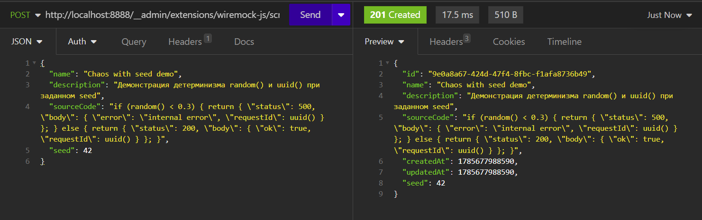

##### Шаг 2 — создаём стаб, привязанный к скрипту

```bash
curl -X POST http://localhost:8888/__admin/mappings \
  -H "Content-Type: application/json" \
  -d '{
    "request": { "method": "GET", "urlPath": "/api/chaos/demo" },
    "response": {
      "status": 200,
      "transformers": ["wiremock-js"],
      "transformerParameters": { "scriptId": "<ID из шага 1>" }
    }
  }'
```

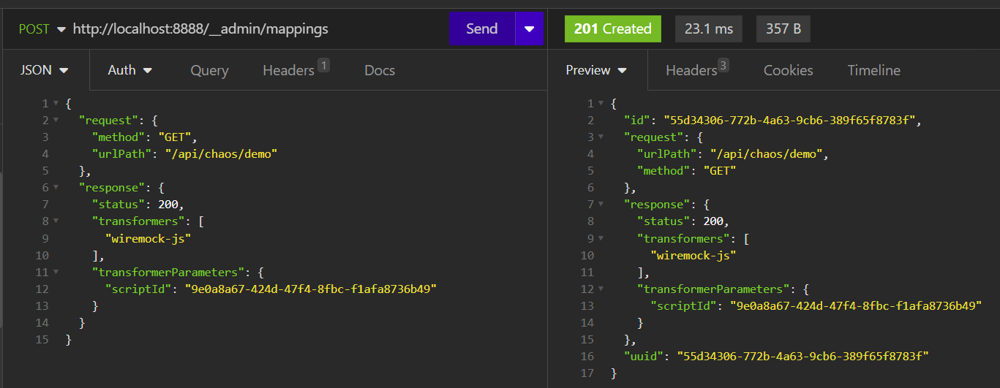

##### Шаг 3 — вызываем стаб несколько раз

```bash
curl http://localhost:8888/api/chaos/demo
curl http://localhost:8888/api/chaos/demo
curl http://localhost:8888/api/chaos/demo
```

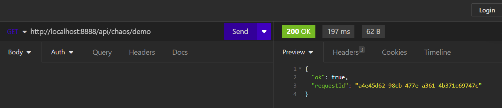

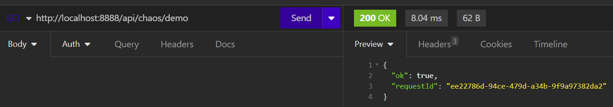

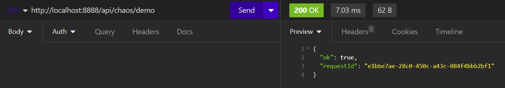


#### Как это ведёт себя на практике

Поскольку `seed = 42` задан явно, генератор внутри `WiremockJsInterpreter` инициализируется как `new Random(42)` на каждый вызов скрипта, а не переиспользуется между вызовами — то есть каждый отдельный HTTP-запрос запускает интерпретатор с нуля, и `random()` на первом же вычислении внутри одного и того же скрипта с одним и тем же `seed` всегда возвращает одно и то же первое значение из последовательности. Это значит, что при таком коде все три curl-вызова выше дадут абсолютно одинаковый результат — либо всегда `{"status": 500, ...}`, либо всегда `{"status": 200, ...}`, в зависимости от того, какое первое число даёт `new Random(42).nextDouble()`.

Если seed не указан то каждый вызов  выводит или 200 статус ответа или 500 в соответствии с условием скрипта. Суть `seed` — он не просто делает "предсказуемым один вызов", а превращает весь скрипт в чистую функцию от seed: одинаковый вход всегда даёт одинаковый выход, что удобно для юнит-тестов, но неожиданно для тех, кто без объяснения ждёт от `uuid()` уникальности на каждый вызов.


### matches(str, pattern)

Важно помнить, что `matches()` в WiremockJs проверяет **полное совпадение всей строки** с шаблоном (через RE2J, а не стандартный `java.util.regex`), и это точь-в-точь как `Pattern.matches()` — без частичного поиска подстроки.

#### Пример 1 — валидация формата телефона перед обработкой заказа

Практичный сценарий: сервис доставки принимает заказ и должен убедиться, что номер телефона клиента соответствует ожидаемому формату, прежде чем создавать заявку.

Скрипт:

````javascript
var phone = jsonField("phone");
if (!matches(phone, "\\+7\\d{10}")) {
    return {
        "status": 400,
        "body": {
            "error": "invalid phone format",
            "expected": "+7XXXXXXXXXX"
        }
    };
}
return {
    "status": 200,
    "body": {
        "orderId": uuid(),
        "phone": phone,
        "status": "CREATED"
    }
};
````


```bash
curl --request POST \
  --url http://localhost:8888/__admin/extensions/wiremock-js/scripts \
  --header 'Content-Type: application/json' \
  --data '{
	"name": "Validate phone format",
	"sourceCode": "var phone = jsonField(\"phone\"); if (!matches(phone, \"\\+7\\d{10}\")) { return { \"status\": 400, \"body\": { \"error\": \"invalid phone format\", \"expected\": \"+7XXXXXXXXXX\" } }; } return { \"status\": 200, \"body\": { \"orderId\": uuid(), \"phone\": phone, \"status\": \"CREATED\" } };"
}'
```
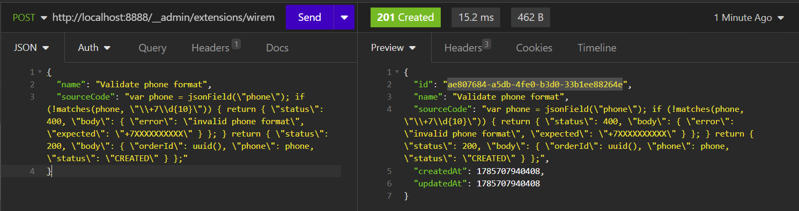
```bash
curl --request POST \
  --url http://localhost:8888/__admin/mappings \
  --header 'Content-Type: application/json' \
  --data '{
	"request": {
		"method": "POST",
		"urlPath": "/api/orders/validate-phone"
	},
	"response": {
		"status": 200,
		"transformers": [
			"wiremock-js"
		],
		"transformerParameters": {
			"scriptId": "ae807684-a5db-4fe0-b3d0-33b1ee88264e"
		}
	}
}'
```
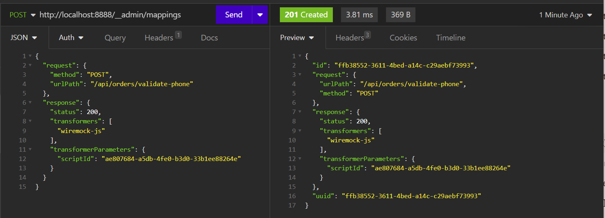

```bash
curl --request POST \
  --url http://localhost:8888/api/orders/validate-phone \
  --header 'Content-Type: application/json' \
  --data '{
	"phone": "+79161234567"
}'
```

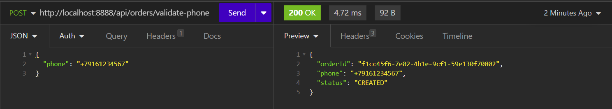


#### Пример 2 - более сложный пример в котором реализована маршрутизация по нескольким форматам телефона

Скрипт:

```javascript
var phone = jsonField("phone");
if (matches(phone, "\\+79\\d{9}")) {
    return {
        "status": 200,
        "body": {
            "phone": phone,
            "country": "RU",
            "type": "mobile",
            "valid": true
        }
    };
}
if (matches(phone, "\\+7[34568]\\d{9}")) {
    return {
        "status": 200,
        "body": {
            "phone": phone,
            "country": "RU",
            "type": "landline",
            "valid": true
        }
    };
}
if (matches(phone, "8\\d{10}")) {
    return {
        "status": 200,
        "body": {
            "phone": phone,
            "country": "RU",
            "type": "mobile_legacy_format",
            "valid": true,
            "warning": "use +7 format instead"
        }
    };
}
if (matches(phone, "\\+1\\d{10}")) {
    return {
        "status": 200,
        "body": {
            "phone": phone,
            "country": "US",
            "type": "mobile",
            "valid": true
        }
    };
}
return {
    "status": 400,
    "body": {
        "phone": phone,
        "valid": false,
        "error": "unrecognized phone format"
    }
}
```


```bash
curl --request POST \
  --url http://localhost:8888/__admin/extensions/wiremock-js/scripts \
  --header 'Content-Type: application/json' \
  --data '{
  "name": "Phone classifier",
  "description": "Классифицирует номер телефона по формату и оператору",
  "sourceCode": "var phone = jsonField(\"phone\"); if (matches(phone, \"\\+79\\d{9}\")) { return { \"status\": 200, \"body\": { \"phone\": phone, \"country\": \"RU\", \"type\": \"mobile\", \"valid\": true } }; } if (matches(phone, \"\\+7[34568]\\d{9}\")) { return { \"status\": 200, \"body\": { \"phone\": phone, \"country\": \"RU\", \"type\": \"landline\", \"valid\": true } }; } if (matches(phone, \"8\\d{10}\")) { return { \"status\": 200, \"body\": { \"phone\": phone, \"country\": \"RU\", \"type\": \"mobile_legacy_format\", \"valid\": true, \"warning\": \"use +7 format instead\" } }; } if (matches(phone, \"\\+1\\d{10}\")) { return { \"status\": 200, \"body\": { \"phone\": phone, \"country\": \"US\", \"type\": \"mobile\", \"valid\": true } }; } return { \"status\": 400, \"body\": { \"phone\": phone, \"valid\": false, \"error\": \"unrecognized phone format\" } };"
}'
```

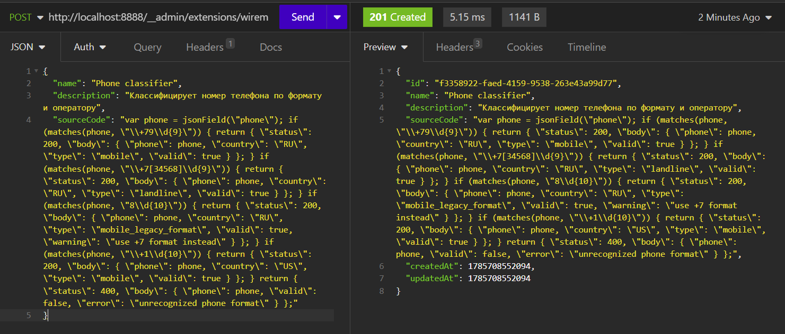

```bash
curl --request POST \
  --url http://localhost:8888/__admin/mappings \
  --header 'Content-Type: application/json' \
  --data '{
	"request": {
		"method": "POST",
		"urlPath": "/api/phones/classify"
	},
	"response": {
		"status": 200,
		"transformers": [
			"wiremock-js"
		],
		"transformerParameters": {
			"scriptId": "f3358922-faed-4159-9538-263e43a99d77"
		}
	}
}'
```


Российский мобильный (+7 9XX):

```bash
curl --request POST \
  --url http://localhost:8888/api/phones/classify \
  --header 'Content-Type: application/json' \
  --data '{"phone": "+79161234567"}'
```

```json
{ "phone": "+79161234567", "country": "RU", "type": "mobile", "valid": true }
```

Российский стационарный (+7, но не 9):

```bash
curl --request POST --url http://localhost:8888/api/phones/classify --header 'Content-Type: application/json' --data '{"phone": "+74951234567"}'
```

```json
{ "phone": "+74951234567", "country": "RU", "type": "landline", "valid": true }
```

Устаревший формат с 8 вместо +7:

```bash
curl --request POST --url http://localhost:8888/api/phones/classify --header 'Content-Type: application/json' --data '{"phone": "89161234567"}'
```

```json
{ "phone": "89161234567", "country": "RU", "type": "mobile_legacy_format", "valid": true, "warning": "use +7 format instead" }
```

Американский номер:

```bash
curl --request POST --url http://localhost:8888/api/phones/classify --header 'Content-Type: application/json' --data '{"phone": "+12025551234"}'
```

```json
{ "phone": "+12025551234", "country": "US", "type": "mobile", "valid": true }
```

Неопознанный формат

```bash
curl --request POST --url http://localhost:8888/api/phones/classify --header 'Content-Type: application/json' --data '{"phone": "12345"}'
```

```json
{ "phone": "12345", "valid": false, "error": "unrecognized phone format" }
```

#### Зачем понадобился RE2J

Отдельная функция `matches(str, pattern)` для проверки строки на regex создала новый риск — классический ReDoS через catastrophic backtracking в `java.util.regex`. Проблема конкретная: злой или просто неудачный паттерн типа `(a+)+` в связке со строкой из полусотни символов `a` и без финального совпадения может заставить стандартный движок регулярок работать экспоненциально долго, а поскольку `matches()` вызывается из пользовательского скрипта, это открытая дверь для DoS через сам механизм мокирования.

```java
@Test
@DisplayName("matches() безопасно обрабатывает потенциально катастрофический паттерн без зависания")
void shouldHandleCatastrophicPatternSafely() {
    String script = """
    if (matches("aaaaaaaaaaaaaaaaaaaaaaaaaaaaaaaaaaaaaaaaaaaaaaaaaaaaaaaaaaaaaaaaaaaaaaaaaaaaaaaaaaaaaaaaaaaaaaaaaaaaaaaaaaaaaaaaaaaaaaaaaaaaaaaaaaaaaaaaaaaaaaaaaaaaaaaaaaaaaaaaaaaaaaaaaaaaaaaaaaaaaaaaaaaaa!", "(a+)+b")) {
      return { "valid": true };
    } else {
      return { "valid": false };
    }
    """;

    long start = System.currentTimeMillis();
    Map<String, Object> result = run(script);
    long elapsed = System.currentTimeMillis() - start;

    assertEquals(false, result.get("valid"));
    assertTrue(elapsed < 500);
}
```

Я это проверяю тестом с ReDoS-паттерном — строка из ~150 символов `a` плюс `!` в конце против паттерна `(a+)+$`, и с `java.util.regex` такой ввод завис бы на неопределённое время, а таймаут в 100 мс на уровне `CompletableFuture` в `ScriptTransformer` тут не спасает по-настоящему: `future.cancel(true)` пытается прервать поток через `Thread.interrupt()`, но `Matcher` из `java.util.regex` не проверяет флаг прерывания во время backtracking-цикла, и поток продолжает жечь CPU даже после "отмены".

Решил заменить движок регулярок целиком на `com.google.re2j:re2j:1.7`, который реализует Google RE2: вместо backtracking там DFA-подобный алгоритм с гарантированным линейным временем выполнения O(n) от длины строки, независимо от паттерна. Плата за эту гарантию — RE2J не поддерживает backreferences (`\1`, `\2`) и часть сложных lookahead/lookbehind конструкций, но для типовых задач мокирования (email, телефон, формат ID) это не нужно:

```groovy
dependencies {
    implementation 'com.google.re2j:re2j:1.7'
}
```

````java
case "matches": {
                    String input = str(args, 0);
                    String pattern = str(args, 1);
                    if (input == null || pattern == null) {
                        return false;
                    }
                    try {
                        return com.google.re2j.Pattern.matches(pattern, input);
                    } catch (com.google.re2j.PatternSyntaxException e) {
                        throw new ScriptExecutionException("Некорректное регулярное выражение: " + e.getMessage());
                    }
                }
````


### fake() — заглушка для реалистичных данных

Отдельная категория пробела — реалистичные тестовые данные (имена, email, адреса), которые вручную писать в каждом скрипте было бы утомительно. Решение — подключить DataFaker и пробросить единственную функцию `fake(pattern)`, которая делегирует всю работу выражению DataFaker:

```java
case "fake": {
    String pattern = str(args, 0);
    if (pattern == null) throw new ScriptExecutionException("fake(): шаблон не может быть null");
    try {
        return faker.expression(pattern);
    } catch (Exception e) {
        throw new ScriptExecutionException("Ошибка в шаблоне fake(\"" + pattern + "\"): " + e.getMessage());
    }
}
```

Здесь особенно показательна экономия усилий — вместо того чтобы придумывать whitelist из десятков отдельных функций (`fakeName()`, `fakeEmail()`, `fakeAddress()`...), я прокинул в язык ровно одну функцию, которая принимает строковый шаблон DataFaker (`"Name.firstName"`, `"Internet.emailAddress"`) и делегирует всю сложность генерации самой библиотеке. Как и `uuid()`, `fake()` инициализируется с тем же `seed`, что даёт `Faker` в режиме repeatable-данных — снова тот же принцип "один seed управляет всей случайностью скрипта".

#### Пример 1 — простая генерация клиента

Самый базовый сценарий: сервис возвращает случайного, но реалистичного клиента при каждом запросе.

```bash
curl --request POST \
  --url http://localhost:8888/__admin/extensions/wiremock-js/scripts \
  --header 'Content-Type: application/json' \
  --data '{
	"name": "Fake customer",
	"description": "Возвращает случайного клиента через DataFaker",
	"sourceCode": "var firstName = fake(\"#{Name.first_name}\"); var lastName = fake(\"#{Name.last_name}\"); var email = fake(\"#{Internet.email_address}\"); return { \"status\": 200, \"body\": { \"id\": uuid(), \"firstName\": firstName, \"lastName\": lastName, \"email\": email } };"
}'
```

```bash
curl --request POST \
  --url http://localhost:8888/__admin/mappings \
  --header 'Content-Type: application/json' \
  --data '{
	"request": {
		"method": "GET",
		"urlPath": "/api/customers/random"
	},
	"response": {
		"status": 200,
		"transformers": [
			"wiremock-js"
		],
		"transformerParameters": {
			"scriptId": "<ID>"
		}
	}
}'
```

```bash
curl http://localhost:8888/api/customers/random
```

Каждый вызов вернёт новое имя, фамилию и email — без `seed` это по-настоящему случайные данные на каждый запрос.

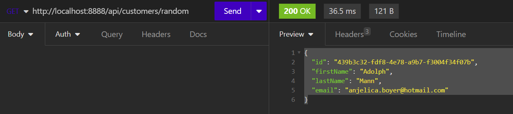

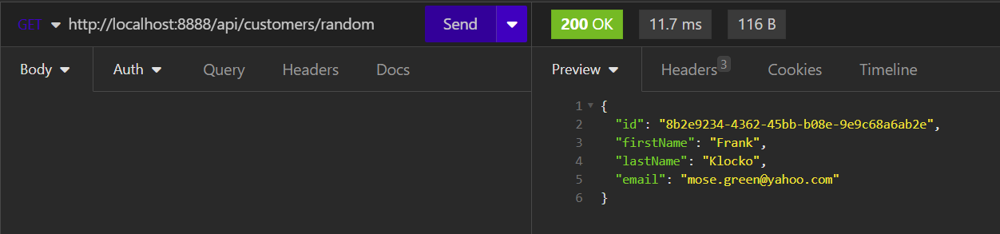


#### Пример 2 — детерминированный фейковый заказ через seed

Здесь показывается связка `fake()` + `seed` — полезно для тестов, где нужны стабильные, но реалистичные данные:

```bash
curl --request POST \
  --url http://localhost:8888/__admin/extensions/wiremock-js/scripts \
  --header 'Content-Type: application/json' \
  --data '{
	"name": "Fake order with fixed seed",
	"description": "Одинаковый фейковый адрес доставки при каждом прогоне теста",
	"sourceCode": "var city = fake(\"#{Address.city}\"); var street = fake(\"#{Address.street_address}\"); return { \"status\": 200, \"body\": { \"orderId\": uuid(), \"deliveryAddress\": { \"city\": city, \"street\": street }, \"createdAt\": now() } };",
	"seed": 7
}'
```

````bash
curl --request POST \
  --url http://localhost:8888/__admin/mappings \
  --header 'Content-Type: application/json' \
  --data '{
	"request": {
		"method": "GET",
		"urlPath": "/api/orders/fake"
	},
	"response": {
		"status": 200,
		"transformers": [
			"wiremock-js"
		],
		"transformerParameters": {
			"scriptId": "<ID>"
		}
	}
}'
````

````bash
curl --request GET --url http://localhost:8888/api/orders/fake
````

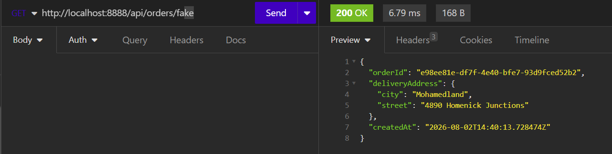

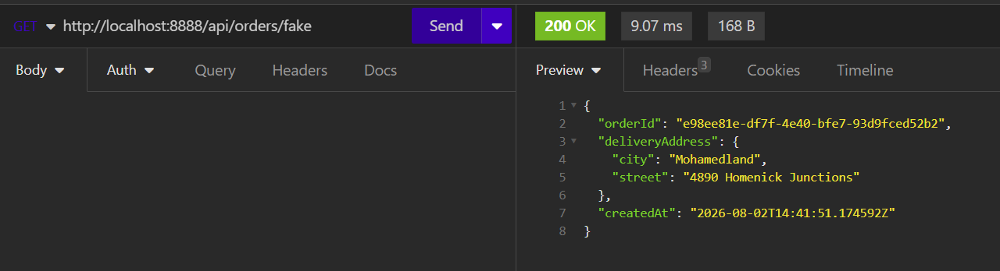

Поскольку `Faker` внутри `Visitor` создаётся с тем же `Random(seed)`, что и `uuid()`, при `seed: 7` каждый повторный вызов этого скрипта даст один и тот же `city`, `street` и `orderId` — а вот `createdAt` будет всегда новым, потому что `now()` берёт реальное системное время, а не генератор случайных чисел.

#### Пример 3 — сочетание fake() с реальными данными из запроса

Более практичный кейс — тело ответа собирается частично из входного JSON, частично из faker, что типично для webhook-имитаций (похоже на кейс Uzum Fintech из вашей практики):

```bash
curl --request POST \
  --url http://localhost:8888/__admin/extensions/wiremock-js/scripts \
  --header 'Content-Type: application/json' \
  --data '{
	"name": "Payment webhook with fake merchant",
	"description": "paymentId берётся из запроса, merchant данные — фейковые",
	"sourceCode": "var paymentId = jsonField(\"paymentId\"); if (paymentId == null) { return { \"status\": 400, \"body\": { \"error\": \"paymentId is required\" } }; } var merchantName = fake(\"#{Company.name}\"); return { \"status\": 200, \"body\": { \"paymentId\": paymentId, \"status\": \"COMPLETED\", \"merchant\": merchantName, \"processedAt\": now() } };"
}'
  
curl --request POST \
  --url http://localhost:8888/__admin/mappings \
  --header 'Content-Type: application/json' \
  --data '{
	"request": {
		"method": "POST",
		"urlPath": "/api/payments/webhook"
	},
	"response": {
		"status": 200,
		"transformers": [
			"wiremock-js"
		],
		"transformerParameters": {
			"scriptId": "<ID>"
		}
	}
}'
  
curl --request POST \
  --url http://localhost:8888/api/payments/webhook \
  --header 'Content-Type: application/json' \
  --data '{"paymentId": "pay_12345"}'
```

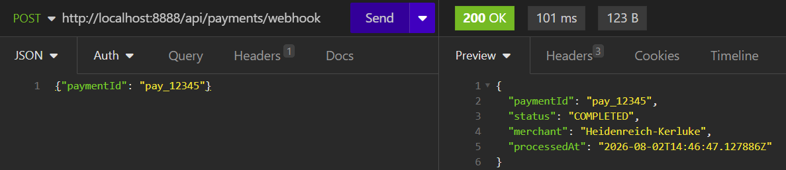

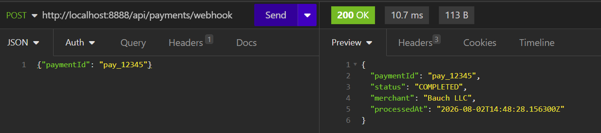

````json
{
  "paymentId": "pay_12345",
  "status": "COMPLETED",
  "merchant": "<случайное название компании>",
  "processedAt": "<текущее время>"
}
````

Вызов: 

````bash
curl-X POST http://localhost:8888/api/payments/webhook -H "Content-Type: application/json" -d '{}'
````

Ожидаемый ответ — HTTP 400:

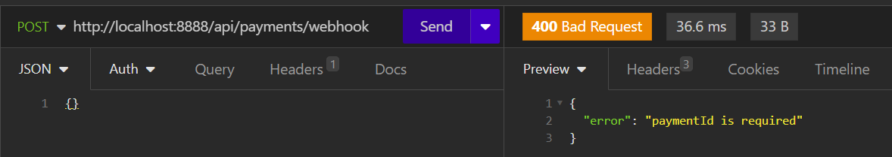

Здесь `jsonField("paymentId")` читает реальные данные запроса, `fake("Company.name")` добавляет реалистичный, но не фиксированный элемент, а `if (paymentId == null)` показывает уже знакомую нам защиту от отсутствующих полей.

#### Полезные шаблоны DataFaker для справки

| Категория             | Шаблон                        | Пример результата (EN)               | Пример результата (RU)                                       |
| :-------------------- | :---------------------------- | :----------------------------------- | :----------------------------------------------------------- |
| Полное имя            | `#{Name.full_name}`           | Miss Samanta Schmidt                 | Иванова Мария Петровна                                       |
| Имя                   | `#{Name.first_name}`          | Norman                               | Мария                                                        |
| Фамилия               | `#{Name.last_name}`           | O'Reilly                             | Иванова                                                      |
| Email                 | `#{Internet.email_address}`   | ralph.keebler@yahoo.com              | maria.ivanova@yandex.ru                                      |
| Домен                 | `#{Internet.domain_name}`     | example.com                          | example.ru                                                   |
| Компания              | `#{Company.name}`             | Mohamedland Inc.                     | ПАО ИвановоСбытСнабСбыт                                      |
| Слоган компании       | `#{Company.catch_phrase}`     | Innovative solutions for tomorrow    | Инновационные решения для будущего                           |
| Город                 | `#{Address.city}`             | Mohamedland                          | Москва                                                       |
| Полный адрес          | `#{Address.full_address}`     | 4890 Homenick Junctions, Springfield | г. Москва, ул. Ленина, д. 15                                 |
| Улица                 | `#{Address.street_address}`   | 4890 Homenick Junctions              | ул. Ленина, д. 15                                            |
| Почтовый индекс       | `#{Address.zip_code}`         | 90210                                | 101000                                                       |
| Страна                | `#{Address.country}`          | Suriname                             | Россия                                                       |
| Телефон               | `#{PhoneNumber.phone_number}` | +1-555-0134                          | +7-900-123-45-67                                             |
| Предложение (текст)   | `#{Lorem.sentence}`           | Случайное предложение на английском  | Случайное предложение (обычно на английском, даже в ru-локали) |
| Слово                 | `#{Lorem.word}`               | apple                                | яблоко                                                       |
| Номер кредитной карты | `#{Finance.credit_card}`      | 4111-1111-1111-1111                  | 4111-1111-1111-1111                                          |
| Название валюты       | `#{Money.currency}`           | USD                                  | RUB                                                          |
| Профессия             | `#{Job.title}`                | Software Engineer                    | Инженер-программист                                          |
| UUID (через Faker)    | `#{Internet.uuid}`            | Альтернатива встроенному `uuid()`    | Альтернатива встроенному `uuid()`                            |

#### Комбинирование нескольких значений в одном вызове

Поскольку `expression()` ищет все подстроки `#{...}` внутри произвольного текста, можно собрать целое сообщение одним вызовом `fake()`, без промежуточных переменных, как вы уже видели на примере с merchant:

````json
"sourceCode": "var summary = fake(\"Клиент #{Name.full_name} из компании #{Company.name}, email: #{Internet.email_address}\"); return { \"status\": 200, \"body\": { \"summary\": summary } };"
````


Обратите внимание — синтаксис шаблона зависит от версии DataFaker (`1.9.0` использует нотацию `Category.method_name` через `snake_case`, тогда как некоторые примеры в интернете написаны под `2.x` с другим стилем) — если `fake(...)` бросает `ScriptExecutionException` с сообщением про несуществующий провайдер, стоит свериться с точным списком методов конкретно для версии `1.9.0`, которую вы сейчас используете после downgrade


### mapKeys() — переименование полей без полноценного eval

Последний штрих в этой волне — задача переименования ключей в массиве объектов (например, API отдаёт `{"cost": 100}`, а тест ожидает `{"price": 100}`). Полноценное решение через произвольные выражения (`map(array, item => ...)`) означало бы добавление eval-семантики в язык, а это противоречило всей идее ограниченного DSL — поэтому вместо этого добавил узкую, но достаточную функцию `mapKeys(array, mapping)`, которая просто переименовывает ключи по статическому словарю соответствий, без вычисления произвольных выражений на каждый элемент. 


### Агрегированные функции

#### Почему агрегированные функции

Основная причина — безопасность выполнения в изолированном интерпретаторе. Циклы (`for`, `while`) в языке, встроенном в HTTP-мок-сервер, открывают прямой путь к runaway-выполнению: пользователь может написать `while (true) {}` или цикл с ошибкой в условии выхода, и единственная защита от зависшего потока — таймаут в `ScriptTransformer` (`EXECUTION_TIMEOUT_MS`), который просто прерывает `Future`, но не гарантирует, что поток реально остановится мгновенно и не продолжит жрать CPU в фоне. Я уже сталкивалися с тем, как чувствителен этот таймаут — даже 100 мс холодного старта `Faker` ловил ошибку, а произвольный цикл без верхней границы итераций — куда более серьёзный риск для продакшен-инстанса WireMock, который обслуживает множество стабов одновременно

`sum()`, `count()` и `avg()` решают ту же практическую задачу — обработку массива данных — но при этом:

- **Ограничены по построению** — они всегда проходят ровно по одному конкретному списку один раз, без возможности случайной бесконечной итерации.
- **Не требуют произвольного пользовательского кода внутри тела цикла** — вся логика агрегации зашита в `sumOf()`, а не в скрипте, значит нет риска, что пользователь напишет внутри цикла что-то тяжёлое или рекурсивное.
- **Предсказуемы по времени выполнения** — сложность `O(n)` от размера массива, который и так ограничен реальным размером тела HTTP-запроса, а не потенциально бесконечен, как условие произвольного `while`.

#### Как это работает под капотом

Все три функции принимают один аргумент — массив (`List<Object>`), обычно полученный через `jsonField()` с wildcard-путём типа `orders.price`, который возвращает не одно значение, а список чисел из всех элементов массива:

````java
case "sum": return sumOf(args.get(0));
case "count": return (double) toList(args.get(0)).size();
case "avg": {
    List<Object> list = toList(args.get(0));
    if (list.isEmpty()) {
        throw new ScriptExecutionException("avg(): пустой массив");
    }
    return sumOf(args.get(0)) / list.size();
}
````

`sum()` проходит по каждому элементу списка через `sumOf()` и складывает их как числа (с приведением типов через `num()`), `count()` просто возвращает размер списка независимо от содержимого, а `avg()` делит сумму на количество — с явной защитой от деления на ноль, если массив окажется пустым. Обратите внимание на важную деталь: `avg()` бросает `ScriptExecutionException` при пустом массиве, а не возвращает `NaN` или `0` — это осознанное решение сделать ошибку явной, а не молча замаскировать проблему в данных запроса.

#### Пример 1 — сумма и количество товаров в заказе

Практичный сценарий: клиент присылает список товаров с ценами, а стаб должен вернуть общую стоимость заказа и количество позиций.

```bash
curl --request POST \
  --url http://localhost:8888/__admin/extensions/wiremock-js/scripts \
  --header 'Content-Type: application/json' \
  --data '{
	"name": "Order total calculator",
	"sourceCode": "var prices = jsonField(\"items[*].price\"); var total = sum(prices); var itemsCount = count(prices); return { \"status\": 200, \"body\": { \"totalPrice\": total, \"itemsCount\": itemsCount } };"
}'
```
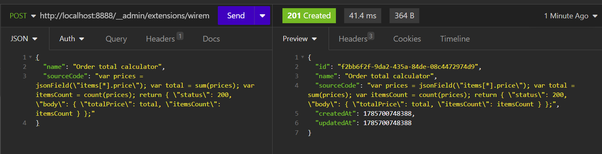

```bash
curl --request POST \
  --url http://localhost:8888/__admin/mappings \
  --header 'Content-Type: application/json' \
  --data '{
	"request": {
		"method": "POST",
		"urlPath": "/api/orders/calculate"
	},
	"response": {
		"status": 200,
		"transformers": [
			"wiremock-js"
		],
		"transformerParameters": {
			"scriptId": "<ScriptID>"
		}
	}
}'
```
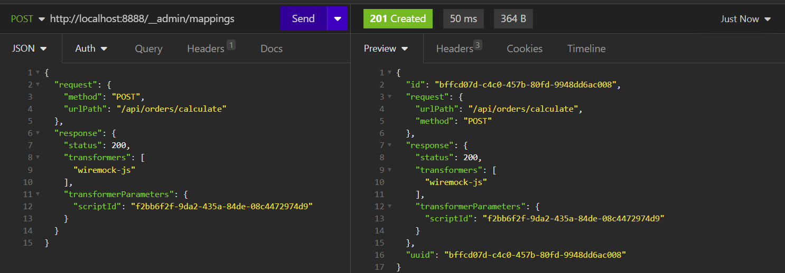

```bash
curl --request POST \
  --url http://localhost:8888/api/orders/calculate \
  --header 'Content-Type: application/json' \
  --data '{
	"items": [
		{
			"price": 100
		},
		{
			"price": 250
		},
		{
			"price": 50
		}
	]
}'
```

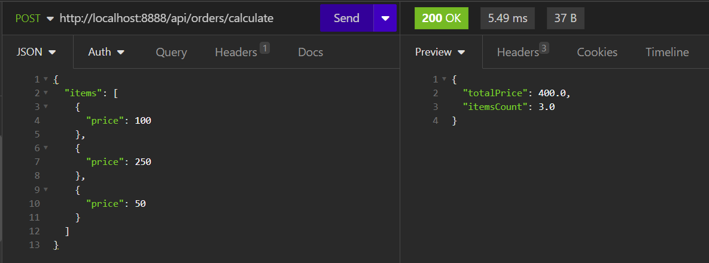


Результат:

```json
{
  "totalPrice": 400,
  "itemsCount": 3
}
```

Здесь `jsonField("items.price")` собирает все значения `price` из массива `items` в единый список `[100, 250, 50]`, а `sum()` и `count()` работают уже с этим готовым списком, а не с исходным JSON напрямую=

#### Пример 2 — средний чек с проверкой на пустой заказ

Этот пример показывает, как обработать защиту от пустого массива через `if`, не дожидаясь исключения:

```bash
curl --request POST \
  --url http://localhost:8888/__admin/extensions/wiremock-js/scripts \
  --header 'Content-Type: application/json' \
  --data '{
	"name": "Average order value",
	"description": "Считает средний чек по позициям заказа",
	"sourceCode": "var prices = jsonField(\"items[*].price\"); if (count(prices) == 0) { return { \"status\": 400, \"body\": { \"error\": \"order has no items\" } }; } var average = avg(prices); return { \"status\": 200, \"body\": { \"averagePrice\": average, \"itemsCount\": count(prices) } };"
}'

```
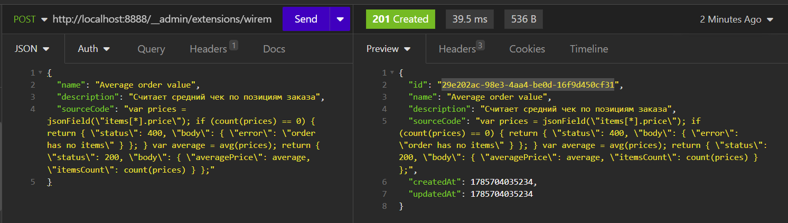

```bash
curl --request POST \
  --url http://localhost:8888/__admin/mappings \
  --header 'Content-Type: application/json' \
  --data '{
	"request": {
		"method": "POST",
		"urlPath": "/api/orders/average"
	},
	"response": {
		"status": 200,
		"transformers": [
			"wiremock-js"
		],
		"transformerParameters": {
			"scriptId": "29e202ac-98e3-4aa4-be0d-16f9d450cf31"
		}
	}
}'
```
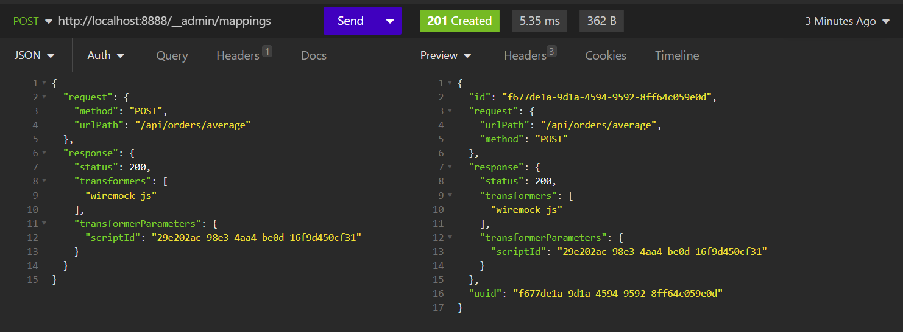

```bash
curl --request POST \
  --url http://localhost:8888/api/orders/average \
  --header 'Content-Type: application/json' \
  --data '{
	"items": [
		{
			"price": 100
		},
		{
			"price": 300
		}
	]
}'
```

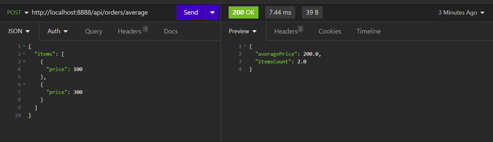


Результат:

```bash
{
  "averagePrice": 200,
  "itemsCount": 2
}
```

А при пустом массиве `items`:

```bash
curl --request POST \
  --url http://localhost:8888/api/orders/average \
  --header 'Content-Type: application/json' \
  --data '{"items": []}'
```

Результат — управляемая ошибка 400, а не падение скрипта с необработанным исключением:

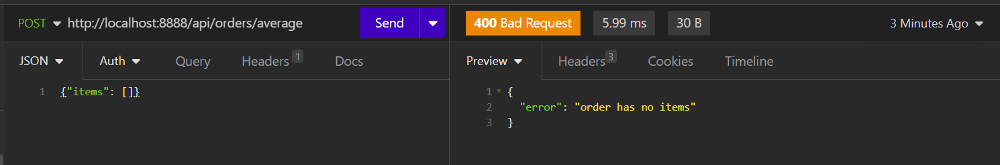

```json
{
  "error": "order has no items"
}
```


### ForEach по массиву

У нас есть `visitForEachStatement` — цикл `forEach` по массиву. Почему именно `forEach`, а не произвольный `while`/`for` с условием:

**`forEach` по массиву** — число итераций жёстко равно `itemsList.size()`, то есть заранее известной, конечной длине списка, которая в свою очередь ограничена реальным размером тела HTTP-запроса. Бесконечный `forEach` физически невозможен — массив не может стать длиннее самого JSON, который прислал клиент.

**Произвольный `while (condition)` или `for (init; condition; step)`** — число итераций зависит от результата вычисления `condition` на каждом шаге, а это уже произвольная логика скрипта. Ошибка в условии (забыли `i++`, неправильно сформулировали выход) — и цикл выполняется вечно, съедая CPU потока в `CompletableFuture.supplyAsync`, пока таймаут `EXECUTION_TIMEOUT_MS` не прервёт `Future` — но сам поток при этом не обязательно остановится мгновенно.


### Где тогда место sum/count/avg рядом с forEach

Функции `sum()`, `count()`, `avg()` по сути делают то же самое, что можно было бы сделать через `forEach` вручную:

```
jsvar total = 0;
for (var item of items) {
    total = total + item.price;
}
```

Но `sum(jsonField("items.price"))` короче и не требует от пользователя писать даже безопасный `forEach` для типовой задачи — агрегированные функции — это просто более удобный, специализированный шорткат над той же самой идеей ограниченной итерации, а не альтернативная более безопасная замена циклам, как я сформулировал ранее. `forEach` и `sum/count/avg` решают одну и ту же категорию задач (обработка массива), просто на разных уровнях абстракции — `forEach` даёт гибкость для сложной кастомной логики на каждом элементе, а агрегированные функции — быстрый путь для самых частых операций без написания цикла вручную.

Пример 1 — скидка на товары:

Для сравнения два скрипта делающих одно и тоже. Одно с forEach, а второе с агрегированными функциями 

```javascript
var items = jsonField("items");
var total = 0;
for (var item of items) {
    var discountedPrice = item.price * 0.9;
    var total = total + discountedPrice;
}
return {
    "status": 200,
    "body": {
        "originalItemsCount": count(items),
        "totalAfterDiscount": total
    }
}
```

```javascript
var prices = jsonField("items[*].price");
var total = sum(prices) * 0.9;
return {
    "status": 200,
    "body": {
        "originalItemsCount": count(prices),
        "totalAfterDiscount": total
    }
}
```

```bash
curl --request POST \
  --url http://localhost:8888/__admin/extensions/wiremock-js/scripts \
  --header 'Content-Type: application/json' \
  --data '{
	"name": "Apply discount to order items",
	"sourceCode": "var items = jsonField(\"items\"); var total = 0; for (var item of items) { var discountedPrice = item.price * 0.9; var total = total + discountedPrice; } return { \"status\": 200, \"body\": { \"originalItemsCount\": count(items), \"totalAfterDiscount\": total } };"
}'
```


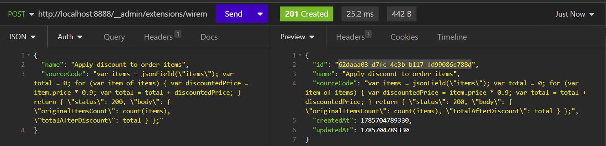


```bash
curl --request POST \
  --url http://localhost:8888/__admin/mappings \
  --header 'Content-Type: application/json' \
  --data '{
	"request": {
		"method": "POST",
		"urlPath": "/api/orders/discount"
	},
	"response": {
		"status": 200,
		"transformers": [
			"wiremock-js"
		],
		"transformerParameters": {
			"scriptId": "62daaa03-d7fc-4c3b-b117-fd99086c788d"
		}
	}
}'
```

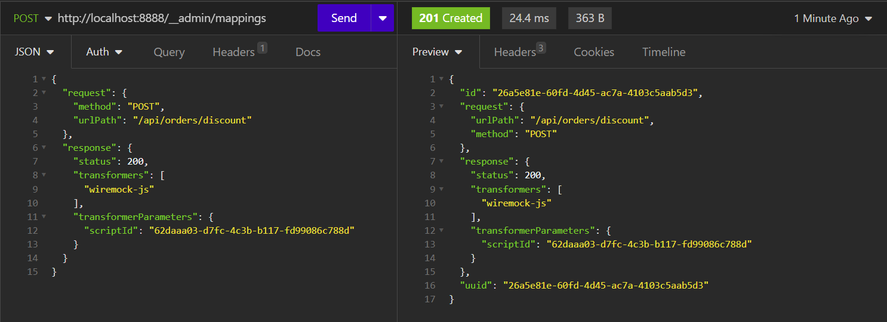


```bash
curl --request POST \
  --url http://localhost:8888/api/orders/discount \
  --header 'Content-Type: application/json' \
  --data '{
	"items": [
		{
			"name": "Book",
			"price": 100
		},
		{
			"name": "Pen",
			"price": 50
		},
		{
			"name": "Notebook",
			"price": 200
		}
	]
}'
```

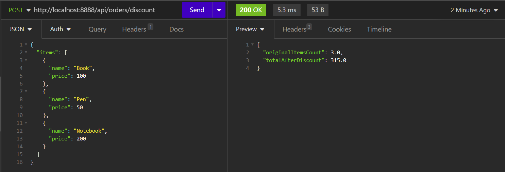


### 

## Лимиты

Почему именно такие лимиты? Значения 2000 символов и 5 уровней вложенности — не произвольные цифры, а результат простого расчёта: при лимите в 2000 символов физически невозможно объявить больше ~220 переменных (`var x = ...;` — минимум 9 символов на объявление), поэтому отдельный `MAX_VARIABLES` не добавляет никакой дополнительной защиты — лимит длины уже решает эту задачу. Похожая логика стоит за отказом от отдельного счётчика итераций цикла (как в `MAX_LOOP_ITERATIONS` у Salesforce Apex) — `forEach` в WiremockJs итерирует строго по размеру уже готового массива, и бесконечный цикл архитектурно исключён самой природой конструкции, а не отдельным лимитом сверху.


## Хронология проблем 

| Проблема                                   | Причина                                                      | Решение                                                      |
| :----------------------------------------- | :----------------------------------------------------------- | :----------------------------------------------------------- |
| `UnsupportedClassVersionError`             | DataFaker 2.7.0 скомпилирован под Java 17+, а контейнер WireMock — Java 11 | Downgrade на `datafaker:1.9.0`                               |
| Таймаут 100 мс на первом вызове `fake()`   | Холодная загрузка YAML-провайдеров `Faker` при первом создании объекта | `FakerHolder` — синглтон, прогретый в конструкторе `ScriptTransformer` |
| Таймаут 100 мс даже после прогрева `Faker` | Отдельный холодный старт движка `expression()` — другая подсистема DataFaker | Прогревочный скрипт теперь сам вызывает `fake(...)`, а не просто создаёт `Faker` |
| `missing '=' at 'fake'`                    | Ошибка ручного редактирования скрипта после некорректного импорта в Insomnia | Проверка `sourceCode` через Admin API перед вызовом стаба    |
| `fake()` возвращал текст шаблона как есть  | Синтаксис DataFaker `expression()` требует `#{...}`, а не голое имя провайдера | Оборачивать имена провайдеров в `#{Category.method}`         |